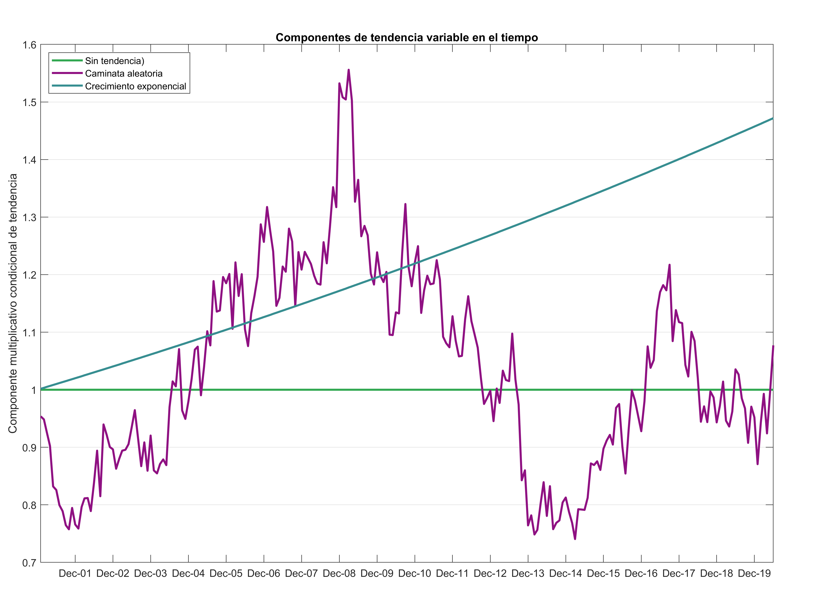
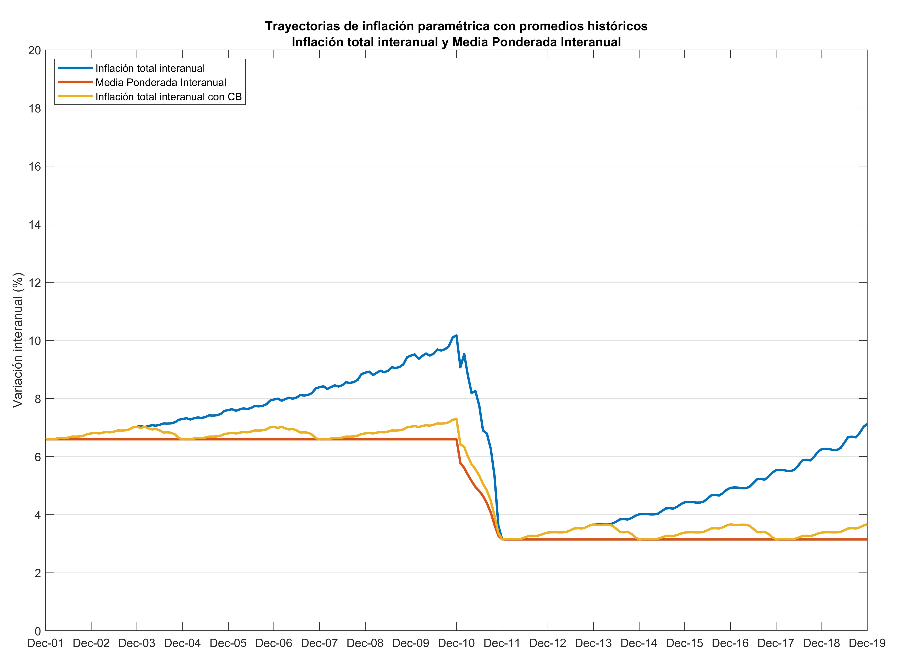

# Calibración de varianza del proceso de caminata aleatoria del EMI

Se describe a continuación la propuesta de calibración de caminata aleatoria para la tendencia de caminata aleatoria del proceso de evaluación de medidas de inflación.

## Modelado de caminata aleatoria

Se propone que la tendencia estocástica de la inflación, en la evaluación de medidas de inflación, sea multiplicativa. El propósito de hacer dicha tendencia no sea aditiva es evitar que la adición de un término común imponga una correlación espuria entre las medidas de inflación muestrales y la medida de inflación paramétrica.

Por otro lado, para que haya continuidad en la dirección de la tendencia estocástica, cuando la inflación intermensual (poblacional o muestral) cambie de signo, se propone que el factor multiplicativo sólo afecte a las variaciones intermensuales de precios que tienen signo positivo.

En particular, se propone el modelo siguiente:
$$ z_{i,t} = x_{i,t} \cdot y_{t} $$
en donde $z_{i,t}$ representa la variación intermensual del índice de precios del basto básico $i$ en $t$, $x_{i,t}$ la variación intermensual del índice de precios del basto básico $i$ en $t$ sin tendencia estocástica y $y_t$ es el componente multiplicativo condicional de tendencia estocástica en $t$.

La tendencia estocástica multiplicativa es una función exponencial (cuando la variación intermensual del índice de precios del gasto básico, sin tendencia estocástica, es positiva) o es una constante igual a uno (cuando la variación intermensual del índice de precios del gasto básico, sin tendencia estocástica, es no positiva). En particular: 
$$ y_t = \begin{cases}
e^{\rho_t} &  \text{ si } x_{i,t} > 0 \\
1 &  \text{ si } x_{i,t} \leq 0
\end{cases} $$ 

En donde $\rho_t$ tiene la especificación de una caminata aleatoria: 
$$ \rho_t = \rho_{t-1} + \varepsilon_t, \quad \rho_0 = 0, \quad \varepsilon_t\sim N(0, \sigma_\varepsilon^2) $$

## Calibración de la varianza

Para generar las series de tiempo correspondientes al parámetro poblacional y a las simulaciones muestrales, la variable $\rho_t$ tiene valor inicial cero y luego evoluciona de acuerdo con su ley de movimiento (caminata aleatoria).  Para este propósito, los valores de los choques estocásticos $t$ se extraen de una distribución normal con media cero y con varianza $\sigma_\varepsilon^2$.

El valor de $\sigma_\varepsilon^2$ se obtiene a partir de los datos históricos observados de inflación de Guatemala, de la manera siguiente:

$$ \sigma_\varepsilon^2 = \text{Var}(\delta_t) $$
en donde  
$$ \delta_t = \frac{1}{12} \sum_{j=1}^{12} \left(q_{t-j} - q_{t-j-1} \right) $$  
corresponde a la media móvil de 12 meses de las diferencias en las variaciones intermensuales del IPC $q_t$ del período $t$ en los datos históricos.

Al aplicar este proceso se obtiene la siguiente gráfica de variaciones intermensuales del IPC y sus medias móviles de 12 meses. Como se puede apreciar, la varianza es mucho menor para las medias móviles.  

  

En la siguiente tabla se presentan las estimaciones de varianza y desviación estándar de las variaciones intermensuales del IPC en las dos períodos del IPC (así como en el período completo). Los valores se muestran en puntos porcentuales para las desviaciones estándar. Se puede resaltar que los valores de desviación estándar sin suavizamiento de media móvil parecen ser muy grandes, y por lo tanto, inadecuados para utilizarse en bruto para el proceso de calibración de varianza de la tendencia de caminata aleatoria.

| Período  | Varianza  | Desviación estándar | Varianza media móvil| Desviación estándar media móvil |
|---|---:|---:|---:|---:|
| Base 2000 | 0.2713 | 0.5209 |0.003490 | 0.0591 |
| Base 2010 | 0.2162 | 0.4650 |0.001868 | 0.0432 |
| Período completo | 0.2435 | 0.4935 | 0.002693 | 0.0519 |

Ahora se procederá a computar una señal de ruido blanco utilizando la varianza de la media móvil de 12 meses de las variaciones intermensuales del IPC de la base 2000 y del período completo. A continuación, como ejemplo, se muestra una de las realizaciones:  

  

Como se puede observar, la volatilidad de la señal de ruido blanco utilizando la varianza del período completo ($\text{Var}(\delta_t) = 0.0027$) es ligeramente menor a la volatilidad de la señal de ruido blanco que utiliza la varianza solamente de la base 2000 ($\text{Var}(\delta_t) = 0.0035$). Aunque, en apariencia, la diferencia de volatilidad no parece muy importante.

A continuación se procederá a utilizar la señal de ruido blanco del período completo para computar las trayectorias paramétricas de inflación. Esto permitirá evaluar si la volatilidad calibrada a través de este procedimiento es adecuada, es decir, si permite que la evolución de la tendencia estocástica genere cambios significativos, pero no muy grandes, en la trayectoria de la inflación interanual.

## Tendencia estocástica en las trayectorias de inflación paramétrica

En esta sección se describe cómo quedan los parámetros poblacionales de inflación resultantes al utilizar tres tipos de tendencia multiplicativa.
- Componente nulo, que anula el efecto de tendencia multiplicativo. Es equivalente a un factor igual a uno. 
- La señal de ruido blanco calibrada con las variaciones intermensuales del IPC.
- Una componente de crecimiento exponencial, calibrada para reflejar factores de crecimiento del 2% interanual. 

En la siguiente figura se aprecia los diferentes factores multiplicativos de tendencia en el proceso de cómputo de inflación paramétrica y en el remuestreo.  

<!--    -->

Como referencia, se muestran las trayectorias de inflación paramétrica sin tendencia.  

<!--    -->

Se muestran las trayectorias de inflación paramétrica utilizando la componente multiplicativa de tendencia de caminata aleatoria que se muestra en color morado en la figura anterior de componentes de tendencia.  

<!--    -->

Como se observa, se obtienen trayectorias de inflación paramétrica con tendencia estocástica y moderada volatilidad, por lo que el método de calibración podría considerarse adecuadamente escalado para modelar la varianza del proceso de caminata aleatoria de la tendencia.  

Finalmente, se muestran las trayectorias de inflación paramétrica utilizando la componente multiplicativa de tendencia de factor exponencial que se muestra en color azul en la figura anterior de componentes de tendencia.  

