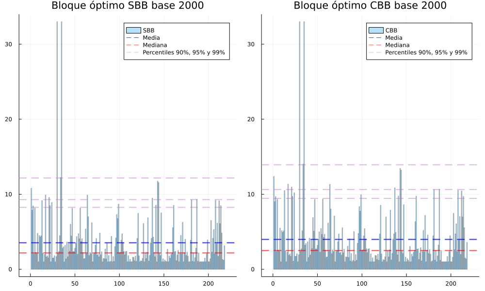
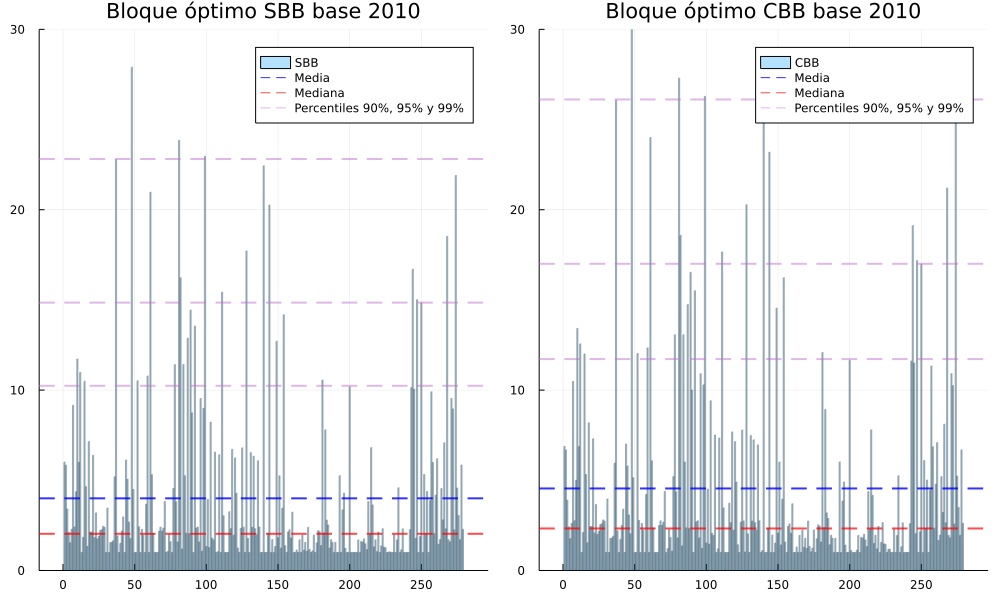
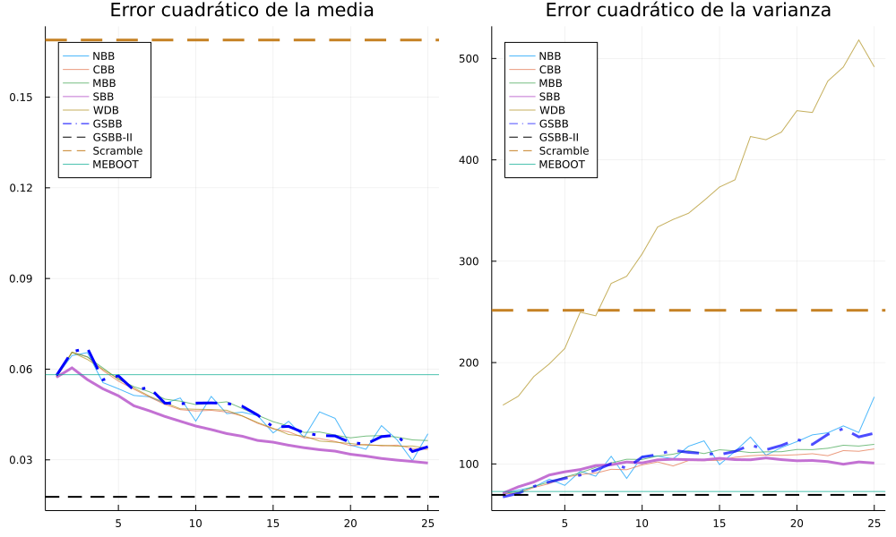
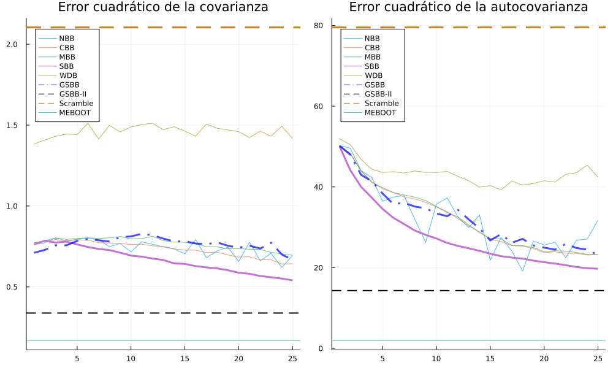
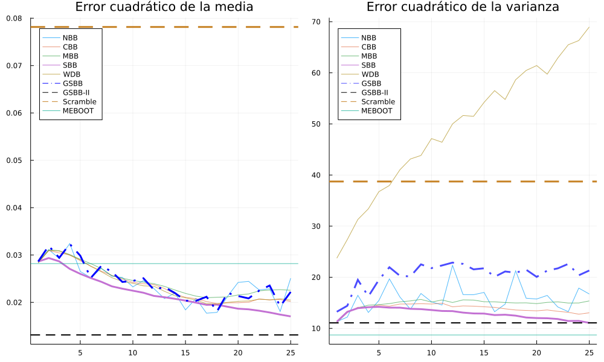
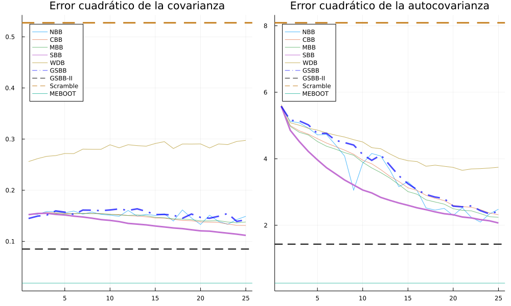

# Métodos de remuestreo de *block bootstrap*

## Revisión de literatura

- En esta sección se hace un breve resumen de literatura en el tema de metodologías de remuestreo de bloque para series de tiempo. 
- A continuación se describen algunos elementos en común encontrados en dichos documentos.
 
### Elementos en común en la literatura revisada

- En los artículos revisados, los autores suponen que las series de tiempo son *estacionarias en covarianza*, es decir, que poseen una media y una varianza incondicional que es constante, además de una función de autocovarianza que depende solo de la distancia entre rezagos. 

- El desempeño de las metodologías de remuestreo se compara utilizando el error cuadrático medio del estimador de la varianza incondicional, o bien, analizando sus propiedades de sesgo y varianza.

- Este tipo de literatura estadística es bastante rigurosa. Los documentos que proponen una metodología de muestreo usualmente incluyen demostraciones teóricas muy rigurosas de las propiedades de convergencia de los estadísticos (tanto de la media y varianza incondicional) para justificar teóricamente la utilización de dichos métodos. 

- Con cada metodología de remuestreo, se utilizan diferentes modelos de series de tiempo, en los cuales se conocen las propiedades estadísticas del proceso. Esto permite obtener el error cuadrático medio de los procedimientos de remuestreo. 

- En los documentos se incluyen demostraciones de la consistencia de estimadores más generales, que pueden ser representados como "funciones suaves" de la media del proceso.  
  - Por ejemplo, Lahiri (2003) incluye demostraciones de la consistencia de los estadísticos de autocovarianza y de la función de autocorrelación muestral para los métodos de *Moving Block Bootstrap* (MBB), *Nonoverlapping Block Bootstrap* (NBB), *Circular Block Bootstrap* (CBB), y *Stationary Block Bootstrap* (SBB). 

 
### *Automatic block-length selection for the dependent bootstrap*

- En Politis y White (2004, 2009) se expone una metodología de selección del
  tamaño óptimo de bloque para los métodos de *Circular Block Bootstrap* y *Stationary Block Bootstrap*. 
- Esta metodología se fundamenta en los métodos de análisis espectral para seleccionar el tamaño de bloque que minimiza el error cuadrático medio del estimador de la varianza incondicional de la serie de tiempo. 
- Se determinan fórmulas cerradas para el tamaño de bloque óptimo para las metodologías de CBB y SBB.
  - La fórmula para el CBB, de acuerdo con los autores también es aplicable a la metodología de MBB.

- Los autores recomiendan analizar el correlograma para determinar el ancho de banda a utilizar en la estimación de la función de densidad de potencia. 
  - Con este análisis es posible generar un algoritmo que obtenga el ancho de banda automáticamente a través del correlograma, y a su vez, obtener los elementos necesarios para el cálculo del tamaño de bloque óptimo. 
  - Este procedimiento está implementado en el paquete de Julia denominado [DependentBootstrap.jl](https://github.com/colintbowers/DependentBootstrap.jl).
- El ancho de banda de los métodos espectrales se determina utilizando el doble del rezago máximo en el que la función de autocorrelación es estadísticamente distinta de cero.

### *Maximum Entropy Bootstrap for Time Series* 

- Vinod y López de Lacalle (2009) detallan un algoritmo para obtener remuestras de una serie de tiempo. Dicho algoritmo preserva la forma básica de la serie de tiempo y la estructura de dependencia en la función de autocorrelación. 
- Algunas características importantes: 
  - No requiere que la serie de tiempo sea estacionaria, es aplicable a series de tiempo con tendencia y estacionalidad.
  - Genera nuevos valores en el remuestreo, no solamente los observados en la serie de tiempo. Es decir, el remuestreo puede generar valores fuera del rango determinado por el valor mínimo y máximo de la serie de tiempo. 

- Utiliza distribuciones uniformes definidas entre los intervalos formados por los valores ordenados de la serie de tiempo. Con la combinación de dichas distribuciones, se genera una distribución de "máxima entropía", de la cual se obtienen percentiles aleatoriamente para generar las nuevas muestras. 
- El documento fue publicado junto con su librería en R, pero se encontró la implementación en el paquete [Boostrap.jl](https://github.com/juliangehring/Bootstrap.jl) de Julia. 

### *The Wild Dependent Bootstrap*

<!-- (Incluir acá algo del tapering? para explicar por qué se afectan los residuos con la serie W) -->
- Shao (2010) expone una metodología alternativa a los métodos de remuestreo de bloque, denominada *Wild Dependent Bootstrap* (WDB).
- La idea utiliza el concepto de *tapering*, utilizado anteriormente por Paparoditis y Politis (2001) con su *Tapered Block Bootstrap*. Esta idea consiste en mantener la estructura de autocovarianza empleando una serie de tiempo auxiliar $W$ para afectar a la serie de tiempo original. 
  - Dicho proceso $W$ se escoge para reflejar la estructura de dependencia de la serie de tiempo, pero *reducir gradualmente* el efecto de las componentes de autocovarianza en la serie de tiempo.  
  
#### Procedimiento de remuestreo de WDB
- Para remuestrear una serie de tiempo $\lbrace X_t\rbrace_{t\in \mathbf{Z}}$ se utiliza la siguiente fórmula: 
$$X_{i}^{\ast} = \bar{X}_{n} + (X_i - \bar{X}_{n})W_i, \quad i = 1, \ldots, n$$ 
en donde $\bar{X}_{n}$ es la media muestral y el proceso $\lbrace W_i\rbrace_{i=1}^{n}$ es una variable aleatoria que satisface las siguientes condiciones: 
- $\mathbf{E}(W_t) = 0$
- $\mathrm{Var}(W_t) = 1$
- $\mathrm{Cov}(W_t, W_{t^\prime}) = a(\frac{t - t^\prime}{l})$, en donde $a(\cdot)$ es una función de ventana (*kernel*) y $l = l_n$ es un parámetro de ancho de banda, el cual juega un rol similar al tamaño del bloque en esas metodologías. 

#### Características del procedimiento de WDB

- El parámetro de ancho de banda no necesariamente debe ser un número entero, por lo que es posible alcanzar el MSE óptimo teórico del estimador de varianza de la serie de tiempo. 
- El método puede ser utilizado para series de tiempo *espaciadas irregularmente*, cuestión que supone dificultad para los métodos de bloque en la práctica. 
- **REVISAR ESTO:**
- De acuerdo con el autor, "*para series de tiempo regularmente espaciadas, este método puede ser superior a los otros métodos basados en bloques en términos de sesgo y error cuadrático medio de los estimadores de media y varianza*". 
- Se llevó a cabo una implementación en Julia de dicho algoritmo.

### *A generalized block bootstrap for seasonal time series*
- Dudek, Leśkow, Paparoditis y Politis (2013) proponen un método de remuestreo de bloques específico para series de tiempo con componentes periódicas o estacionales, denominado *Generalized Seasonal Block Bootstrap* (GSBB).
- Su motivación es que, coom argumentan sus autores, los procedimientos de *block bootstrap* no son directamente aplicables para datos estacionales. 
  - Esto puede observarse en las series de tiempo de las variaciones intermensuales del IPC: a pesar de que se sustrae la media estacional para poder aplicar los procedimientos de bloque, queda un remanente estacional en la serie de tiempo de los residuos, que se mezcla en la selección aleatoria de blqoues. 

#### Procedimiento de remuestreo de GSBB
- El algoritmo une bloques de tamaño $b$ pero hace coincidir el inicio de cada bloque con los bloques disponibles que empiecen con esa misma estación. 
  - Este algoritmo es exactamente el sugerido en la propuesta de Juan Carlos Castañeda, pero con dos diferencias: 
    - Se puede utilizar cualquier tamaño de bloque $b$ sin importar el largo de la periodicidad $d$ de la serie de tiempo. 
    - El GSBB no extiende la serie de tiempo más allá de las observaciones que se tienen. Es decir, si la serie de tiempo posee 120 observaciones, el algoritmo detalla cómo obtener otras 120 observaciones.
- Se llevó a cabo una implementación en Julia de dicho algoritmo.

### Otras posibles metodologías a revisar
- El documento revisado más reciente, titulado *Generalized seasonal tapered block bootstrap*, de Dudek, Paparoditis y Politis (2016) incluye una modificación al método de GSBB incluyendo ideas del *Tapered Block Bootstrap* de Paparoditis y Politis (2001). 
  - Los métodos de *tapering* alteran cuantitativamente los valores remuestreados al multiplicar por "funciones de ventana". 
  - Esta alteración en el método de remuestreo tiene el efecto de reducir el sesgo del estimador asintótico de la varianza de la media muestral (Paparoditis y Politis, 2001). 
  - En el *Tapering Block Bootstrap*, si la función de ventana es igual a 1 para todas las observaciones del bloque, este método se reduce al MBB (*Moving Block Bootstrap*). 

<!-- RESULTADOS DE EJERCICIO DE BLOQUE ÓPTIMO DE POLITIS Y WHITE -->

## Ejercicio de tamaño de bloque óptimo 

- En esta sección se obtienen resultados de la aplicación de la metodología de Politis y White (2004, 2009) para la obtención del tamaño de bloque óptimo para las metodologías de SBB y CBB (también aplicable a MBB). 
- A continuación se muestran gráficas del tamaño óptimo de bloque para cada una de las series de tiempo de variaciones intermensuales del IPC base 2000 y del IPC base 2010. 
  - En el eje horizontal se muestra el número de gasto básico. 
  - En el eje vertical el tamaño óptimo de bloque obtenido de acuerdo con la metodología. 
 
### Resultados en la base 2000 del IPC

### Resultados en la base 2010 del IPC

- Se observa que para la mayoría de gastos básicos, el tamaño de bloque obtenido es relativamente pequeño en comparación con la estacionalidad ($d=12$) de las series de tiempo. 
  - En la base 2000, el promedio está en $l=3.53$ para SBB y $l=3.98$ para CBB. El percentil del 95% se encuentra en $l=9.28$ para SBB y en $l=10.63$ para CBB. 
  - En la base 2010, el promedio está en $l=3.99$ para SBB y $l=4.55$ para CBB. El percentil del 95% se encuentra en $l=14.85$ para SBB y en $l=17$ para CBB. 

- Estos resultados sugieren que no todas las series de tiempo requieren el mismo tamaño de bloque, de acuerdo con sus características espectrales. 
- Además, se puede observar que para algunos gastos básicos, la metodología sugiere que se requieren bloques de mayor tamaño para representar apropiadamente la estructura de autocovarianza de las mismas. En estos gastos básicos el tamaño de bloque puede llegar a ser superior a 25. 
  

<!-- SECCIÓN DE PROPUESTA DE EJERCICIO DE SIMULACIÓN -->

## Ejercicio de simulación para comparar los métodos de remuestreo

- En esta sección se define una propuesta de ejercicio de simulación para propósitos de comparación y definición del método de remuestreo utilizado en la HEMI. 

- Se propone un ejercicio de simulación para comparar las propiedades de variabilidad de los métodos de remuestreo para el IPC. En concreto, dicho ejercicio pretende obtener intuición sobre qué métodos y parámetros (como el largo del bloque) son los más adecuados para remuestrear las bases del IPC. 
- La premisa sobre la que se fundamenta dicho ejercicio es que los métodos de remuestreo deben reflejar las propiedades de variabilidad de las series de tiempo que componen el IPC. En concreto, se evalúa tomando en cuenta que los métodos repliquen, de la manera más similar posible, la media, la varianza, la covarianza entre gastos básicos y la autocovarianza de cada una de las series de tiempo que componen el IPC. 

- Un enfoque similar se puede encontrar en Radovanov y Marcikić (2014), así como en Shao (2010)
- Se comparan las siguientes metodologías de remuestreo: 
  - Metodologías de bloque convencionales: NBB, MBB, CBB. 
  - *Stationary Block Bootstrap* (SBB): con bloque de tamaño aleatorio.
  - *Wild Dependent Bootstrap* (WDB)
  - *Generalized Seasonal Block Bootstrap* (GSBB)
  - GSBB con $b = 25$ y extensión de la serie de tiempo (denotado por GSBB-II) . 
  - *Maximum Entropy Bootstrap* (denotado por MEBOOT).
  - Remuestreo por selección IID de meses (denominado *Scramble* en los resultados)

- Para la aplicación de las siguientes metodologías de NBB, MBB, CBB, SBB y WDB se remuestrean las series de residuos en vez de las variaciones intermensuales de índices de precios. 
- Es decir, para cada serie de tiempo $v_{x,t}$ del gasto básico $x$ se sustrae la media del mes correspondiente al período $t$ y se trabaja con la serie residual.
$$v_{x,t} = \mu_{x, i} + \varepsilon_{x,t}, \quad i = (t \mod 12) \in \lbrace 0, 2, \ldots, 11\rbrace, i_{\text{dic}} = 0$$

- La idea es que la serie de tiempo de los residuos $\varepsilon_{x,t}$ en este modelo de promedios mensuales sea estacionaria y la estacionalidad esté controlada, pues se sustraen los promedios de cada mes. 
  - Sin embargo, en la base 2000 del IPC, debido a los efectos de la crisis financiera mundial de 2008-2009, la estacionariedad de las series parece invalidarse en estos períodos, aún con este modelo de promedios. 
- Después de remuestrear los residuos, se suma la serie de promedios mensuales para reconstruir apropiadamente las series de tiempo remuestreadas. 

### Procedimiento de simulación
- Se obtienen estimaciones de las propiedades de variabilidad de las series de tiempo de variaciones intermensuales de los índices de precios. 
- En cada base del IPC se tienen $G$ gastos básicos ($G \in \lbrace 218, 279\rbrace$). 
- Se computan los siguientes valores: 
  - Se obtiene la media de cada serie de tiempo $\mu_{1 \times G}$.
  - Se obtiene la matriz de varianzas y covarianzas $\Sigma_{G\times G}$. 
  - Se obtiene una matriz de las funciones de autocovarianza de los gastos básicos en las columnas $\Gamma_{L \times G}$ con $L=12$. 

- Para cada una de las metodologías de remuestreo $j$ en la realización $k$: 
  - Se remuestrea una base del IPC con la metodología $j$.
  - Se computa la media de las series de tiempo remuestreadas $\mu_{(1 \times G)}^{\ast_j(k)}$. 
  - Se obtiene la matriz de varianzas y covarianzas $\Sigma_{(G\times G)}^{\ast_j (k)}$.
  - Se obtiene la matriz de las funciones de autocovarianza $\Gamma_{(L \times G)}^{\ast_j (k)}$ con $L=12$. 
  - Se guardan estos resultados en cada $k=1, \ldots, K$, computar una medida de desviación respecto de los valores observados, los cuales son tomados como poblacionales para este ejercicio de simulación.

- Se computa una medida de resumen para las desviaciones del procedimiento de remuestreo $j$ respecto de los valores poblacionales para la media, la varianza, las covarianzas y las funciones de autocovarianza de las series de tiempo de la siguiente forma: 

- Para resumir el desempeño en términos de la media: 
$$ \overline{\text{MSE}}_{\mu, j} = \frac{1}{G} \sum_{x=1}^{G}\overline{\text{MSE}}_{\mu_x, j} = \frac{1}{G K} \sum_{x=1}^{G} \sum_{k=1}^{K} (\mu_{x}^{\ast_j(k)} - \mu_{x})^2 $$
- Esta medida resumen qué tanto se desvía el procedimiento de remuestreo $j$ de la media incondicional estimada de los gastos básicos. Es decir, qué tan bien el procedimiento de muestreo $j$ está recreando en el remuestreo la media (observada) de las series de tiempo del IPC. 

- Para resumir el desempeño en términos de la varianza, sumamos sobre la diagonal principal de $\Sigma$: 
$$ \overline{\text{MSE}}_{\sigma, j} = \frac{1}{G} \sum_{x=1}^{G}\overline{\text{MSE}}_{\sigma_x, j} = \frac{1}{G K} \sum_{x=1}^{G} \sum_{k=1}^{K} (\Sigma_{x,x}^{\ast_j(k)} - \Sigma_{x,x})^2 $$

- Para resumir el desempeño en términos de la covarianza entre gastos básicos, sumamos sobre la matriz triangular inferior de $\Sigma$. Con $I = \lbrace 1,\ldots, G \rbrace$: 
$$ \overline{\text{MSE}}_{\sigma_{xy}, j} = \frac{1}{\frac{G(G-1)}{2} K} \sum_{k=1}^{K} \sum_{ \substack{x,y \in I, \\ x < y}} (\Sigma_{x,y}^{\ast_j(k)} - \Sigma_{x,y})^2 $$

- Para resumir el desempeño en términos de la autocovarianza de los gastos básicos:  
$$ \overline{\text{MSE}}_{\gamma, j} = \frac{1}{G} \sum_{x=1}^{G}\overline{\text{MSE}}_{\gamma_x, j} = \frac{1}{G K L} \sum_{x=1}^{G} \sum_{l=1}^{L} \sum_{k=1}^{K} (\Gamma_{l,x}^{\ast_j(k)} - \Gamma_{l,x})^2 $$

- Nuevamente, la idea de estas medidas de resumen es obtener una medida de la desviación de las metodologías de remuestreo respecto de las características de variabilidad observada en las series de tiempo de cada base en el IPC. 
- A continuación, se presentan los resultaods obtenidos para las diferentes metodologías de remuestreo con $K=10,000$. 
  - El eje horizontal representa el tamaño de bloque en la metodología. En el SBB representa el tamaño de bloque esperado y en el WDB el parámetro de ancho de banda. 
  - El eje vertical representa las diferentes medidas de resumen expuestas con anterioridad.

### Resultados en la base 2000 del IPC

### Resultados en la base 2010 del IPC

 

- A continuación se presenta un resumen de los tamaños de bloque que minimizan el error sobre la autocovarianza en las diferentes metodologías: 
  - Se utiliza la autocovarianza porque es la que muestra una mayor disminución conforme aumenta el tamaño de bloque. 

- Resultados en la base 2000 del IPC:

| Método $j$ | $\overline{\text{MSE}}_{\mu, j}$ | $\overline{\text{MSE}}_{\sigma, j}$ | $\overline{\text{MSE}}_{\sigma_{xy}, j}$ | $\overline{\text{MSE}}_{\gamma, j}$ | $l$ | Simulaciones |
|------------|----------------------------------|-------------------------------------|------------------------------------------|-------------------------------------|-----|--------------|
| NBB        | 0.0458627                        | 108.601                             | 0.722809                                 | 19.1646                             | 18  | 10,000       |
| MBB        | 0.0363794                        | 119.332                             | 0.69549                                  | 23.2177                             | 25  | 10,000       |
| CBB        | 0.0337768                        | 112.479                             | 0.641703                                 | 23.122                              | 24  | 10,000       |
| SBB        | 0.0289566                        | 100.853                             | 0.54069                                  | 19.7309                             | 25  | 10,000       |
| Scramble   | 0.168909                         | 251.546                             | 2.10401                                  | 79.5187                             | 1   | 10,000       |
| MEBOOT     | 0.0581758                        | 72.8073                             | 0.168742                                 | 1.9613                              | 120 | 10,000       |
| GSBB       | 0.0343441                        | 130.294                             | 0.667043                                 | 23.0947                             | 25  | 10,000       |
| GSBB-II    | 0.017751                         | 69.4646                             | 0.338418                                 | 14.3235                             | 25  | 10,000       |
| WDB        | 0.0383825                        | 380.329                             | 1.4321                                   | 39.2876                             | 16  | 10,000       |

- Resultados en la base 2010 del IPC:
  
| Método $j$ | $\overline{\text{MSE}}_{\mu, j}$ | $\overline{\text{MSE}}_{\sigma, j}$ | $\overline{\text{MSE}}_{\sigma_{xy}, j}$ | $\overline{\text{MSE}}_{\gamma, j}$ | $l$ | Simulaciones |
|------------|----------------------------------|-------------------------------------|------------------------------------------|-------------------------------------|-----|--------------|
| NBB        | 0.0228729                        | 13.2697                             | 0.133452                                 | 2.09628                             |  23 |        10,000 |
| MBB        | 0.0225591                        | 15.3719                             | 0.13794                                  | 2.23895                             |  25 |        10,000 |
| CBB        | 0.0201833                        | 13.0462                             | 0.131169                                 | 2.31665                             |  25 |        10,000 |
| SBB        | 0.0170434                        | 11.0763                             | 0.111765                                 | 2.06842                             |  25 |        10,000 |
| Scramble   | 0.0781563                        | 38.7323                             | 0.527435                                 | 8.08978                             |   1 |        10,000 |
| MEBOOT     | 0.0281866                        | 8.71368                             | 0.0183661                                | 0.259309                            | 120 |        10,000 |
| GSBB       | 0.0191781                        | 20.3845                             | 0.139076                                 | 2.34147                             |  24 |        10,000 |
| GSBB-II    | 0.0131248                        | 11.0809                             | 0.0850226                                | 1.43194                             |  25 |        10,000 |
| WDB        | 0.0203064                        | 59.7415                             | 0.282657                                 | 3.65202                             |  21 |        10,000 |

- Las líneas horizontales tienen un tamaño de bloque fijo. Por ejemplo, el método de remuestreo por meses de ocurrencia podría considerarse en estas gráficas como un método de remuestreo de bloques de tamaño igual a uno, con diferentes bloques para cada gasto básico. 
- Note que la diferencia entre el método de GSBB y GSBB-II, cuando $l=25$ es que el segundo extiende las observaciones en el remuestreo de 120 a 300 períodos. En las gráficas se puede observar que esto tiene el efecto de mejorar el desempeño de la metodología de remuestreo en todas las métricas obtenidas.
  - Es decir, mientras más largas sean las series de tiempo, estas métricas de variabilidad experimentan un cambio de nivel respecto de las metodologías que preservan el largo de la serie de tiempo. 

- Respecto de la media: 
  - Se puede observar que en ambas bases del IPC, a medida que aumenta el tamaño de bloque, el error va disminuyendo. Esto puede reflejar la consistencia de los métodos de remuestreo en generar un estimador de la media incondicional que es consistente a medida que aumenta el tamaño de bloque. 

- Respecto de la varianza: 
  - En Shao (2010) se observa un efecto similar, el error promedio aumenta y es máximo en un determinado tamaño de bloque y posteriormente, va disminuyendo gradualmente, conforme aumenta el tamaño de bloque. En algunas de las metodologías de remuestreo, parece converger más lentamente, o bien, estabilizarse en un nivel más alto de error. 
  - En este caso, las metodologías con mejor desempeño en términos de varianza son las de *Stationary Block Bootstrap* y la variante GSBB-II. 

- Respecto de la covarianza: 
  - Se observa que el error disminuye en todas las metodologías de bloque conforme aumenta el tamaño de bloque.
  - El error de la metodologías de bloque puede llegar a ser entre 5 y 6 veces menor que el que se obtiene con el método de *Scramble*. 

- Respecto de la autocovarianza: 
  - Se observa una disminución del error más que proporcional conforme aumenta el tamaño de bloque. En general, los valores mínimos de error se obtienen en los tamaños de bloque máximos, exceptuando la metodología de *Nonoverlapping Block Bootstrap*. 
  - El error de la metodologías de bloque puede llegar a ser hasta 4 veces menor que el que se obtiene con el método de *Scramble*. 

<!-- Conclusiones sobre metodologías específicas descritas hasta el final -->

- En el caso del método de remuestreo de WDB, se observa que la varianza aumenta conforme aumenta el parámetro de ancho de banda.  
  <!-- - Debido a que se utilizó una función de ventana con un decaimiento más lento que otras de las funciones de ventana indicadas en la literatura, esto podría haber aumentado la variabilidad de las series del IPC al multiplicar por la componente $W$.  -->
  - Es posible que el desempeño del método mejore al cambiar la función de ventana. En particular, se utilizó una ventana de Bartlett, pero el autor menciona otras en su publicación. 
  <!-- - Quizás el parámetro de ancho de banda está en una escala diferente que el tamaño de bloque y se debería utilizar valores mucho mayores para que el desempeño de esta metodología sea similar al de las otras.  -->
  - Posiblemente se requiera mayor calibración para obtener mejores resultados. 
 

- Respecto al método de remuestreo de máxima entropía, se observa que, en general, posee un bajo error de variabilidad en términos de varianza, covarianza y autocovarianza. Sin embargo, el error en la media es alto en comparación con los niveles que alcanzan las diferentes metodologías conforme aumenta el tamaño de bloque. 
  - Cuando se observan ejemplos de remuestreo de esta metodología se observa que en general introduce muy poca variabilidad alrededor de la serie de tiempo remuestreada. La serie remuestreada se parece mucho a la serie de tiempo original, excepto por ligeras diferencias en algunos períodos. Esto hace que las métricas de error descritas sean en general las mejores, excepto en el caso de la media. 
  - Sin embargo, podría ser el caso de que con esta metodología de remuestreo no se genere suficiente variabilidad para capturar adecuadamente las métricas de error en la evaluación de medidas, ya que las series remuestreadas son muy similares a los datos observados.  

- Cabe destacar el caso de la metodología de *Stationary Block Bootstrap*. A pesar de ser una metodología de bloque, la característica de aleatoriedad del largo de bloque permite que disminuya más rápidamente y quede en niveles inferiores a los del resto de las metodologías de bloque, incluso la metodología estacional GSBB. 
  - La razón de esto puede ser un reflejo de los resultados obtenidos en la metodología de Politis y White para los datos del IPC. Se observaba que la mayoría de gastos básicos tenían tamaños de bloques mucho menores a los de la estacionalidad de la serie. 
  - Como en el SBB el tamaño de bloque se escoge aleatoriamente, esto parece mejorar significativamente los resultados de desempeño respecto a las otras metodologías de bloque.
  - Esta metodología es la más cercana en el desempeño observado de la metodología GSBB-II sin extender los períodos de las series de tiempo. 
 
## Referencias

- Selección del largo de bloques: 
  - Politis, D. N., & White, H. (2004). **Automatic block-length selection for the dependent bootstrap**. Econometric reviews, 23(1), 53-70.
  - Patton, A., Politis, D. N., & White, H. (2009). **Correction to “Automatic block-length selection for the dependent bootstrap” by D. Politis and H. White**. Econometric Reviews, 28(4), 372-375.
- Libros:
  - Lahiri, S. N. (2003). **Resampling methods for dependent data**. Springer Science & Business Media.
- Block bootstrap para series de tiempo estacionales: 
  - Dudek, A. E., Leśkow, J., Paparoditis, E., & Politis, D. N. (2013). **A generalized block bootstrap for seasonal time series**. Journal of Time Series Analysis, 35(2), 89-114.
  - Dudek, A. E., Paparoditis, E., & Politis, D. N. (2016). **Generalized seasonal tapered block bootstrap**. Statistics & Probability Letters, 115, 27-35.
  - Dudek, A. E. (2018). **Block bootstrap for periodic characteristics of periodically correlated time series**. Journal of Nonparametric Statistics, 30(1), 87-124.

- Evaluación de métodos de block bootstrap: 
  - Radovanov, B., & Marcikić, A. (2014). **A comparison of four different block bootstrap methods**. Croatian Operational Research Review, 189-202.

- Otras metodologías de bootstrap para datos dependientes: 
  - Paparoditis, E., & Politis, D. N. (2001). **Tapered block bootstrap**. Biometrika, 88(4), 1105-1119.
  - Shao, X. (2010). **The dependent wild bootstrap**. Journal of the American Statistical Association, 105(489), 218-235.
  - Vinod, H. D., & López-de-Lacalle, J. (2009). **Maximum entropy bootstrap for time series: the meboot R package**. Journal of Statistical Software, 29(5), 1-19.
