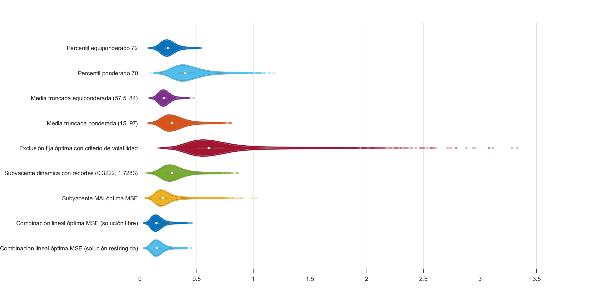
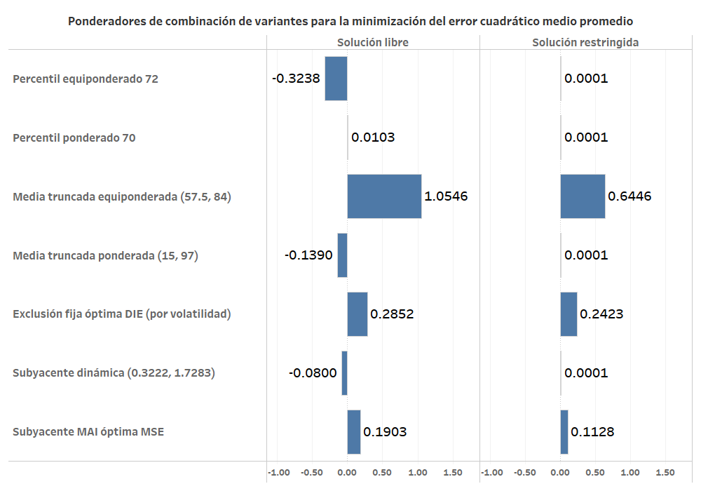
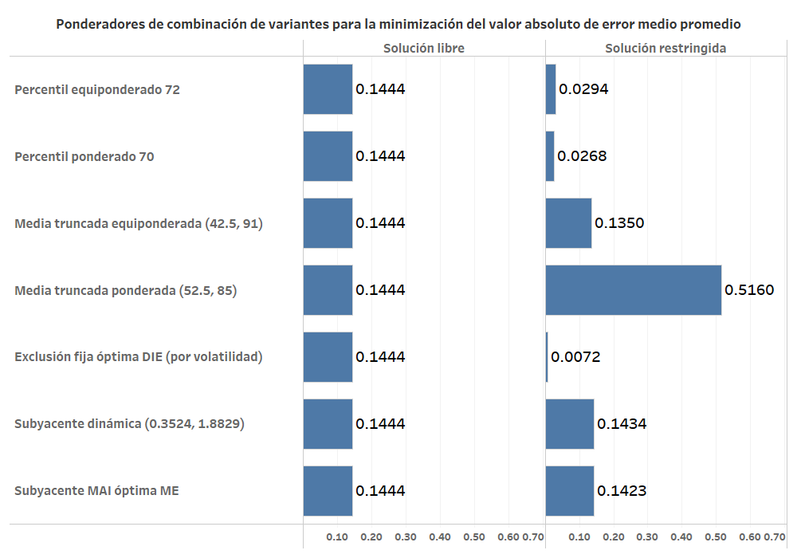

# Optimización de la combinación lineal de variantes de medidas de inflación subyacente

## Combinación lineal que minimiza el MSE promedio

- Se aplica la misma metodología de combinación lineal óptima utilizada en la optimización de la inflación subyacente MAI.
- La metodología de combinación se aplica utilizando las medidas de inflación con menor MSE de cada método de cómputo. 
- Se obtiene una solución libre y una solución restringida (ligeramente subóptima).
- En la variante de optimización restringida:
  - Se requiere que los ponderadores sean positivos y que su suma sea igual a 1. 
  - Se utiliza como punto inicial una distribución uniforme de ponderadores y una distribución de ponderadores construidos con base en el inverso de los valores de MSE promedio de cada medida y se obtienen los mismos resultados.

### Minimización de MSE promedio
- Medidas de inflación incluidas en la combinación lineal y se obtienen los siguientes ponderadores.

| **Medida de inflación**                           | $\overline{\text{MSE}}$ | $\hat{w}_{\text{libre}}$ | $\hat{w}_{\text{rest}}$ |
| :------------------------------------------------ | :---------------------: | -----------------------: | ----------------------: |
| Percentil equiponderado 72                        |         0.2498          |                  -0.3238 |                  0.0001 |
| Percentil ponderado 70                            |         0.4149          |                   0.0103 |                  0.0001 |
| Media truncada equiponderada (57.5, 84)           |         0.2171          |                   1.0546 |                  0.6446 |
| Media truncada ponderada (15, 97)                 |         0.2948          |                  -0.1390 |                  0.0001 |
| Exclusión fija óptima con criterio de volatilidad |         0.6414          |                   0.2852 |                  0.2423 |
| Subyacente dinámica con factores (0.3222, 1.7283) |         0.2906          |                  -0.0800 |                  0.0001 |
| Subyacente MAI óptima MSE                         |         0.2162          |                   0.1903 |                  0.1128 |

- ***Combinación lineal óptima MSE promedio (solución libre)***

$$\overline{\text{MSE}} = 0.151965$$ 

- Suma de ponderadores: *0.9975*

- ***Combinación lineal óptima MSE promedio (solución restringida)***

$$\overline{\text{MSE}} = 0.156907$$

- Suma de ponderadores: *1.0000*

### Trayectorias históricas de medidas de inflación que minimizan el MSE promedio

--- 
## Ejercicio de optimización sin la medida de exclusión fija
- En este ejercicio se lleva a cabo la minimización del error cuadrático medio de la combinación lineal de medidas de inflación. 
- Se excluye la medida de inflaciíon denominada ***Exclusión fija óptima con criterio de volatilidad***

### Minimización de MSE 
- Medidas de inflación incluidas en la combinación lineal: 

| **Medida de inflación**                           | $\overline{\text{MSE}}$ | $\hat{w}_{\text{libre}}$ | $\hat{w}_{\text{rest}}$ |
| :------------------------------------------------ | :---------------------: | -----------------------: | ----------------------: |
| Percentil equiponderado 72                        |         0.2498          |                  -0.3852 |                  0.0000 |
| Percentil ponderado 70                            |         0.4149          |                   0.0642 |                  0.0499 |
| Media truncada equiponderada (57.5, 84)           |         0.2171          |                   0.8457 |                  0.4616 |
| Media truncada ponderada (15, 97)                 |         0.2948          |                   0.0487 |                  0.0691 |
| Subyacente dinámica con factores (0.3222, 1.7283) |         0.2906          |                   0.0004 |                  0.0095 |
| Subyacente MAI óptima MSE                         |         0.2162          |                   0.4153 |                  0.4099 |

- ***Combinación lineal óptima MSE promedio (solución libre)***  

$$\overline{\text{MSE}} = 0.192694$$ 

- Suma de ponderadores: *0.9891*
- ***Combinación lineal óptima MSE promedio (solución restringida)***  

$$\overline{\text{MSE}} = 0.193813$$

- Suma de ponderadores: *1.0000*

### Trayectorias históricas de medidas de inflación que minimizan el MSE promedio

---
## Combinación lineal que maximiza la correlación lineal promedio

- Se aplica la misma metodología de combinación lineal óptima utilizada en la optimización de la inflación subyacente MAI para maximizar el coeficiente de correlación lineal de evaluación.
  - La función objetivo a optimizar es la correlación promedio.
- La metodología de combinación se aplica utilizando las medidas de inflación con mayor correlación promedio de cada método de cómputo. 
- Se obtiene una solución libre y una solución restringida (ligeramente subóptima).

### Maximización del coeficiente de correlación lineal promedio
- Medidas de inflación incluidas en la combinación lineal: 

| **Medida de inflación**                           | $\bar{\rho}$ | $\hat{w}_{\text{libre}}$ | $\hat{w}_{\text{rest}}$ |
| :------------------------------------------------ | :----------: | -----------------------: | ----------------------: |
| Percentil equiponderado 80                        |   0.985750   |                   0.0859 |                  0.1127 |
| Percentil ponderado 80                            |   0.975427   |                   0.0071 |                  0.0000 |
| Media truncada equiponderada (57.5, 92)           |   0.986799   |                   0.1380 |                  0.1548 |
| Media truncada ponderada (52.5, 97)               |   0.979170   |                  -0.0191 |                  0.0000 |
| Exclusión fija óptima con criterio de volatilidad |   0.973143   |                   0.1352 |                  0.1597 |
| Subyacente dinámica con recortes (0.3590, 2.5004) |   0.978045   |                  -0.0473 |                  0.0000 |
| Subyacente MAI óptima de correlación              |   0.986457   |                   0.5140 |                  0.5728 |

- ***Combinación lineal óptima para correlación promedio (solución libre)***

$$\overline{\rho} = 0.9887851$$ 

- Suma de ponderadores: *0.8137*

- ***Combinación lineal óptima para correlación promedio (solución restringida)***

$$\overline{\rho} = 0.9886683$$

- Suma de ponderadores: *1.0000*

### Trayectorias históricas de medidas de inflación que maximizan la correlación lineal promedio

 

---
## Combinación lineal que minimiza el valor absoluto de error medio promedio

- Se aplica la misma metodología de combinación lineal óptima utilizada en la optimización de la inflación subyacente MAI para minimizar el valor absoluto de error medio promedio.
- La metodología de combinación se aplica utilizando las medidas de inflación con menor valor asboluto de error medio promedio de cada método de cómputo. 
- Se obtiene una solución libre y una solución restringida.

--- 
### Minimización del valor absoluto de error medio promedio
- Medidas de inflación incluidas en la combinación lineal: 

| **Medida de inflación**                           | $\text{ME}$ | $\hat{w}_{\text{libre}}$ | $\hat{w}_{\text{rest}}$ |
| :------------------------------------------------ | :---------: | -----------------------: | ----------------------: |
| Percentil equiponderado 72                        |   -0.0620   |                   0.1444 |                  0.0294 |
| Percentil ponderado 70                            |   -0.0698   |                   0.1444 |                  0.0268 |
| Media truncada equiponderada (42.5, 91)           |   -0.0009   |                   0.1444 |                  0.1350 |
| Media truncada ponderada (52.5, 85)               |   0.0116    |                   0.1444 |                  0.5160 |
| Exclusión fija óptima con criterio de volatilidad |   -0.3053   |                   0.1444 |                  0.0072 |
| Subyacente dinámica con factores (0.3524, 1.8829) |   0.0000    |                   0.1444 |                  0.1434 |
| Subyacente MAI óptima ME                          |   0.0000    |                   0.1444 |                  0.1423 |

---

- ***Combinación lineal óptima para $|\overline{\text{ME}}|$ (solución libre)***

$$|\overline{\text{ME}}| = 0$$ 

- Suma de ponderadores: *1.0109*

- ***Combinación lineal óptima para $|\overline{\text{ME}}|$ (solución restringida)***

$$|\overline{\text{ME}}| = 0$$

- Suma de ponderadores: *1.0000*

### Trayectorias históricas de medidas de inflación que minimizan el valor absoluto de error medio promedio

