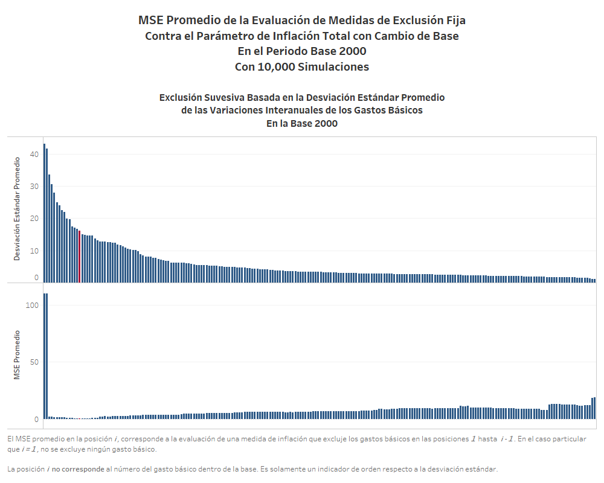
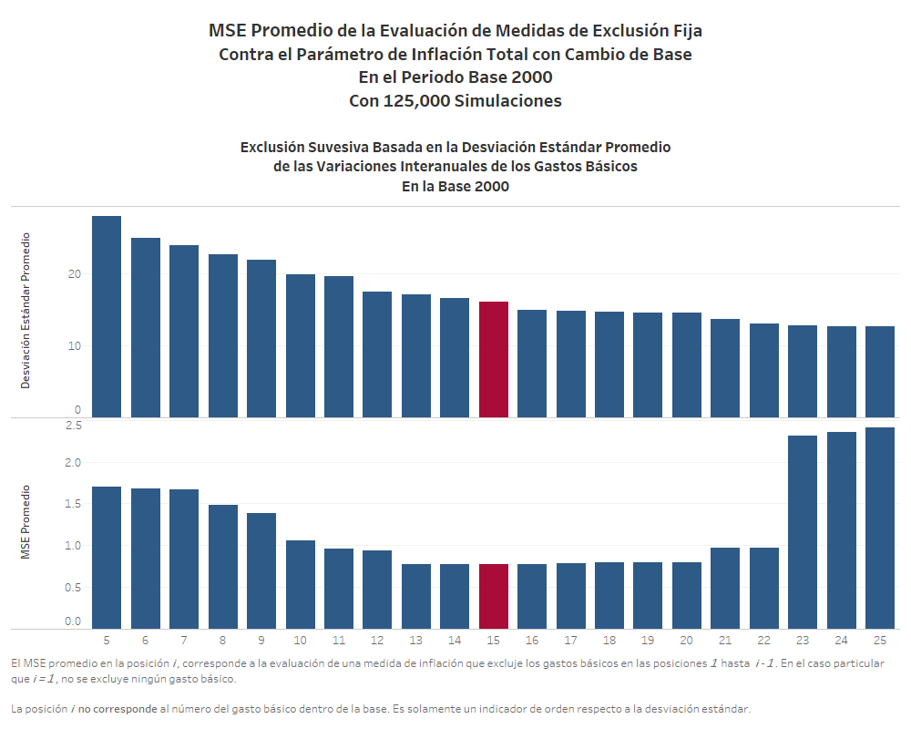
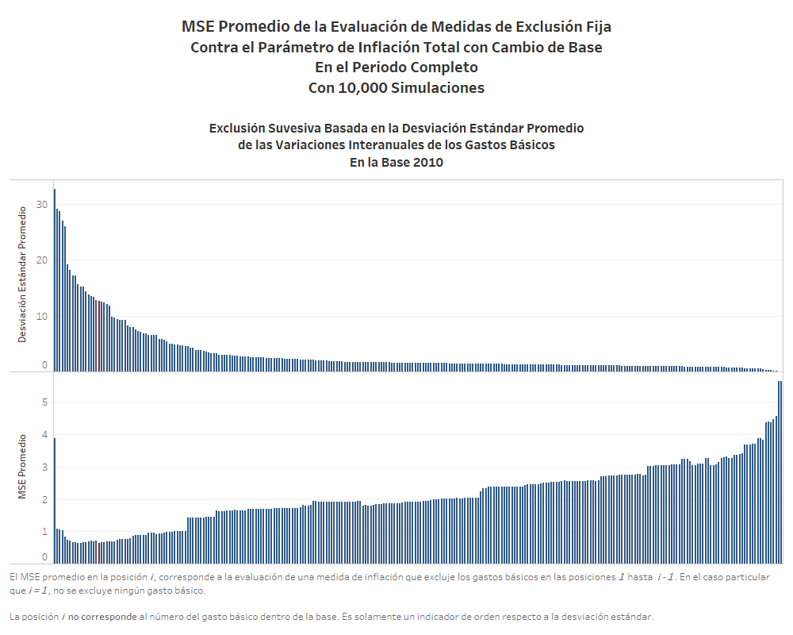
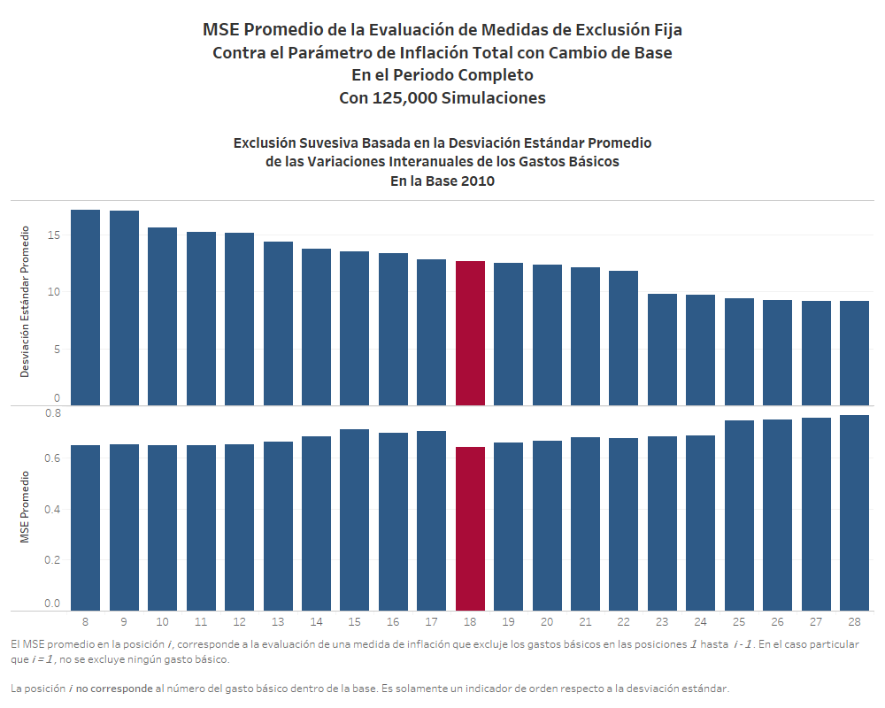
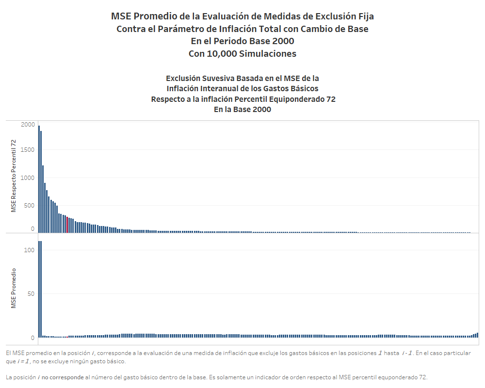
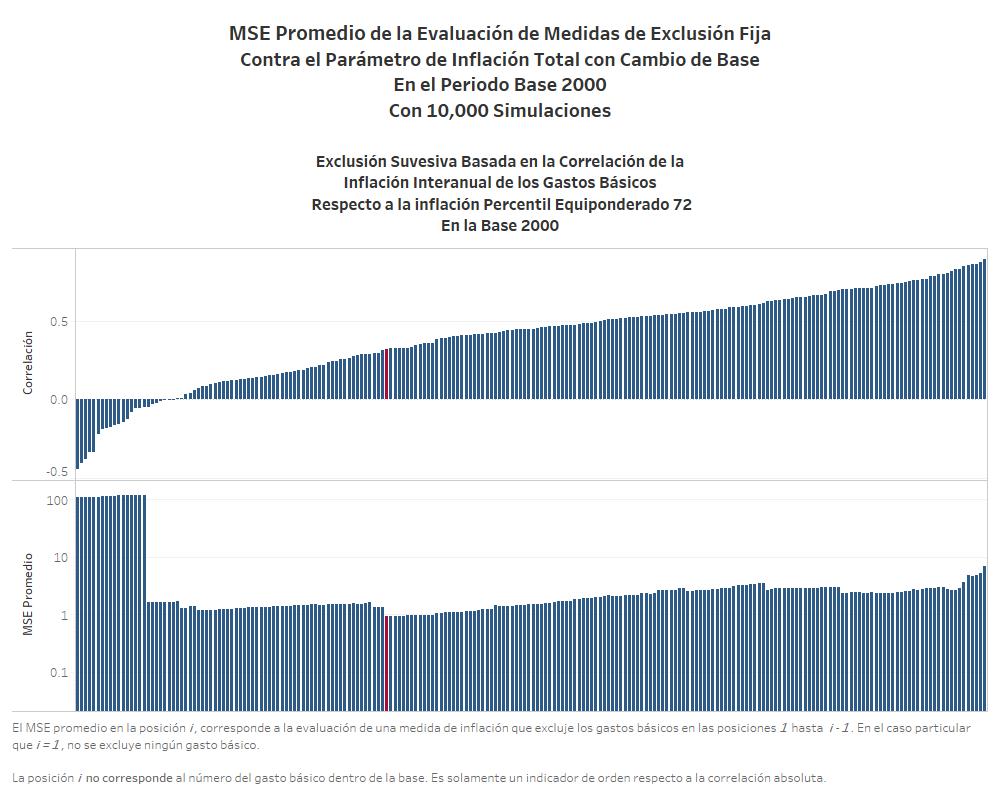
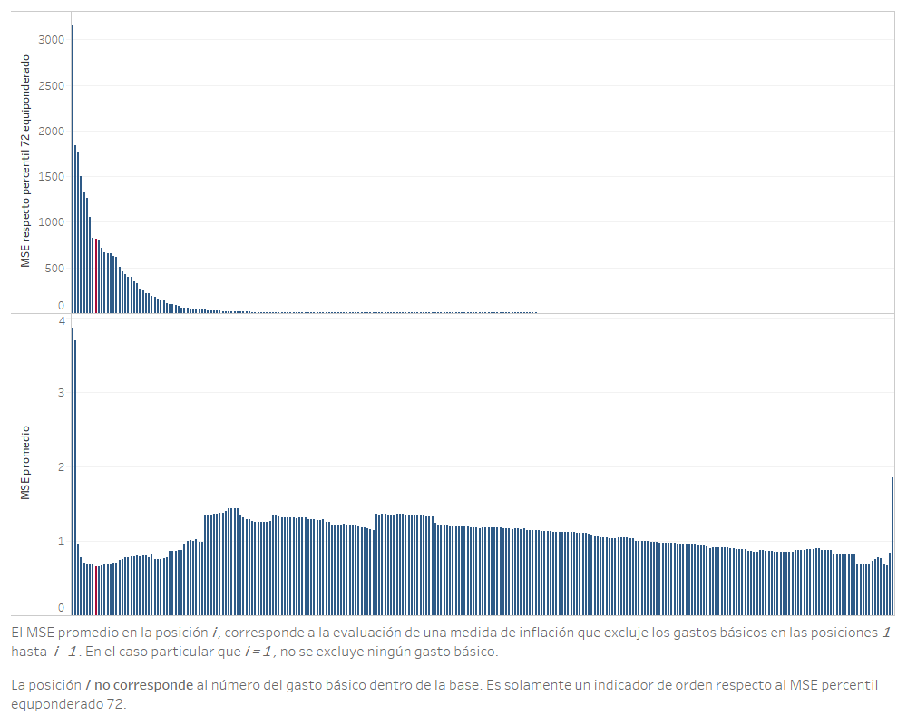
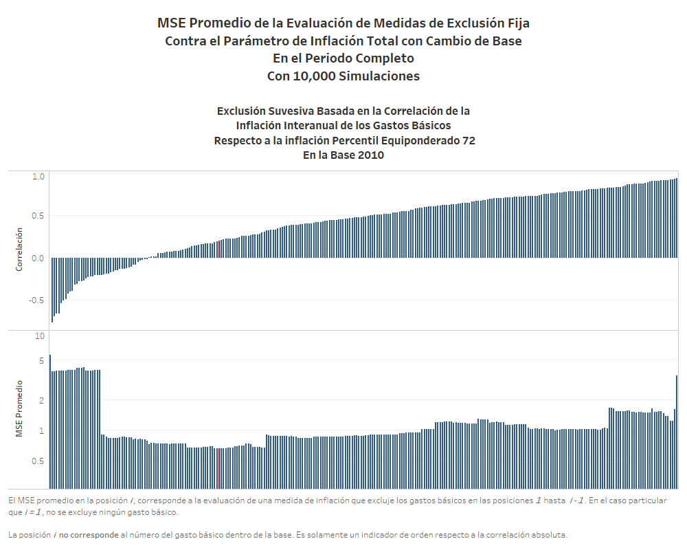
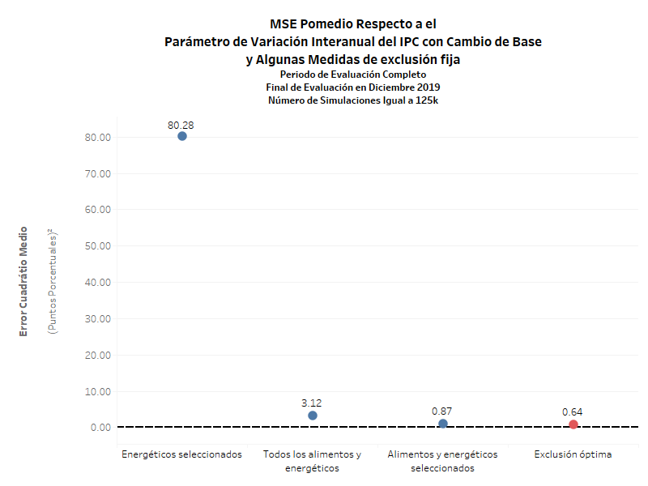

# Evaluación de medidas de inflación basadas en la exclusión de gastos básicos

En esta sección se documentan los resultados del proceso de evaluación de las medidas de inflación interanual basadas en la exclusión fija de algunos gástos básicos que componen el índice total de precios.

Además de esto, se expone un procedimiento por el cuál optimiza a exclusión de gastos básicos a través de la aplicación de la HEMI y un criterio de descarte de los mismos.

## Medidas de exclusión fija a evaluar que no requieren proceso de optimización

En este apartado se definen las medidas de inflación subyacente de exclusión fija que serán evaluadas por la HEMI.

1. Medida de inflación subyacente de exclusión fija de alimentos y energéticos que forma parte del conjunto de medidas de inflación subyacente que integran la medida de Inflación Subyacente Oficial actualmente vigente en el Banco de Guatemala.

2.	Medida de inflación subyacente de exclusión fija de energéticos que forma parte del conjunto de medidas de inflación subyacente que integran la medida de Inflación Subyacente Oficial actualmente vigente en el Banco de Guatemala.

3.	Medida de inflación subyacente de exclusión fija de alimentos y energéticos en la cual queden excluidos todos los alimentos y todos los productos energéticos que forman parte del IPC de Guatemala.

## Medidas de exclusión fija a evaluar que requieren proceso de optimización

**Medida de inflación subyacente de exclusión fija óptima, por volatilidad**

Se determina, de manera óptima, la medida de inflación subyacente que excluye a los gastos básicos que han tenido mayor volatilidad (en la variación intermensual de sus respectivos números índices) en el período en el cual el IPC Base 200 y 2010 ha estado vigente.

Para encontrar tal medida, se utiliza el algoritmo siguiente:

1.	Para cada uno de los gastos básicos en cada base, hallar la desviación estándar de las variaciones intermensuales del respectivo índice de precios, desde el inicio de la base correspondiente hasta el final de la misma.

2.	Ordenar los gastos básicos en orden descendente de la mencionada desviación estándar.

3. Evaluar la medida de inflación subyacente que excluye cero gastos básicos (esto es lo mismo que evaluar la medida de inflación total o variación interanual del IPC).

4.	Realizar una evaluación exploratoria (10,000 simulaciones) excluyendo, sucesivamente, el gásto básico con mayor volatilidad.

5. Identificar la medida de exclusión fija que obtiene el menor *MSE*.

6. Seleccionar aquellas medidas de exclusión fija que descartan 10 gastos básicos más y 10 gastos básicos menos a la identificada en el paso 5.
   
7. Al conjunto de medidas seleccionado en el paso 6, realizar una evaluación con 125,000 simulaciones

8. Identificar la medida de exclusión (evaluadas tal como indica el paso 7) que obtenga el menor *MSE*

9. Identificar los gástos básicos excluidos y listarlos. 

Este proceso se realiza, en primer lugar, sobre la base 2000. Luego de obtener la medida de exclusión óptima en dicha base, se procede a realizar la optimización en la base 2010, evaluando el periodo completo junto a la medida de exclusión óptima hallada para la base 2000. 

 **Medida de inflación subyacente de exclusión fija óptima, por correlación con el Percentil 72 Equiponderado**

Se determina, de manera óptima, la medida de inflación subyacente que excluye a los gastos básicos cuyas respectivas series de variaciones interanuales de los índices de precios correspondientes tienen las menores correlaciones con la serie de las variaciones interanuales del índice de precios correspondiente a la medida de inflación denominada “Percentil 72 Equiponderado”.

El algoritmo es el mismo al anterio, con la diferencia que:

*	Para cada uno de los gastos básicos en cada base, se calcula la correlación entre la serie de la variación interanual del índice de precios respectivo y la serie de la variación interanual del índice de precios correspondiente a la medida de inflación denominada “Percentil 72 Equiponderado”, en los datos históricos de inflación de Guatemala. Esto sustituye al paso 1 en el algoritmo aplicado para la medida de inflación subyacente de exclusión fija óptima, por volatilidad.

*	Ordenar los gastos básicos en orden ascendente de la mencionada correlación. Esto sustituye al paso 2 en el algoritmo aplicado para medida de inflación subyacente de exclusión fija óptima, por volatilidad.

**Medida de inflación subyacente de exclusión fija óptima, por minimización de MSE respecto del Percentil 72 Equiponderado**

Se determina, de manera óptima, la medida de inflación subyacente que excluye a los gastos básicos cuyas respectivas series de variaciones interanuales de los índices de precios correspondientes tienen los mayores valores de MSE respecto de la serie de las variaciones interanuales del índice de precios correspondiente a la medida de inflación denominada “Percentil 72 Equiponderado”.

El algoritmo es el mismo al aplicado para la medida de inflación subyacente de exclusión fija óptima por volatilidad, con la diferencia que:

*	Para cada uno de los gastos básicos en cada base, se calcula el MSE de la serie de la variación interanual del índice de precios correspondiente respecto de la serie de la variación interanual del índice de precios de la medida de inflación denominada “Percentil 72 Equiponderado”, en los datos históricos de inflación de Guatemala. Esto sustituye al paso 1 en el algoritmo aplicado para la medida de inflación subyacente de exclusión fija óptima, por volatilidad.

*	Ordenar los gastos básicos en orden descendente del mencionado MSE. Esto sustituye al paso 2 en el algoritmo aplicado para medida de inflación subyacente de exclusión fija óptima, por volatilidad.

### **Resultados del proceso de optimización**

#### **Exclusión basada en volatilidad**

Para la base **2000**, los gastos básicos excluidos son:

* Tomate
* Güisquil
* Otras verdiras y hortalizas
* Frijol
* Cebolla
* Papa o patata
* Zanahoria
* Culantro o cilantro
* Gastos derivados del gas manufacturado y gases licuados de petróleo
* Gasolina
* Transporte urbano
* Transporte aéreo
* Otras cuotas fijas y extraordinarias en la educaión preprimaria y primaria
* Otras cuotas fijas y extraordinarios en la educación secundaria

De los cuales se destacaN la cebolla y el tomate, siendo los gástos básicos que mayor inciden en la volatilidad de la inflación. Tal y como se observa en la gráfica, al descartar estos dos productos, el mse promedio (con 10,000 simulaciones) pasa de un valor de 110.1 a 1.9. 

Para la base **2010**, evaluando en el periodo completo y utilizando la canasta anterior para calcular la medida de exclusión en la base 2000, se obtiene la siguiente canasta de exlcusión:

* Aguacate
* Tomate
* Güisquil
* Chile Pimiento
* Repollo
* lechuga
* Papa
* Zanahoria
* Culantro
* Hierbabuena
* Otras legumbres y hortalizas
* Gas propano
* Gasolina superior
* Gasolina regular
* Diesel
* Servicios de transporte aéreo

De los cuales se destaca el tomate, siendo el gástos básicos que mayor inciden en la volatilidad de la inflación en esta base. Tal y como se observa en la gráfica, al descartar este producto, el mse promedio (con 10,000 simulaciones) pasa de un valor de 3.87 a 1.08. 

#### **Exclusión fija óptima por correlación y MSE con el Percentil 72 Equiponderado**

Utilizando estos dos criterios, se llega a unas medidas de exclusión óptimas que se resumen en la tabla siguiente.

Medida de exclusión|Cantidad de Gastos Básicos Excluidos en la base 2000|Cantidad de Gastos Básicos Excluidos en la base 2010|MSE promedio en la base 2000||MSE promedio en la base 2010|
-|-|-|-|-|-|
Volatilidad|14|17|0.772|0.641|
Correlación respecto percentil equiponderado 72| 74|74|0.959|0.660|
MSE respecto percentil equiponderado 72| 14|8|0.860|0.659|

Cabe destacar que, sin importar el criterio, la exclusión de aquellos gastos básicos con mayor volatilidad permite tener una medida de inflación subyacente mejor evaluada. 

Tal y como se observa en las gráficas anteriores, la exclusión de ciertos gastos básicos (tomate y cebolla para la base 2000 y tomate para la base 2010) provoca gran disminución en la medida de exclusión evaluada.

Utilizando la información en la tabla resumen, se llega a la conclusión que el mejor criterio de exclusión es el que se realiza a través de la desviación estándar o volatilidad, dado que es la que genera el menor MSE promedio comparado con los otros criterios de exclusión.

## Resultados con criterios base

Aplicando el procedimiento de evaluación con los criterios de evaluación definidos con el período de evaluación hasta diciembre de 2019, se lleva a cabo la simulación de 125,000 realizaciones para cada una de las medidas de inflación interanual basadas en la exclusión fija de gastos básicos. 

Las 4 medidas seleccionadas se puede dividir en aquellas que pertenecen a la batería de medidas de inflación subyacente que sigue el Banguat, y aquellas que son propuesta en el presente documento. 

Las medidas que pertenecen a la batería Banguat son:
* Energéticos seleccionados
* Alimentos y energéticos seleccionados

La medidas denominada *Exclusión Óptima*, es la resultante del proceso de optimización de exclusión presentado anteriormente.

Se puede notar que la medida que únicamente excluye algunos energéticos seleccionados, es la que presenta un mayor MSE promedio, esto se debe a que dicha medida aún incluye algunos de los gastos básicos más volátiles como el tomate o la cebolla.

## Análisis de sensibilidad ante cambios en el período final de evaluación

Debido a que se considera el período completo de evaluación hasta diciembre de 2019, se realiza un análisis de sensibilidad que considera los resultados ante un cambio en el período final de evaluación. Se consideran los siguientes períodos finales de evaluación:

* Diciembre de 2018
* Junio de 2019

Los resultados se muestran en la gráfica que se muestra a continuación.

Como se puede observar, en todos los períodos finales considerados,la medida denominada *Exclusión óptima* resulta invariantemente óptima en términos del MSE de evaluación. Estos resultados muestran que dicha medida óptima no es sensible a cambios en los períodos finales de evaluación que están separados entre 6 meses y un año.

## Análisis de sensibilidad ante cambio en la medida de evaluación

Considerando los estadísticos de evaluación alternativos, se construye una gráfica que ilustra el desempeño de las medidas consideradas como óptimas en en el escenario base utilizando diferentes medidas de evaluación. Dicha gráfica se muestra a continuación.

Se puede observa que la medida *Exclusión óptima* es la que optimiza todos 4 de los 5 estimadores, siendo la excepción el Error Medio, donde la medida que resulta óptima es *Alimentos y energéticos seleccionados*. 

Se puede concluir que la medida *Exclusión óptima* no es sensible al cambio de estadísticos. 

## Análisis de sensibilidad ante cambios en el subperíodo de evaluación

A continuación, se presenta un análisis de sensibilidad de la evaluación al considerar un cambio en el período de evaluación. La siguiente gráfica ilustra la evaluación de las diferentes medidas exclusión en los diferentes períodos de evaluación, mientras que el escenario base se observa en la última fila, correspondiente al período completo.

Se puede notar que la medida *Exclusión óptima* permanece como la mejor evaluada sin importar el subperiodo de evaluación. Además se hace notar que el subperiodo de evaluación *2010* es la que presenta los MSE promedios más bajos en todas la medidas evaluadas. Por el contrario, el periodo con mayores MSE promedio corresponde al periodo de transición *2000-2010*.

## Análisis de sensibilidad ante cambios en la componente de tendencia

A continuación, se presenta un análisis de sensibilidad de la evaluación al considerar un cambio en la componente multiplicativa de tendencia en el procedimiento de evaluación. La siguiente gráfica ilustra la evaluación de las medidas de exclusión fija en tres escenarios de tendencia, siendo el escenario base el que se observa en la primera fila, correspondiente a la componente de tendencia de caminata aleatoria.

Se puede notar que la medida *Exclusión óptima* tiene el menor MSE promedio sin importar la tendencia aplicada. También se puede notar que la aplicación de una tendencia exponencial repercute en un MSE promedio más alto en todas las medidas de exclusión evaluadas. 

## Análisis de sensibilidad ante cambios en la trayectoria de inflación paramétrica

Ahora se presenta un análisis de sensibilidad de la evaluación al considerar un cambio en la trayectoria de inflación paramétrica del procedimiento de evaluación. La siguiente gráfica ilustra la evaluación de las diferentes medidas de exclusión fija utilizando tres diferentes parámetros de inflación, siendo el escenario base el que se observa en la primera fila, correspondiente a la evaluación respecto al parámetro de variación interanual del IPC con cambios de base.

Se puede notar que la medida *Exclusión óptima* tiene el menor MSE promedio sin importar el parámetro contra el que fue evaluada.

## Análisis de sensibilidad ante cambios en el número de simulaciones

En este caso, se realiza una prueba de sensibilidad cambiando el número de simulaciones a 500,000 realizaciones de las trayectorias de inflación muestral.

Como se muestra en la gráfica siguiente, los resultados coinciden sin mayor variabilidad. Esto se debe a que el número inicial de simulaciones es en realidad más que suficiente para la distribución del MSE de los estimadores muestrales basados en percentiles (en realidad, con alrededor de 10,000 simulaciones se tenía errores estándar de simulación muy pequeños).

## Análisis de sensibilidad ante cambios en el muestreo

Se realiza una prueba de sensibilidad utilizando como técnica de remuestreo la variante de nonoverlapping block bootstrap con bloques de 12 meses. El muestreo se realiza de forma independiente para cada unos de los gastos básicos en cada una de las bases del IPC. A continuación, se muestran los resultados en la gráfica siguiente.

## Distribuciones de simulación del MSE en las medidas óptimas

A continuación, se presentan gráficas de las distribuciones de simulación del MSE en el escenario base. Esta gráfica permite observar el rango, o amplitud, de la distribución de simulación del estadístico de evaluación a través de la gráfica de la distribución acumulada.

Se puede observar que la medida *Energéticos seleccionados* presenta la distribución de MSE promedio con mayor desviación estándar, asimetría y curtosis. Por el contrario, la medida denominada *Exclusión óptima* es la que presenta la menor curtosis y asimetría. 

A continuación, se muestra una gráfica similar, en la que se compara la amplitud de las distribuciones de simulación respecto al tipo de tendencia. Nuevamente, se observa que con cualquiera de los tres tipos de componentes de tendencia, se tienen distribuciones con mayor desviación estándar en la medida que solamente excluye alguno gastos básicos relacionado a energéticos.

En la siguiente gráfica, se compara la amplitud de las distribuciones de simulación en los diferentes períodos de evaluación. En este caso, se observa que las distribuciones con mayor rango son las del período de transición, en cualquiera de los escenarios de tendencia. Además, se hace notar que al tendencia exponencial es la que produce una mayor amplitud en los rangos de MSE en todas las medidas de exclusión fija, así como cualquier periodo de evaluación. 

## Análisis de trayectorias para los datos históricamente observados
