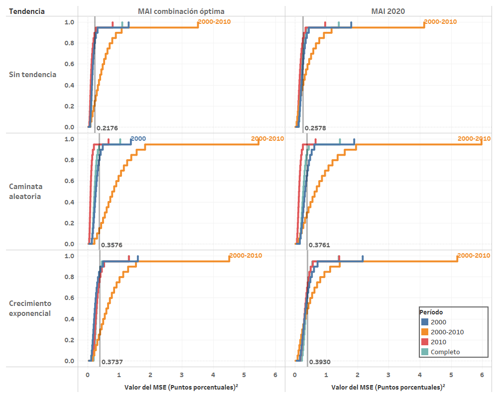

# Evaluación de medidas de inflación basadas en la metodología de muestra ampliada implícitamente

En esta sección se documentan los resultados del proceso de evaluación de las medidas de inflación interanual basadas en la metodología de muestra ampliada implícitamente (MAI).

## Variantes de inflación MAI
Las variantes están divididas en tres grupos: 

- **Medidas de inflación MAI-F**: llevan a cabo una reponderación de las variaciones intermensuales de cada mes utilizando la distribución histórica de ocurrencias de variaciones intermensuales. La reponderación se lleva a cabo utilizando $i$ segmentos de la distribución, en donde $i \in \lbrace 4, 5, 10, 20, 40\rbrace$. En adelante, estas variantes están denotadas por la denominación MAI-$i$,F.
- **Medidas de inflación MAI-G**: estas llevan a cabo una reponderación de las variaciones intermensuales de cada mes utilizando la distribución ponderada histórica de variaciones intermensuales. En adelante, estas variantes están denotadas por la denominación MAI-$i$,G.
- **Suma ponderada de las variantes MAI-F y MAI-G**: resultan de la combinación lineal de las medidas de inflación interanual que resultan de los dos procedimientos anteriores. La combinación lineal de las medidas MAI se expresa de acuerdo con la ecuación: 

$$\begin{aligned}
  \text{MAI}_{t} = \, & a_{f,4}\text{MAI}_{f,4,t} + a_{f,5}\text{MAI}_{f,5,t} + a_{f,10}\text{MAI}_{f,10,t} + a_{f,20}\text{MAI}_{f,20,t} + a_{f,40}\text{MAI}_{f,40,t} \\
  ~ & \; + a_{g,4}\text{MAI}_{f,4,t} + a_{g,5}\text{MAI}_{f,5,t} + a_{g,10}\text{MAI}_{f,10,t} + a_{g,20}\text{MAI}_{f,20,t} + a_{g,40}\text{MAI}_{f,40,t}
\end{aligned}$$

En adelante, se utiliza una combinación lineal denominada MAI 2020, la cual utiliza ponderaciones idénticas para cada una de las variantes de las medidas de inflación MAI-F y MAI-G y cuya suma es igual a uno. Es decir que, en este caso se utilizan $a_{f,i} = a_{g,i} = 1/10$.

### Optimización de la combinación lineal de trayectorias

En esta sección se describe el proceso de selección de los ponderadores óptimos para llevar a cabo la combinación lineal de trayectorias de inflación interanual de las variantes de MAI-F y MAI-G. Dicha selección de ponderadores se obtiene de un proceso de optimización, el cual se describe a continuación.

Con la trayectoria combinada $\text{MAI}_{t}$, se plantea un problema de optimización libre con respecto al $\overline{\text{MSE}}$ promedio obtenido del proceso de evaluación con criterios básicos. Para la combinación anterior, se puede notar que, dadas las realizaciones de las trayectorias, el estadístico de error cuadrático medio es función de los ponderadores de la combinación lineal:

$$\overline{\text{MSE}}(\mathbf{a}) = \frac{1}{T\,K}\sum_{k=1}^{K}\sum_{t=1}^{T} \left( \text{MAI}_{t}^{(k)}(\mathbf{a}) - \pi_t \right)^2$$ 

en donde: 
- el vector $\mathbf{a}$ representa las ponderaciones para cada una de las variantes de las medidas MAI. En particular, se utiliza el siguiente ordenamiento para los ponderadores: 
$$ \mathbf{a} = \left[ a_{f,4}, a_{g,4}, a_{f,5}, a_{g,5}, a_{f,10}, a_{g,10}, a_{f,20}, a_{g,20}, a_{f,40}, a_{g,40}\right]^T $$

- $k$ representa el número de realización en el ejercicio de simulación, respecto de un total de $K$ realizaciones.

- $\pi_t$ representa la trayectoria de inflación paramétrica en el período $t$. El total de períodos está dado por $T$.

La función que representa el valor esperado del error cuadrático medio $\overline{\text{MSE}}(\mathbf{a})$, es estrictamente convexa en los ponderadores $a_{f,i}$ y $a_{g,i}$, y por lo tanto, se deriva analíticamente una solución global, dada por la solución al sistema de ecuaciones obtenido a través de las condiciones de primer orden: 

$$ \left[\begin{matrix}
\overline{\text{MAI}_{f,4}^{2}} & \overline{\text{MAI}_{f,4}\,\text{MAI}_{g,4}} & \ldots & \overline{\text{MAI}_{f,4}\,\text{MAI}_{g,40}} \\
\overline{\text{MAI}_{f,4}\,\text{MAI}_{g,4}} & \overline{\text{MAI}_{g,4}^{2}} & \ldots & \overline{\text{MAI}_{g,4}\,\text{MAI}_{g,40}} \\
\vdots & \vdots & \ddots  & \vdots \\
\overline{\text{MAI}_{f,4}\,\text{MAI}_{g,40}} & \overline{\text{MAI}_{g,4}\,\text{MAI}_{g,40}} & \ldots & \overline{\text{MAI}_{g,40}^{2}}
\end{matrix}\right] 
\left[\begin{matrix} 
a_{f,4} \\ 
a_{g,4} \\
\vdots \\
a_{f,40} \\
a_{g,40} \\
\end{matrix}\right] = 
\left[\begin{matrix} 
\overline{\pi\,\text{MAI}_{f,4}} \\ 
\overline{\pi\,\text{MAI}_{g,4}} \\ 
\vdots \\ 
\overline{\pi\,\text{MAI}_{f,40}} \\ 
\overline{\pi\,\text{MAI}_{g,40}} \\ 
\end{matrix}\right]
$$

en donde, por ejemplo, $\overline{\text{MAI}_{f,4}\,\text{MAI}_{g,4}}$ representa el promedio a través del tiempo y realizaciones del producto de las trayectorias de inflación subyacente MAI con cuartiles que utilizan la distribución de ocurrencias y con la distribución ponderada de ocurrencias, es decir: 

$$\overline{\text{MAI}_{f,4}\,\text{MAI}_{g,4}} = \frac{1}{T\,K}\sum_{k=1}^{K}\sum_{t=1}^{T} \text{MAI}_{f,4,t}^{(k)}\,\text{MAI}_{g,4,t}^{(k)}$$

#### Ponderadores óptimos
Finalmente, los ponderadores óptimos obtenidos de la aplicación de este proceso resultan en: 

**Tabla.** *Ponderadores óptimos para la combinación lineal de las medidas de inflación basadas en métodos de muestra ampliada implícitamente*.

| Ponderador |    Valor |
| :--------: | -------: |
| $a_{f,4}$  |  0.79743 |
| $a_{g,4}$  |  0.11083 |
| $a_{f,5}$  | -0.29523 |
| $a_{g,5}$  | -0.03743 |
| $a_{f,10}$ |  0.23942 |
| $a_{g,10}$ | -0.02465 |
| $a_{f,20}$ | -0.08466 |
| $a_{g,20}$ |  0.04934 |
| $a_{f,40}$ |  0.16632 |
| $a_{g,40}$ |  0.05028 |

A continuación, se describen los resultados del proceso de evaluación.

## Resultados con los criterios básicos de evaluación
Aplicando el procedimiento de evaluación con los criterios básicos definidos, se lleva a cabo la simulación de 125,000 realizaciones para cada una de las variantes de medidas de inflación interanual del procedimiento de muestra ampliada implícitamente. En la siguiente figura, se observan los resultados de los tres grupos de variantes de inflación MAI. 

**Figura.** *MSE de evaluación de medidas de inflación basadas en métodos de muestra ampliada implícitamente*. 

Como se puede observar, la combinación lineal óptima que resulta del proceso de minimización del error cuadrático medio presenta un mejor desempeño que el promedio simple de la medida de inflación MAI 2020.

En la siguiente figura se muestra la descomposición aditiva del error cuadrático medio en sus componentes de sesgo, varianza o precisión y correlación, con respecto a la trayectoria de inflación paramétrica, al utilizar los criterios básicos de evaluación. Como se puede observar, la combinación MAI óptima resulta con el mejor desempeño en términos de sesgo y correlación con respecto a la trayectoria paramétrica de inflación. En términos de varianza, la medida con mejor desempeño es la MAI con renormalización de quintiles que utiliza la distribución de ocurrencias de variaciones intermensuales (MAI-5,F).

**Figura.** *Descomposición aditiva del MSE de evaluación de medidas de inflación basadas en métodos de inflación subyacente MAI*. 

A continuación, se presentan algunos análisis de sensibilidad respecto al escenario con los criterios básicos de evaluación.

## Análisis de sensibilidad

En esta sección se presentan los análisis de sensbilidad obtenidos en el ejercicio de evaluación de las medidas de inflación basadas en la metodología de muestra ampliada implícitamente.

### Análisis de sensibilidad ante cambios en el período final de evaluación

Debido a que se considera el período completo (hasta diciembre de 2019), como criterio básico de evaluación, a continuación se realiza un análisis de sensibilidad que considera los resultados ante un cambio en la fecha final del período de evaluación. Se consideran los siguientes períodos finales de evaluación:  

- Diciembre de 2018
- Junio de 2019
- Diciembre de 2019 (de acuerdo con los criterios básicos)
  
**Figura.** *Análisis de sensibilidad respecto del período final considerado en la evaluación*.

Como se puede observar, la combinación lineal que resulta del proceso de optimización es invariantemente la que presenta un mejor desempeño en todos los períodos finales considerados. Al igual que con otros tipos de medidas de inflación, estos resultados muestran que los ponderadores óptimos, obtenidos de la combinación lineal de medidas de inflación subyacente MAI, no son tan sensibles a cambios en las fechas finales del período de evaluación que están separadas entre 6 meses y un año.  

### Análisis de sensibilidad ante cambio en la medida de evaluación

Considerando estadísticos de evaluación alternativos, se construye una gráfica que ilustra el desempeño de las medidas consideradas como óptimas al aplicar los criterios básicos de evaluación utilizando diferentes medidas de evaluación. Dicha gráfica se muestra a continuación.   

**Figura.** *Análisis de sensibilidad respecto de la medida de evaluación*.

Como se puede observar, la combinación lineal MAI óptima presenta el mejor desempeño para todos los estadísticos de evaluación, excepto en el caso del error medio de simulación, cuyo valor más cercano a cero lo obtiene la medida de inflación que renormaliza utilizando 40 divisiones de la distribución de ocurrencias de variaciones intermensuales (MAI-40,F).

### Análisis de sensibilidad ante cambios en el subperíodo de evaluación

A continuación, se presenta un análisis de sensibilidad de la evaluación al considerar un cambio en el período de evaluación. La siguiente gráfica ilustra la evaluación de tres grupos de medidas de inflación con métodos de muestra ampliada implícitamente en los diferentes períodos de evaluación, mientras que el escenario con el criterio básico de evaluación observa en la última columna, correspondiente al período completo.  

**Figura.** *Análisis de sensibilidad respecto del subperíodo de evaluación*.

Como se observa, en todos los subperíodos de evaluación, excepto por el período de transición de cambio de base del IPC (de 11 meses de duración), la medida de inflación MAI óptima del período completo resulta con el mejor desempeño.

### Análisis de sensibilidad ante cambios en la componente de tendencia

A continuación, se presenta un análisis de sensibilidad de la evaluación al considerar un cambio en la componente multiplicativa de tendencia del procedimiento de evaluación. La siguiente gráfica ilustra la evaluación de los tres grupos de medidas de inflación con métodos de muestra ampliada implícitamente en tres escenarios de tendencia, siendo el escenario con criterios básicos el que se observa en la primera columna, correspondiente a la componente de tendencia de caminata aleatoria. 

**Figura.** *Análisis de sensibilidad ante cambios en la componente de tendencia*.

Como se puede observar, la medida de inflación MAI óptima es la que invariantemente presenta un mejor desempeño para cualquiera de las componentes de tendencia aplicadas en el proceso de muestreo. 

### Análisis de sensibilidad ante cambios en la trayectoria de inflación paramétrica

Ahora se presenta un análisis de sensibilidad de la evaluación al considerar un cambio en la trayectoria de inflación paramétrica del procedimiento de evaluación. La siguiente gráfica ilustra la evaluación de los tres grupos de medidas de inflación con métodos de muestra ampliada implícitamente  utilizando tres diferentes parámetros de inflación, siendo el escenario con criterios básicos de evaluación el que se observa en la primera columna, correspondiente a la evaluación respecto al parámetro de variación interanual del IPC con cambios de base.

**Figura.** *Análisis de sensibilidad respecto de la trayectoria de inflación paramétrica de evaluación*.

Respecto a los resultados de la evaluación al utilizar la variación interanual del IPC (segunda columna) como parámetro, se observa que provoca un gran aumento en los estadísticos de evaluación, bajo el cual, la medida con mejor desempeño es la que renormaliza utilizando cuartiles de la distribución de ocurrencias de variaciones intermensuales (MAI-4,F). 

Por su parte, respecto a los resultados de evaluación al utilizar la media ponderada interanual (tercera columna) como parámetro, se puede observar que son muy similares en magnitud a los obtenidos con el parámetro de variación interanual del IPC con cambios de base. 

### Análisis de sensibilidad ante cambios en el número de simulaciones

En este caso, se realiza una prueba de sensibilidad cambiando el número de simulaciones a 500,000 realizaciones de las trayectorias de inflación muestral.

Como se muestra en la gráfica siguiente, los resultados coinciden sin mayor variabilidad. Esto se debe a que el número inicial de simulaciones es en realidad más que suficiente para la distribución del MSE de los estimadores muestrales basados en métodos de muestra ampliada implícitamente (en realidad, con alrededor de 10,000 simulaciones se tenía errores estándar de simulación muy pequeños).  

**Figura.** *Análisis de sensibilidad ante cambios en el número de simulaciones*.

### Análisis de sensibilidad ante cambios en el muestreo

Se realiza una prueba de sensibilidad utilizando como técnica de remuestreo la variante de *nonoverlapping block bootstrap* con bloques de 12 meses. El muestreo se realiza de forma independiente para cada unos de los gastos básicos en cada una de las bases del IPC. A continuación, se muestran los resultados en la gráfica siguiente.  

**Figura.** *Análisis de sensibilidad ante cambios en el procedimiento de muestreo*.

Como se puede observar, los resultados son bastante similares a los obtenidos al realizar el procedimiento de muestreo por mismos meses de ocurrencia contemplado en los criterios básicos de evaluación. 

### Distribuciones de simulación del MSE en las medidas óptimas

A continuación, se presentan gráficas de las distribuciones de simulación del MSE aplicando los criterios básicos de evaluación. Esta gráfica permite observar el rango, o amplitud, de la distribución de simulación del estadístico de evaluación a través de la gráfica de la distribución acumulada. En este caso, se presentan únicamente las gráficas de las medidas obtenidas de la combinación lineal, tanto óptima como equitativa, las cuales presentaron el mejor desempeño al utilizar los criterios básicos de evaluación.

**Figura.** *Distribuciones de simulación del MSE de las medidas de inflación basadas en métodos de muestra ampliada implícitamente*.

Como se puede observar, la distribución del MSE de la medida de inflación MAI óptima se encuentra distribuida en un conjunto más estrecho que el error cuadrático medio de la combinación lineal equitativa MAI 2020. Ambas distribuciones presentan valores de asimetría positivos y niveles de curtosis mayores que tres, lo cual indica que gráficamente las distribuciones están mayormente sesgadas hacia la izquierda y son leptocúrticas.

A continuación, se muestra una gráfica similar, en la que se compara la amplitud de las distribuciones de simulación respecto al tipo de tendencia para ambas medidas. Nuevamente, se observa que con cualquiera de los tres tipos de componente de tendencia, se tienen distribuciones con mayor curtosis al utilizar la medida de inflación MAI combinación óptima. 

**Figura.** *Distribuciones de simulación del MSE de las medidas de inflación basadas en métodos de muestra ampliada implícitamente, utilizando criterios básicos, por tipo de tendencia aplicada en la evaluación*.

En la siguiente gráfica, se compara la amplitud de las distribuciones de simulación en los diferentes períodos de evaluación, para ambas medidas de inflación. En este caso, se observa que las distribuciones con mayor rango son las del período de transición, en cualquiera de los escenarios de tendencia.  

**Figura.** *Distribuciones de simulación del MSE de las medidas de inflación basadas en métodos de muestra ampliada implícitamente, utilizando criterios básicos, por subperíodo de evaluación*.

## Análisis de trayectorias para los datos históricamente observados

A continuación, se presenta una gráfica del comportamiento históricamente observado de las medidas de inflación basadas en métodos de muestra ampliada implícitamente cuyo desempeño fue el mejor al aplicar los criterios básicos de evaluación y se comparan resultados con la variación interanual del IPC, en el período de diciembre de 2001 a diciembre de 2019. Como se observa, el comportamiento general de ambas medidas de inflación subyacente posee menor volatilidad que la medida de inflación oficial. Por su parte, la medida de inflación MAI óptima presenta niveles más altos a inicios 2018 hasta diciembre de 2019. 

Cabe resaltar el comportamiento de ambas medidas de inflación durante el período de la crisis económica mundial de 2007-2009, en el cual se observa un alza y una caída mucho más moderada que la registrada por la medida de inflación oficial. Finalmente, a partir de finales del año 2015, la variación interanual del IPC registra un nivel más alto (aunque con fluctuaciones volátiles) mientras que las medidas de inflación subyacente basadas en métodos de muestra ampliada implícitamente reportan niveles más bajos y estables de inflación.

**Figura.** *Trayectorias de inflación históricamente observadas de las medidas óptimas encontradas con el proceso de evaluación*.
