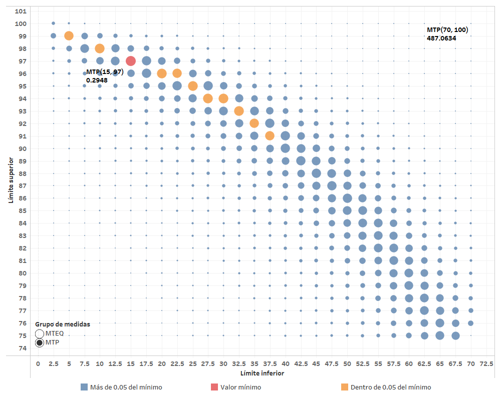
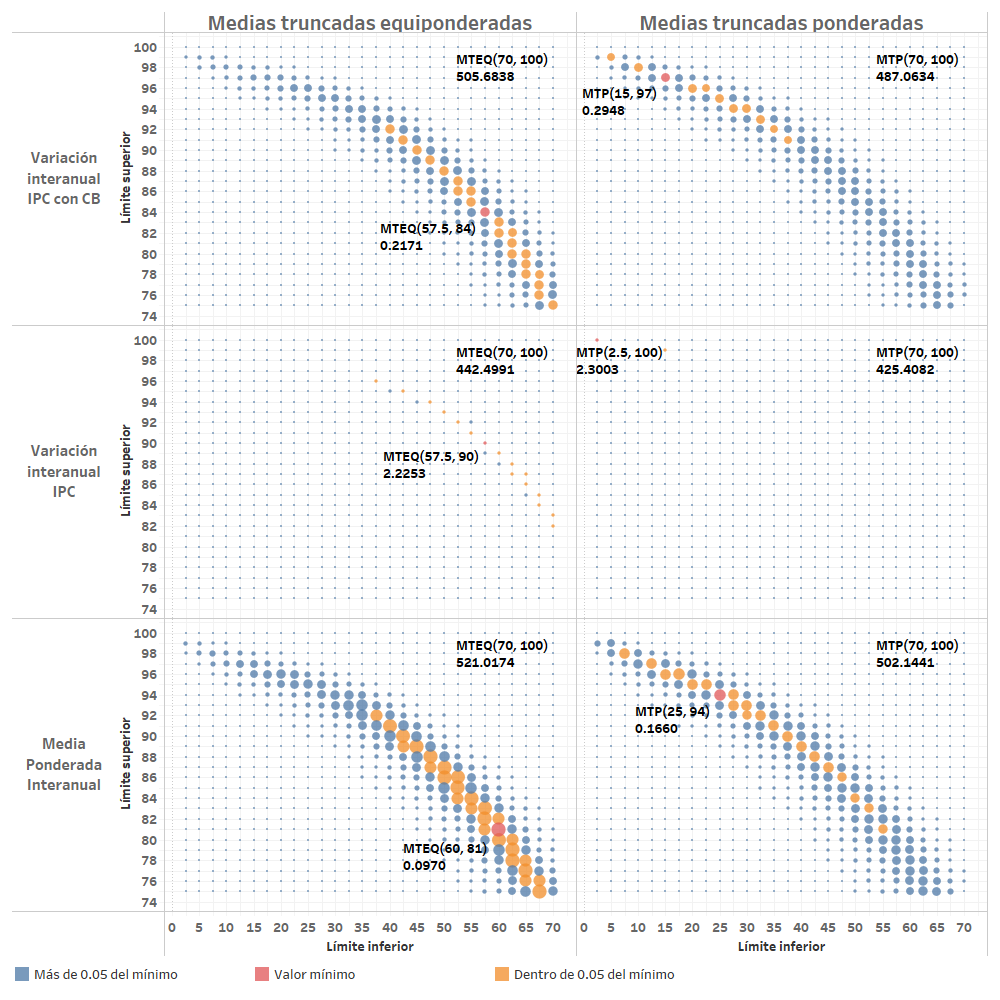
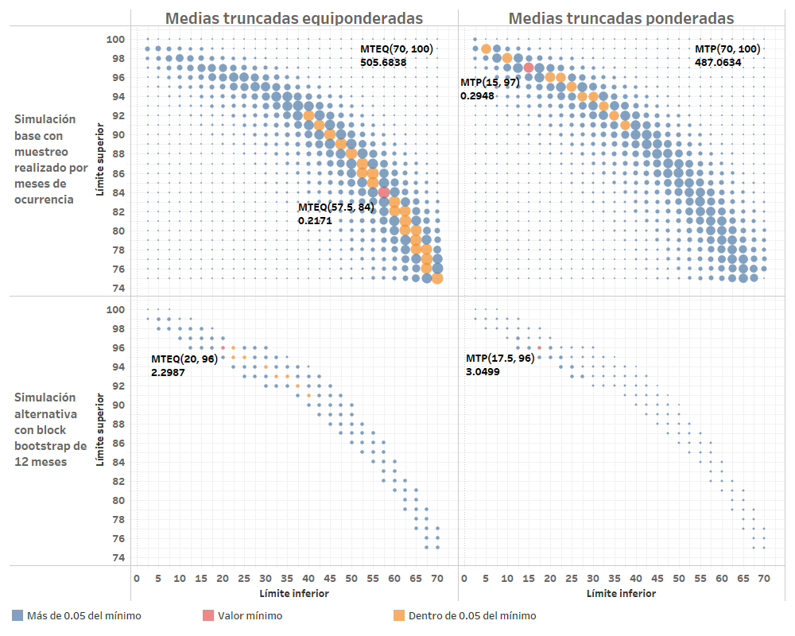

# Evaluación de medidas de inflación basadas en medias truncadas

En esta sección se documentan los resultados del proceso de evaluación de las medidas de inflación interanual basadas en medias truncadas de la distribución transversal de variaciones intermensuales de índices de precios.

## Resultados con los criterios básicos de evaluación
Aplicando el procedimiento de evaluación con los criterios básicos definidos, se lleva a cabo la simulación de 125,000 realizaciones para cada una de las medidas de inflación interanual con diferentes valores para el límite inferior y el límite superior del recorte para aplicar el promedio de la distribución de variaciones intermensuales en cada mes. 

En la siguiente figura, se observan los resultados de la evaluación de una cuadrícula de recortes (combinaciones de límite inferior y límite superior) de la distribución transversal de variaciones intermensuales, que se utiliza para construir una medida de inflación basada en medias truncadas ponderadas, utilizando las respectivas ponderaciones de los gastos básicos de acuerdo con la que tienen en el IPC. En cada uno de los puntos, el tamaño corresponde al valor recíproco del promedio del error cuadrático medio (MSE) a través de 125,000 simulaciones con el recorte especificado, por lo que un círculo más grande denota que la medida de inflación tuvo un mejor desempeño en la simulación. En color rojo se muestra el valor mínimo del MSE en la cuadrícula, mientras que en color naranja, se muestran resultados de las medidas cuyo promedio no se aleja más de 0.05pp² del mínimo. 

**Figura.** *MSE recíproco de evaluación de medidas de inflación basadas en medias truncadas ponderadas*. 

Como se puede observar, existe una región en la que se encuentran los valores más pequeños del MSE, que parecen estar a lo largo de una línea recta inclinada con pendiente negativa menor que uno en magnitud, lo que representa que existe una mayor variación de los resultados a lo largo del límite inferior del recorte. Asimismo, se observa que la medida de inflación que minimiza el valor de MSE es la **media truncada ponderada con recortes (15, 97)** (15% de recorte en la cola izquierda y 3% en la cola derecha de la distribución transversal). Cabe resaltar, que de forma similar que con las medidas basadas en percentiles de la distribución de variaciones intermensuales, la medida óptima presenta asímetría en el recorte de la distribución, siendo mayor el recorte en la cola izquierda, lo cual puede reflejar que la distribución de variaciones intermensuales posee sesgo positivo.

<!-- **Figura.** *MSE recíproco de evaluación de medidas de inflación basadas en medias truncadas equiponderadas*. 

En la [Figura 2](#fig:resultados-criterios-basicos-mteq) -->

En la figura mostrada a continuación, se presenta una gráfica similar a la anterior, que corresponde al MSE de evaluación de las medidas de inflación basadas en medias truncadas equiponderadas (en las cuales, los gastos básicos se tratan con las mismas ponderaciones, en vez de utilizar sus ponderaciones en el IPC, como si se tratara de una distribución de ocurrencias de las variaciones intermensuales).

**Figura.** *MSE recíproco de evaluación de medidas de inflación basadas en medias truncadas equiponderadas*. 

Como se puede observar, al utilizar recortes de la distribución de ocurrencias de variaciones intermensuales, el valor mínimo de MSE es exhibido por la **media truncada equiponderada (57.5, 84)** (57.5% de recorte en la cola izquierda y 16% en la cola derecha de la distribución transversal de ocurrencias). En la gráfica también se resalta el valor máximo de MSE obtenido en la simulación, el cual se obtiene en la media truncada equiponderada (70, 100), la cual excluye solamente el 30% de la cola izquierda de la distribución.

En la siguiente figura se muestra la descomposición aditiva del error cuadrático medio en sus componentes de sesgo, varianza o precisión y correlación, con respecto a la trayectoria de inflación paramétrica, al utilizar los criterios básicos de evaluación. 

En el caso de las medias truncadas equiponderadas, se puede observar que el recorte óptimo de (57.5, 84) resulta debido a que es el que minimiza la componente de variabilidad del MSE, mientras que los recortes que minimizan las componentes de sesgo y correlación se encuentran en recortes del límite inferior que son menores al recorte inferior óptimo general de 57.5%. 

En el caso de las medias truncadas ponderadas, se observa que los valores óptimos de las componentes de sesgo y varianza se observan en recortes inferiores que son mucho mayores al 15% del recorte inferior óptimo general, particularmente en 52.5% en la componente de sesgo y 47.5% en la componente de varianza. Sin embargo, se observa que el recorte óptimo inferior en la componente de correlación se obtiene en el recorte inferior del 17.5%, y por lo tanto, esto empuja el recorte óptimo general al punto (15, 97).

**Figura.** *Descomposición aditiva del MSE recíproco de evaluación de medidas de inflación basadas en medias truncadas equiponderadas*. 

A continuación, se presentan algunos análisis de sensibilidad respecto al escenario con los criterios básicos de evaluación.

## Análisis de sensibilidad

En esta sección se presentan los análisis de sensbilidad obtenidos en el ejercicio de evaluación de las medidas de inflación basadas en medias truncadas. 

### Análisis de sensibilidad ante cambios en el período final de evaluación

Debido a que se considera el período completo (hasta diciembre de 2019), como criterio básico de evaluación, a continuación se realiza un análisis de sensibilidad que considera los resultados ante un cambio en la fecha final del período de evaluación. Se consideran los siguientes períodos finales de evaluación:  

- Diciembre de 2018
- Junio de 2019
- Diciembre de 2019 (de acuerdo con los criterios básicos)
  
Para realizar este análisis de sensibilidad, se excluyen los recortes de la cuadrícula que están fuera de una región de clasificación no lineal que conecta el recorte equiponderado óptimo con el recorte ponderado óptimo. Esta clasificación se llevó a cabo para ahorrar computación, ya que las medidas cuyos recortes presentaron mejor desempeño en la evaluación y en los análisis de sensibilidad, se encuentran en la región con forma de parábola en las gráficas. En adelante, se hará referencia a esta región como una de buen desempeño de las medidas basdadas en medias truncadas.

**Figura.** *Análisis de sensibilidad respecto del período final considerado en la evaluación*.

Como se puede observar, en todos los períodos finales considerados, la **media truncada equiponderada (57.5, 84)** y la **media truncada ponderada (15, 97)** resultan invariantemente óptimas en términos del MSE de evaluación. Estos resultados muestran que el recorte óptimo, en ambos tipos de medidas de inflación, no es tan sensible a cambios en las fechas finales del período de evaluación que están separadas entre 6 meses y un año.  

### Análisis de sensibilidad ante cambio en la medida de evaluación

Considerando estadísticos de evaluación alternativos, se construye una gráfica que ilustra el desempeño de las medidas consideradas como óptimas al aplicar los criterios básicos de evaluación utilizando diferentes medidas de evaluación. Dicha gráfica se muestra a continuación.   

**Figura.** *Análisis de sensibilidad respecto de la medida de evaluación*.

Respecto a las medias truncadas equiponderadas, se puede observar que los recortes óptimos en cada medida de evaluación se encuentran cercanos al recorte óptimo obtenido en los criterios básicos. en el caso del valor absoluto medio y del índice de error muestral, se encuentran en la región de buen desempeño de las medias truncadas. Cabe resaltar que en la gráfica de correlación, todas las medidas en la cuadrícula se encuentran cerca del óptimo, que se encuentra en el recorte (57.5, 92), el cual está fuera de la región de buen desempeño. 

Respecto a las medias truncadas ponderadas, el recorte óptimo (15, 97) del error cuadrático medio, también lo es de acuerdo con el índice de error muestral. Respecto del valor absoluto medio, se observa que el recorte óptimo se encuentra en el punto (52.5, 85), dentro de la región de buen desempeño. Nuevamente, en la gráfica de correlación, el valor óptimo se encuentra en el punto (52.5, 97), el cual se encuentra fuera de la región de buen desempeño. 

En general, se puede concluir que al considerar diferentes estadísticos de evaluación del desempeño de las medidas de inflación, las medidas de inflación consideradas como óptimas al aplicar los criterios básicos de evaluación, no presentan una gran variabilidad, excepto en el caso del coeficiente de correlación lineal. 

### Análisis de sensibilidad ante cambios en el subperíodo de evaluación

A continuación, se presenta un análisis de sensibilidad de la evaluación al considerar un cambio en el período de evaluación. La siguiente gráfica ilustra la evaluación de los grupos de medias truncadas equiponderadas y ponderadas en los diferentes períodos de evaluación, mientras que el escenario con el criterio básico de evaluación observa en la última fila, correspondiente al período completo.  

**Figura.** *Análisis de sensibilidad respecto del subperíodo de evaluación*.

Respecto a las medias truncadas equiponderadas, se puede observar que existen ligeras desviaciones del recorte óptimo, pero dentro de la región de buen desempeño. Cabe resaltar que el período en que se observa mayor error cuadrático medio óptimo es en el período de transición (0.2454pp²) y el menor se observa en el período 2010 (0.0532pp²). 

Mientras tanto, en el grupo de medias truncadas ponderadas, se observa que existen fuertes desviaciones del recorte óptimo hacia puntos cuyo recorte inferior es mayor, dentro de la región de buen desempeño. A su vez, el mayor error cuadrático medio óptimo es el del período base 2000 (0.3639pp²) de evaluación y nuevamente, el menor se observa en el período 2010 (0.0965pp²).

### Análisis de sensibilidad ante cambios en la componente de tendencia

A continuación, se presenta un análisis de sensibilidad de la evaluación al considerar un cambio en la componente multiplicativa de tendencia del procedimiento de evaluación. La siguiente gráfica ilustra la evaluación de los grupos de medias truncadas equiponderadas y ponderadas en tres escenarios de tendencia, siendo el escenario con criterios básicos el que se observa en la primera fila, correspondiente a la componente de tendencia de caminata aleatoria. 

**Figura.** *Análisis de sensibilidad ante cambios en la componente de tendencia*.

Como se puede observar, para ambos grupos de medidas de inflación existen ligeras desviaciones de los recortes óptimos del escenario de caminata aleatoria al escenario en el que no se aplica tendencia en la evaluación. Respecto de la comparación entre el escenario de caminata aleatoria y el escenario con tendencia de crecimiento exponencial, se puede observar que la desviación es mayor, hacia el recorte (35, 94) para las media truncada equiponderada y hacia el recorte (5, 99) para la media truncada ponderada. 

### Análisis de sensibilidad ante cambios en la trayectoria de inflación paramétrica

Ahora se presenta un análisis de sensibilidad de la evaluación al considerar un cambio en la trayectoria de inflación paramétrica del procedimiento de evaluación. La siguiente gráfica ilustra la evaluación de los grupos de medias truncadas equiponderadas y ponderadas utilizando tres diferentes parámetros de inflación, siendo el escenario con criterios básicos de evaluación el que se observa en la primera fila, correspondiente a la evaluación respecto al parámetro de variación interanual del IPC con cambios de base.

**Figura.** *Análisis de sensibilidad respecto de la trayectoria de inflación paramétrica de evaluación*.

Respecto a los resultados de la evaluación al utilizar la variación interanual del IPC (segunda fila) como parámetro, se observa que provoca un desplazamiento de los los recortes óptimos hacia recortes superiores mayores que en el escenario de de criterios básicos. Este resultado se debe a que al utilizar este parámetro de referencia para el cómputo de los errores, las medidas con niveles más altos de inflación (recortes superiores más altos) resultan favorecidas, ya que en el parámetro existe una tendencia creciente debido al sesgo inherente que resulta de la aplicación de la fórmula del IPC.

Por su parte, respecto a los resultados de evaluación al utilizar la media ponderada interanual (tercera fila) como parámetro, se observa que provoca un desplazamiento de los recortes óptimos, equiponderados y ponderados, hacia los recortes (60, 81) para la media truncada equiponderada y al recorte (25, 94) para la media truncada ponderada. Cabe resaltar que dichos recortes están cerca del óptimo del escenario con criterios básicos y dentro de la región de buen desempeño. 

### Análisis de sensibilidad ante cambios en el número de simulaciones

En este caso, se realiza una prueba de sensibilidad cambiando el número de simulaciones a 500,000 realizaciones de las trayectorias de inflación muestral.

Como se muestra en la gráfica siguiente, los resultados coinciden sin mayor variabilidad. Esto se debe a que el número inicial de simulaciones es en realidad más que suficiente para la distribución del MSE de los estimadores muestrales basados en medias truncadas (en realidad, con alrededor de 10,000 simulaciones se tenía errores estándar de simulación muy pequeños).  

**Figura.** *Análisis de sensibilidad ante cambios en el número de simulaciones*.

### Análisis de sensibilidad ante cambios en el muestreo

Se realiza una prueba de sensibilidad utilizando como técnica de remuestreo la variante de *nonoverlapping block bootstrap* con bloques de 12 meses. El muestreo se realiza de forma independiente para cada unos de los gastos básicos en cada una de las bases del IPC. A continuación, se muestran los resultados en la gráfica siguiente.  

**Figura.** *Análisis de sensibilidad ante cambios en el procedimiento de muestreo*.

Como se puede observar, utilizando una variante de muestreo de *block bootstrap*, la media truncada equponderada óptima se desplaza fuertemente hacia el recorte (20, 96), mientras que la media truncada ponderada óptima se desplaza ligeramente hacia el recorte (17.5, 96). 

### Distribuciones de simulación del MSE en las medidas óptimas

A continuación, se presentan gráficas de las distribuciones de simulación del MSE aplicando los criterios básicos de evaluación. Esta gráfica permite observar el rango, o amplitud, de la distribución de simulación del estadístico de evaluación a través de la gráfica de la distribución acumulada.

**Figura.** *Distribuciones de simulación del MSE de las medias truncadas óptimas con criterio basicos*.

Como se puede observar, el error cuadrático medio de la media truncada ponderada (15, 97) se distribuye a través de un rango más amplio de valores y con una media de simulación en un nivel más alto que la media truncada equiponderada (57.5, 84). Ya que se observan valores de asimetría cercanos a cero y curtosis cercana a tres, se tienen distribuciones del error cuadrático medio que son aproximadamente normales al aplicar los criterios básicos de evaluación. 

A continuación, se muestra una gráfica similar, en la que se compara la amplitud de las distribuciones de simulación respecto al tipo de tendencia para ambos grupos de medidas. Nuevamente, se observa que con cualquiera de los tres tipos de componente de tendencia, se tienen distribuciones con mayor desviación estándar en el grupo de medias truncadas ponderadas.

**Figura.** *Distribuciones de simulación del MSE de las medias truncadas óptimas con criterio basicos, por tipo de tendencia aplicada en la evaluación*.

En la siguiente gráfica, se compara la amplitud de las distribuciones de simulación en los diferentes períodos de evaluación, para ambos grupos de medidas. En este caso, se observa que las distribuciones con mayor rango son las del período de transición, en cualquiera de los escenarios de tendencia.  

**Figura.** *Distribuciones de simulación del MSE de las medias truncadas óptimas con criterio basicos, por subperíodo de evaluación*.

## Análisis de trayectorias para los datos históricamente observados

A continuación, se presenta una gráfica del comportamiento históricamente observado de las medias truncadas óptimas obtenidas al aplicar los criterios básicos de evaluación y se comparan resultados con la variación interanual del IPC, en el período de diciembre de 2001 a diciembre de 2019. Como se observa, el comportamiento general de ambas medidas de inflación subyacente posee menor volatilidad que la medida de inflación oficial. Por su parte, la media truncada ponderada (15, 97) presenta niveles ligeramente más altos durante el período del IPC base 2000. Sin embargo, durante el período del IPC base 2010, esta medida presenta en la mayor parte del período un nivel más bajo que el de la media truncada equiponderada (57.5, 84), en especial a partir del año 2014.

Cabe resaltar el comportamiento de ambas medidas de inflación durante el período de la crisis económica mundial de 2007-2009, en el cual se observa un alza y una caída mucho más moderada que la registrada por la medida de inflación oficial. Finalmente, a partir de finales del año 2015, la variación interanual del IPC registra un nivel más alto (aunque con fluctuaciones volátiles) mientras que las medidas de inflación subyacente con base en las medias truncadas reportan niveles más bajos y estables de inflación.

**Figura.** *Trayectorias de inflación históricamente observadas de las medidas óptimas encontradas con el proceso de evaluación*.
