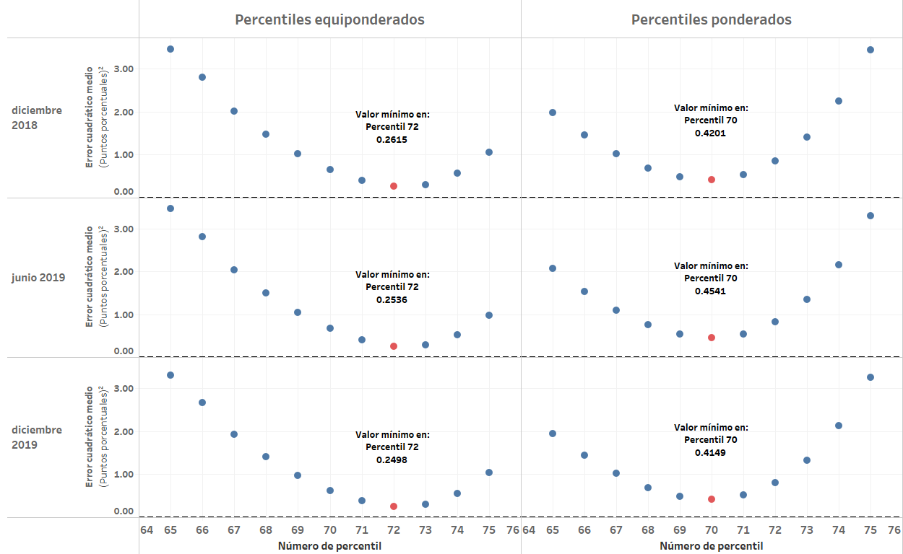
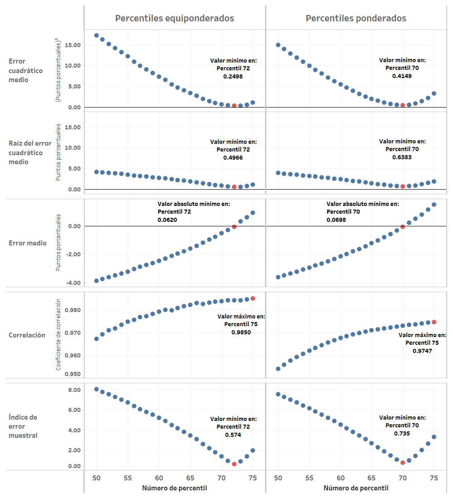

# Evaluación de medidas de inflación basadas en percentiles

En esta sección se documentan los resultados del proceso de evaluación de las medidas de inflación interanual basadas en percentiles de la distribución transversal de variaciones intermensuales de índices de precios.

## Resultados con los criterios básicos de evaluación
Aplicando el procedimiento de evaluación con los criterios básicos definidos, se lleva a cabo la simulación de 125,000 realizaciones para cada una de las medidas de inflación interanual que utilizan como base los percentiles 50 a 80 de la distribución de variaciones intermensuales en cada mes. En cada caso, se consideran las versiones equiponderadas y ponderadas de las medidas de inflación. Los resultados son los siguientes:  

Esta gráfica relaciona el MSE de evaluación con el número de percentil utilizado para la construcción de la medida de inflación, al utilizar tanto la distribución equiponderada, así como la distribución ponderada (por las ponderaciones de los gastos básicos en el IPC), de las variaciones intermensuales de cada mes. Como se observa, el mínimo valor de MSE para los percentiles equiponderados se presenta en el **Percentil equiponderado 72**, mientras que el valor mínimo de MSE en los percentiles ponderados se presenta en el **Percentil ponderado 70**.

La siguiente gráfica muestra la descomposición aditiva del error cuadrático medio en sus componentes de sesgo, varianza o precisión y correlación, con respecto a la trayectoria de inflación paramétrica, al utilizar los criterios básicos de evaluación. Como se puede observar, tanto el percentil equiponderado 72 como el percentil ponderado 70 resultan óptimos debido a que el error debido al componente de sesgo aumenta muy rápidamente al alejarse de estos números de percentiles. Sin embargo, los valores óptimos de precisión se encuentran cercanos a los percentiles óptimos bajo el criterio global. Cabe resaltar que los percentiles óptimos de acuerdo con el componente de correlación resultan mucho menores que con los otros componentes y que con los criterios básicos de evaluación, pero a su vez, se observa que son los más pequeños en magnitud, en comparación con los valores de las componentes de sesgo y precisión.

A continuación, se presentan algunos análisis de sensibilidad respecto al escenario con los criterios básicos de evaluación.

## Análisis de sensibilidad ante cambios en el período final de evaluación

Debido a que se considera el período completo (hasta diciembre de 2019), como criterio básico de evaluación, a continuación se realiza un análisis de sensibilidad que considera los resultados ante un cambio en la fecha final del período de evaluación. Se consideran los siguientes períodos finales de evaluación:  

- Diciembre de 2018
- Junio de 2019

Los resultados se muestran en la gráfica que se muestra a continuación.  

Como se puede observar, en todos los períodos finales considerados, el **percentil equiponderado 72** y el **percentil ponderado 70** resultan invariantemente óptimos en términos del MSE de evaluación. Estos resultados muestran que el percentil óptimo, en ambos tipos de medidas de inflación, no es tan sensible a cambios en las fechas finales del período de evaluación que están separadas entre 6 meses y un año.  

## Análisis de sensibilidad ante cambio en la medida de evaluación

Considerando estadísticos de evaluación alternativos, se construye una gráfica que ilustra el desempeño de las medidas consideradas como óptimas al aplicar los criterios básicos de evaluación utilizando diferentes medidas de evaluación. Dicha gráfica se muestra a continuación.  

Respecto a los percentiles equiponderados, se puede observar que en términos de la raíz del error cuadrático medio, el error medio y el índice de error muestral, el percentil equiponderado 72 resulta óptimo dentro del grupo de medidas de percentiles equiponderados. Sin embargo, en términos del coeficiente de correlación lineal, es el percentil equiponderado 75 el que resulta con el valor máximo.  

Respecto al grupo de percentiles ponderados, se observa que en términos de la raíz del error cuadrático medio, el error medio y el índice de error muestral, el percentil ponderado 70 resulta óptimo dentro de este grupo de medidas de inflación. A su vez, el valor máximo del coeficiente de correlación lineal se observa también en el percentil ponderado 75. 

En general, se puede concluir que al considerar diferentes estadísticos de evaluación del desempeño de las medidas de inflación, las medidas de inflación consideradas como óptimas al aplicar los criterios básicos de evaluación, no presentan una gran variabilidad, excepto en el caso del coeficiente de correlación lineal. 

## Análisis de sensibilidad ante cambios en el subperíodo de evaluación

A continuación, se presenta un análisis de sensibilidad de la evaluación al considerar un cambio en el período de evaluación. La siguiente gráfica ilustra la evaluación de los grupos de percentiles equiponderados y ponderados en los diferentes períodos de evaluación, mientras que el escenario con el criterio básico de evaluación observa en la última fila, correspondiente al período completo.  

Respecto a los percentiles equiponderados, se puede observar que existen desviaciones del percentil equiponderado 72 hacia el percentil equiponderado 75 en el período de transición base 2000 a 2010, y hacia el percentil equiponderado 71 en el período 2010. Cabe resaltar que el período en que se observa mayor error cuadrático medio óptimo es en el período base 2000 (0.2777pp²)y el menor se observa en el período 2010 (0.0560pp²). 

Mientras tanto, en el grupo de los percentiles ponderados, se observa que existe una desviación hacia el percentil ponderado 69 en el período base 2000, hacia el percentil ponderado 73 en el período de transición base 2000 a 2010 y hacia el percentil ponderado 72 en el período base 2010. A su vez, el mayor error cuadrático medio óptimo es el del período base 2000 (0.4502pp²) de evaluación y nuevamente, el menor se observa en el período 2010 (0.1104pp²).

De forma general, aunque se observan ligeras desviaciones a través de los períodos de evaluación, se puede observar que el percentil óptimo se encuentra, para cualquier subperíodo, entre los percentiles equiponderados 71 y 75 y entre los percentiles ponderados 69 y 73.

## Análisis de sensibilidad ante cambios en la componente de tendencia

A continuación, se presenta un análisis de sensibilidad de la evaluación al considerar un cambio en la componente aditiva de tendencia del procedimiento de evaluación. La siguiente gráfica ilustra la evaluación de los grupos de percentiles equiponderados y ponderados en tres escenarios de tendencia, siendo el criterio básico el que se observa en la primera fila, correspondiente a la componente de tendencia de caminata aleatoria. 

Como se puede observar, el percentil equiponderado 72 resulta el óptimo en los escenarios de tendencia de caminata aleatoria y sin tendencia, mientras que en el escenario de crecimiento exponencial, es el percentil equiponderado 73 el que resulta óptimo. A su vez, el percentil ponderado 70 resulta óptimo en el escenario de caminata aleatoria, mientras que en el escenario sin tendencia es el percentil ponderado 69 y en el escenario de crecimiento exponencial, es el percentil ponderado 71 el que resulta óptimo. Por lo tanto, nuevamente se observa poca variabilidad en los percentiles óptimos del criterio básico ante cambios en la componente de tendencia utilizada en la evaluación. 

## Análisis de sensibilidad ante cambios en la trayectoria de inflación paramétrica

Ahora se presenta un análisis de sensibilidad de la evaluación al considerar un cambio en la trayectoria de inflación paramétrica del procedimiento de evaluación. La siguiente gráfica ilustra la evaluación de los grupos de percentiles equiponderados y ponderados utilizando tres diferentes parámetros de inflación, siendo el criterio básico de evaluación el que se observa en la primera fila, correspondiente a la evaluación respecto al parámetro de variación interanual del IPC con cambios de base.

Respecto a los resultados de la evaluación al utilizar la variación interanual del IPC (segunda fila) como parámetro, se observa que provoca un desplazamiento de los percentiles óptimos, equiponderados y ponderados, hacia percentiles más altos, con números 77 y 74, respectivamente. Este resultado se debe a que al utilizar este parámetro de referencia para el cómputo de los errores, las medidas con niveles más altos (percentiles más altos) resultan favorecidas, ya que en el parámetro existe una tendencia creciente debido al sesgo inherente que resulta de la aplicación de la fórmula del IPC.

Por su parte, respecto a los resultados de evaluación al utilizar la media ponderada interanual (tercera fila) como parámetro, se observa que provoca un desplazamiento de los percentiles óptimos, equiponderados y ponderados, hacia percentiles más bajos, con números 71 y 69, respectivamente. Este desplazamiento hacia percentiles óptimos más bajos se debe a que el parámetro de media ponderada interanual no presenta tendencia creciente como los parámetros de variación interanual del IPC y su versión con cambios de base. 

En general, se puede concluir que aunque se observan ligeras desviaciones a través de los diferentes parámetros de inflación, se puede observar que el percentil óptimo se encuentra entre los percentiles equiponderados 71 y 77 y entre los percentiles ponderados 69 y 73.

## Análisis de sensibilidad ante cambios en el número de simulaciones

En este caso, se realiza una prueba de sensibilidad cambiando el número de simulaciones a 500,000 realizaciones de las trayectorias de inflación muestral. Este número de simulaciones es superior al que se obtendría dejando $\epsilon$ constante y cambiando de $\gamma=0.95$ a $\gamma=0.99$, el cual resulta en 215,799 realizaciones. 

Como se muestra en la gráfica siguiente, los resultados coinciden sin mayor variabilidad. Esto se debe a que el número inicial de simulaciones es en realidad más que suficiente para la distribución del MSE de los estimadores muestrales basados en percentiles (en realidad, con alrededor de 10,000 simulaciones se tenía errores estándar de simulación muy pequeños).  

## Análisis de sensibilidad ante cambios en el muestreo

Se realiza una prueba de sensibilidad utilizando como técnica de remuestreo la variante de *nonoverlapping block bootstrap* con bloques de 12 meses. El muestreo se realiza de forma independiente para cada unos de los gastos básicos en cada una de las bases del IPC. A continuación, se muestran los resultados en la gráfica siguiente.  

Como se puede observar, utilizando una variante de muestreo de *block bootstrap*, el **percentil equiponderado 72** y el **percentil ponderado 70** resultan ser nuevamente los estimadores muestrales que minimizan el MSE de evaluación en el período completo, con resultados hasta el período de diciembre de 2019. 

## Distribuciones de simulación del MSE en las medidas óptimas

A continuación, se presentan gráficas de las distribuciones de simulación del MSE aplicando los criterios básicos de evaluación. Esta gráfica permite observar el rango, o amplitud, de la distribución de simulación del estadístico de evaluación a través de la gráfica de la distribución acumulada.

Como se puede observar, el error cuadrático medio del percentil ponderado 70 se distribuye a través de un rango más amplio de valores y con una media de simulación en un nivel más alto que la del percentil equiponderado 72. Ya que se observan valores de asimetría cercanos a cero y curtosis cercana a tres, se tienen distribuciones del error cuadrático medio que son aproximadamente normales al aplicar los criterios básicos de evaluación. 

A continuación, se muestra una gráfica similar, en la que se compara la amplitud de las distribuciones de simulación respecto al tipo de tendencia para ambos grupos de medidas. Nuevamente, se observa que con cualquiera de los tres tipos de componente de tendencia, se tienen distribuciones con mayor desviación estándar en el grupo de percentiles ponderados.

En la siguiente gráfica, se compara la amplitud de las distribuciones de simulación en los diferentes períodos de evaluación, para ambos grupos de medidas. En este caso, se observa que las distribuciones con mayor rango son las del período de transición, en cualquiera de los escenarios de tendencia.  

## Análisis de trayectorias para los datos históricamente observados

A continuación, se presenta una gráfica del comportamiento históricamente observado de los percentiles óptimos obtenidos al aplicar los criterios básicos de evaluación y se comparan resultados con la variación interanual del IPC, en el período de diciembre de 2001 a diciembre de 2019. Como se observa, el comportamiento general de ambas medidas de inflación subyacente posee menor volatilidad que la medida de inflación oficial. Por su parte, el percentil ponderado 70 presenta niveles ligeramente más altos durante el período del IPC base 2000. Sin embargo, durante el período del IPC base 2010, esta medida presenta en la mayor parte del período un nivel más bajo que el del percentil equiponderado 72, en especial a partir del año 2014.

Cabe resaltar el comportamiento de ambas medidas de inflación durante el período de la crisis económica mundial de 2007-2009, en el cual se observa un alza y una caída mucho más moderada que la registrada por la medida de inflación oficial. Finalmente, a partir de finales del año 2015, la variación interanual del IPC registra un nivel más alto (aunque con fluctuaciones volátiles) mientras que las medidas de inflación subyacente con base en los percentiles reportan niveles más bajos y estables de inflación.

