# Evaluación de medidas de inflación basadas en percentiles

En esta sección se documentan los resultados del proceso de evaluación de las medidas de inflación interanual basadas en percentiles de la distribución transversal de variaciones intermensuales de índices de precios.

## Resultados con criterios de evaluación base
Aplicando el procedimiento de evaluación con los criterios de evaluación definidos con el período de evaluación hasta **diciembre de 2019**, se lleva a cabo la simulación de 110,000 realizaciones para cada una de las medidas de inflación interanual que utilizan como base los percentiles 50 a 80 de la distribución de variaciones intermensuales en cada mes. En cada caso, se consideran las versiones equiponderadas y ponderadas de las medidas de inflación. Los resultados son los siguientes:  

<!-- 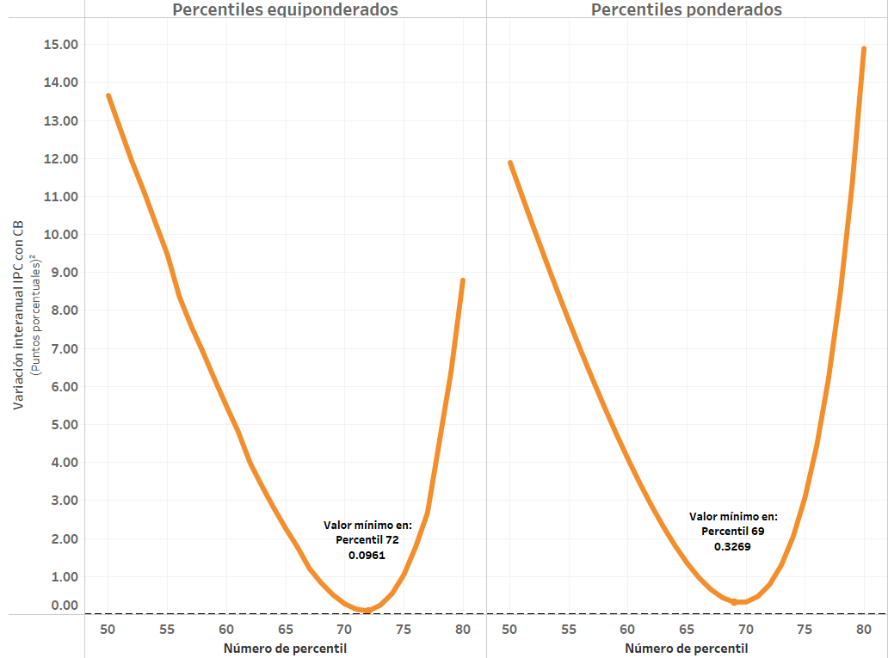  -->

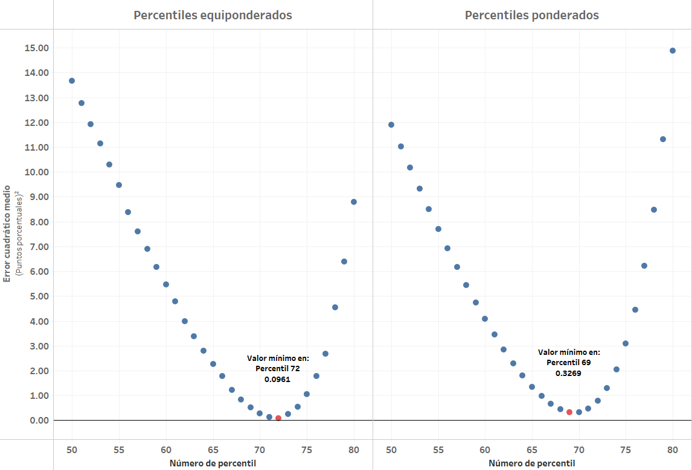  

Esta gráfica relaciona el MSE de evaluación con el número de percentil utilizado para la construcción de la medida de inflación, al utilizar la distribución equiponderada, así como la distribución ponderada (por las ponderaciones del IPC), de las variaciones intermensuales de cada mes. Como se observa, el mínimo valor de MSE para los percentiles equiponderados se presenta en el **Percentil equiponderado 72**, mientras que el valor mínimo de MSE en los percentiles ponderados se presenta en el **Percentil ponderado 69**.

A continuación, se presentan algunos análisis de sensibilidad respecto a este escenario.

## Análisis de sensibilidad ante cambios en el período final de evaluación

Debido a que se considera el período completo de evaluación hasta diciembre de 2019, se realiza un análisis de sensibilidad que considera los resultados ante un cambio en el período final de evaluación. Se consideran los siguientes períodos finales de evaluación:  

- Diciembre de 2018
- Junio de 2019
<!-- - Junio de 2020 -->

Los resultados se muestran en la gráfica que se muestra a continuación.  

<!-- 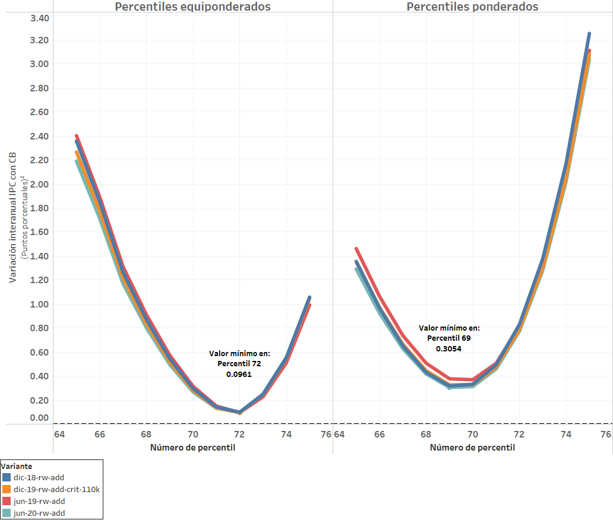   -->

<!-- 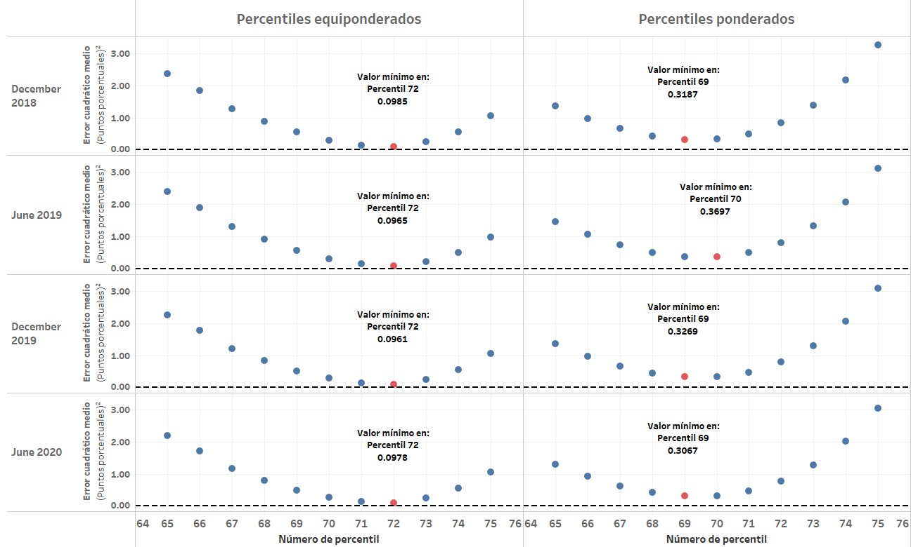  -->

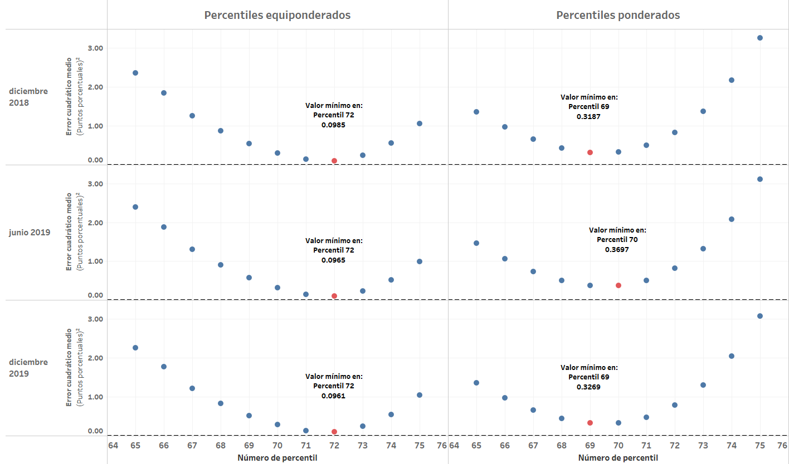  

Respecto a los percentiles equiponderados, como se puede observar, en todos los períodos finales considerados, el **percentil equiponderado 72** resulta invariantemente óptimo en términos del MSE de evaluación. Respecto a los percentiles ponderados, se observa que para los períodos de diciembre de 2018 y diciembre de 2019, el percentil óptimo es el **percentil ponderado 69**, mientras que en junio de 2019 se registra una ligera variación, siendo el percentil óptimo el **percentil ponderado 70**. Estos resultados muestran que el percentil óptimo no es tan sensible a cambios en los períodos finales de evaluación que están separados entre 6 meses y un año.  

## Análisis de sensibilidad ante cambio en la medida de evaluación

Considerando los estadísticos de evaluación alternativos, se construye una gráfica que ilustra el desempeño de las medidas consideradas como óptimas en en el escenario base utilizando diferentes medidas de evaluación. Dicha gráfica se muestra a continuación.  

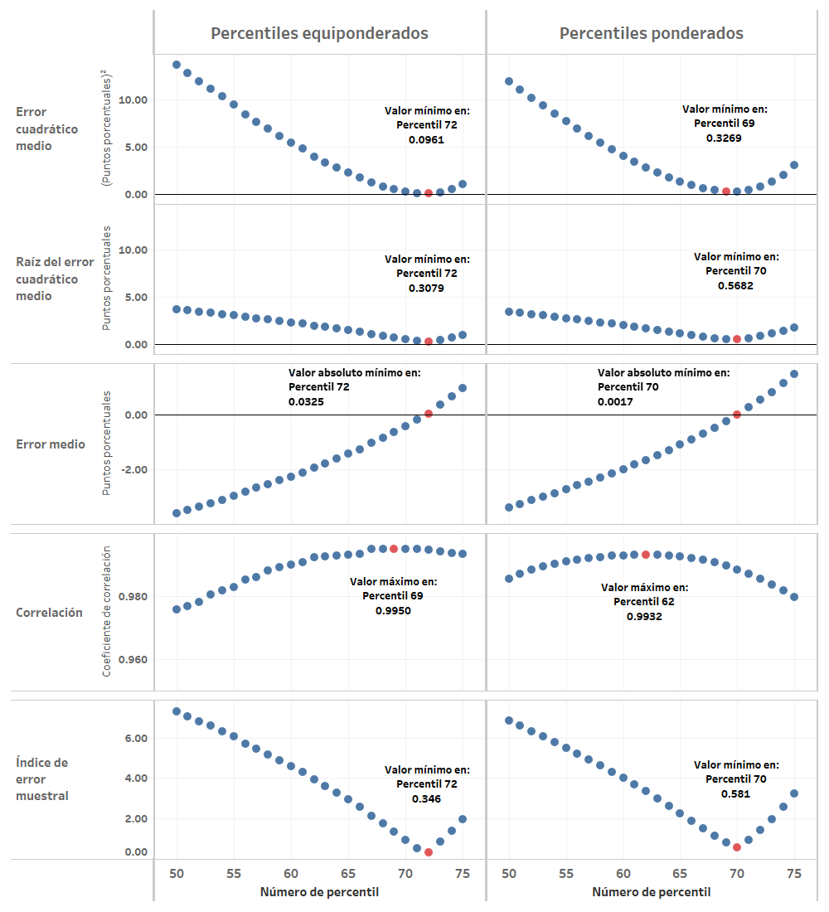  

Respecto a los percentiles equiponderados, se puede observar que en términos de la raíz del error cuadrático medio, el error medio y el índice de error muestral, el percentil equiponderado 72 resulta óptimo dentro del grupo de medidas de percentiles equiponderados. Sin embargo, en términos del coeficiente de correlación lineal, es el percentil equiponderado 69 el que resulta con el valor máximo.  

Respecto al grupo de percentiles ponderados, se observa que en términos de la raíz del error cuadrático medio, el error medio y el índice de error muestral, existe un ligero desplazamiento del óptimo hacia el percentil ponderado 70. A su vez, el valor máximo del coeficiente de correlación lineal se observa en el percentil ponderado 62. Cabe resaltar el hecho de que en el escenario base, el percentil ponderado 69 resulta con el valor mínimo de error cuadrático medio con muy poca diferencia respecto al valor del percentil ponderado 70. 

En general, se puede concluir que al considerar diferentes estadísticos de evaluación del desempeño de las medidas de inflación, las medidas de inflación consideradas como óptimas por el escenario base, no presentan una gran variabilidad, excepto en el caso del coeficiente de correlación lineal. 

## Análisis de sensibilidad ante cambios en el subperíodo de evaluación

A continuación, se presenta un análisis de sensibilidad de la evaluación al considerar un cambio en el período de evaluación. La siguiente gráfica ilustra la evaluación de los grupos de percentiles equiponderados y ponderados en los diferentes períodos de evaluación, mientras que el escenario base se observa en la última fila, correspondiente al período completo. 

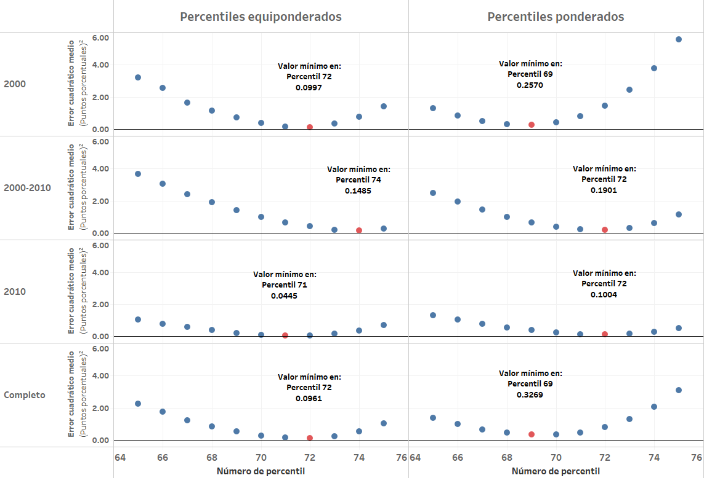  

Respecto a los percentiles equiponderados, se puede observar que existen desviaciones del percentil equiponderado 72 hacia el percentil equiponderado 74 en el período de transición base 2000 a 2010, y hacia el percentil equiponderado 71 en el período 2010. Cabe resaltar que el período en que se observa mayor error cuadrático medio óptimo es en el período de transición y el menor se observa en el período 2010. 

Mientras tanto, en el grupo de los percentiles ponderados, se observa que existe una desviación hacia el percentil ponderado 72, tanto en el período de transición base 2000 a 2010, así como en el período 2010. A su vez, el mayor error cuadrático medio óptimo es el del período completo de evaluación y nuevamente, el menor se observa en el período 2010.

De forma general, aunque se observan ligeras desviaciones a través de los períodos de evaluación, se puede observar que el percentil óptimo se encuentra, para cualquier subperíodo, entre los percentiles equiponderados 71 y 74 y entre los percentiles ponderados 69 y 72.

## Análisis de sensibilidad ante cambios en la componente de tendencia

A continuación, se presenta un análisis de sensibilidad de la evaluación al considerar un cambio en la componente aditiva de tendencia del procedimiento de evaluación. La siguiente gráfica ilustra la evaluación de los grupos de percentiles equiponderados y ponderados en tres escenarios de tendencia, siendo el escenario base el que se observa en la primera fila, correspondiente a la componente de tendencia de caminata aleatoria. 

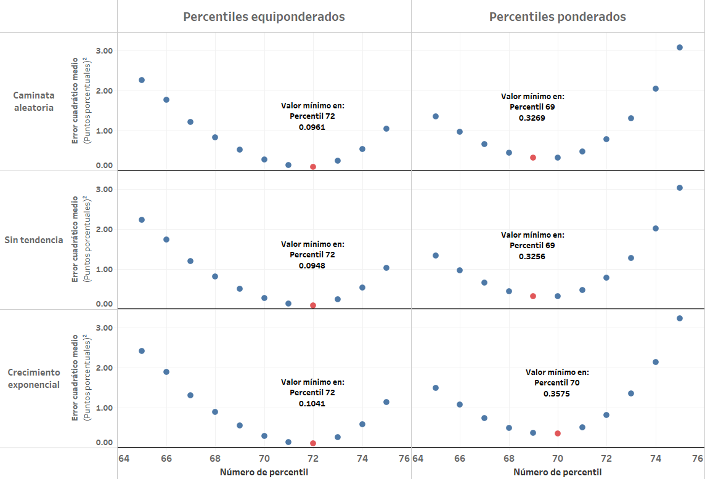  

Como se puede observar, el percentil equiponderado 72 resulta el óptimo en los tres escenarios de tendencia. A su vez, el percentil ponderado 69 resulta óptimo en el escenario de caminata aleatoria y en el escenario sin tendencia, mientras que en el escenario de crecimiento exponencial, es el percentil ponderado 70 el que resulta óptimo. Por lo tanto, se observa nuevamente poca variabilidad en los percentiles óptimos del escenario base ante cambios en la componente de tendencia utilizada en la evaluación. 

## Análisis de sensibilidad ante cambios en la trayectoria de inflación paramétrica

Ahora se presenta un análisis de sensibilidad de la evaluación al considerar un cambio en la trayectoria de inflación paramétrica del procedimiento de evaluación. La siguiente gráfica ilustra la evaluación de los grupos de percentiles equiponderados y ponderados utilizando tres diferentes parámetros de inflación, siendo el escenario base el que se observa en la primera fila, correspondiente a la evaluación respecto al parámetro de variación interanual del IPC con cambios de base.

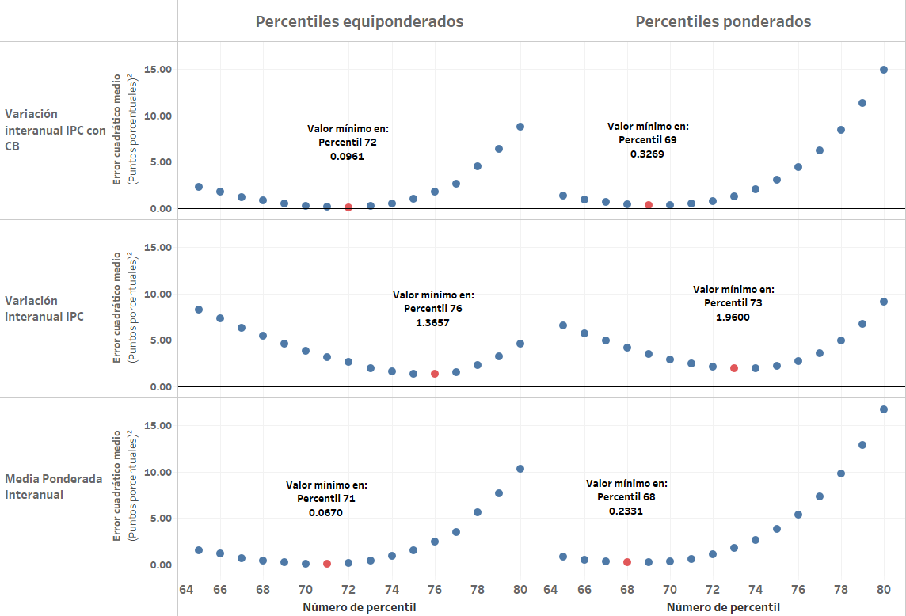  

Respecto a los resultados de la evaluación respecto al parámetro de variación interanual del IPC (segunda fila), se observa que provoca un desplazamiento de los percentiles óptimos, equiponderados y ponderados, hacia percentiles más altos, con números 76 y 73, respectivamente. Este resultado se debe a que al utilizar este parámetro de referencia para el cómputo de error, las medidas con niveles más altos (percentiles más altos) resultan favorecidas, ya que en el parámetro existe una tendencia creciente debido al sesgo inherente que resulta de la aplicación de la fórmula del IPC.

Por su parte, respecto a los resultados de evaluación respecto al parámetro de media ponderada interanual (tercera fila), se observa que provoca un desplazamiento de los percentiles óptimos, equiponderados y ponderados, hacia percentiles más bajos, con números 71 y 68, respectivamente. Este desplazamiento hacia percentiles óptimos más bajos se debe a que el parámetro de media ponderada interanual no presenta tendencia creciente como los parámetros de variación interanual del IPC y su versión con cambios de base. 

En general, se puede concluir que aunque se observan ligeras desviaciones a través de los diferentes parámetros de inflación, se puede observar que el percentil óptimo se encuentra entre los percentiles equiponderados 71 y 76 y entre los percentiles ponderados 68 y 73.

## Análisis de sensibilidad ante cambios en el número de simulaciones

En este caso, se realiza una prueba de sensibilidad cambiando el número de simulaciones a $420,000$ realizaciones de las trayectorias de inflación muestral. Este número de simulaciones es superior al que se obtendría dejando $\epsilon$ constante y cambiando de $\gamma=0.95$ a $\gamma=0.99$, el cual resulta en 177,817 realizaciones. 

Como se muestra en la gráfica siguiente, los resultados coinciden sin mayor variabilidad. Esto se debe a que el número inicial de simulaciones es en realidad más que suficiente para la distribución del MSE de los estimadores muestrales basados en percentiles (en realidad, con alrededor de 10,000 simulaciones se tenía errores estándar de simulación muy pequeños).  

<!-- 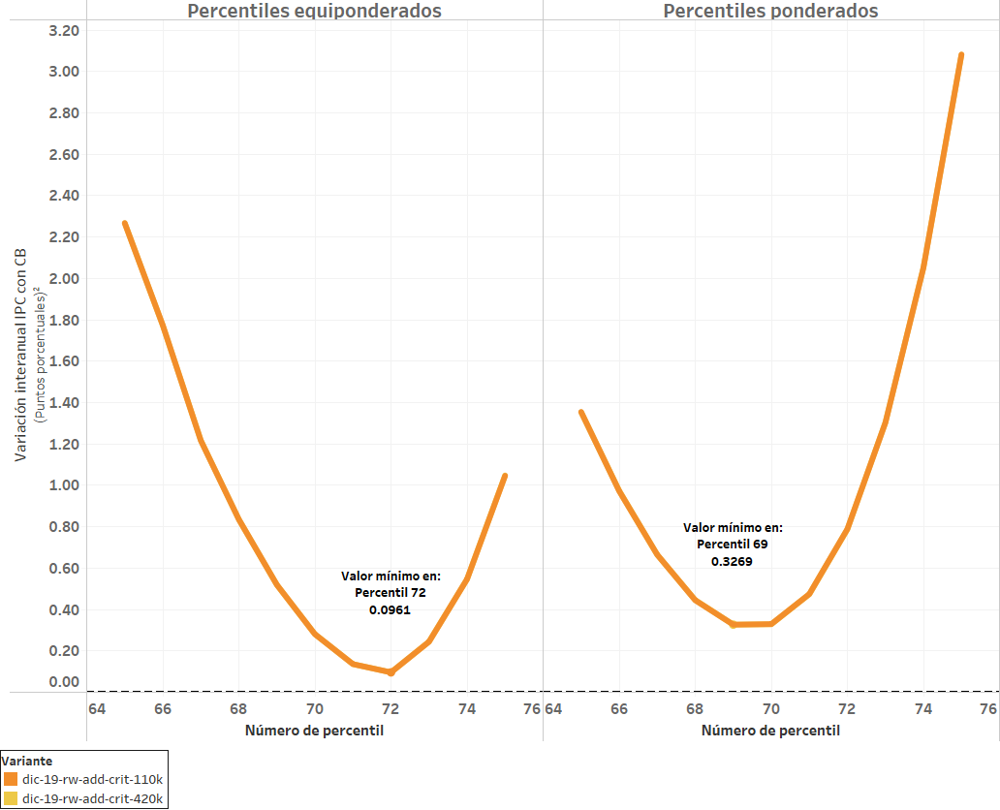   -->

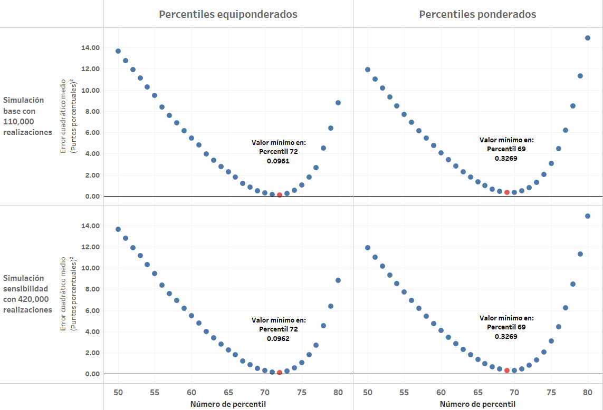  

## Análisis de sensibilidad ante cambios en el muestreo

Se realiza una prueba de sensibilidad utilizando como técnica de remuestreo la variante de *nonoverlapping block bootstrap* con bloques de 12 meses. El muestreo se realiza de forma independiente para cada unos de los gastos básicos en cada una de las bases del IPC. A continuación, se muestran los resultados en la gráfica siguiente.  

<!-- 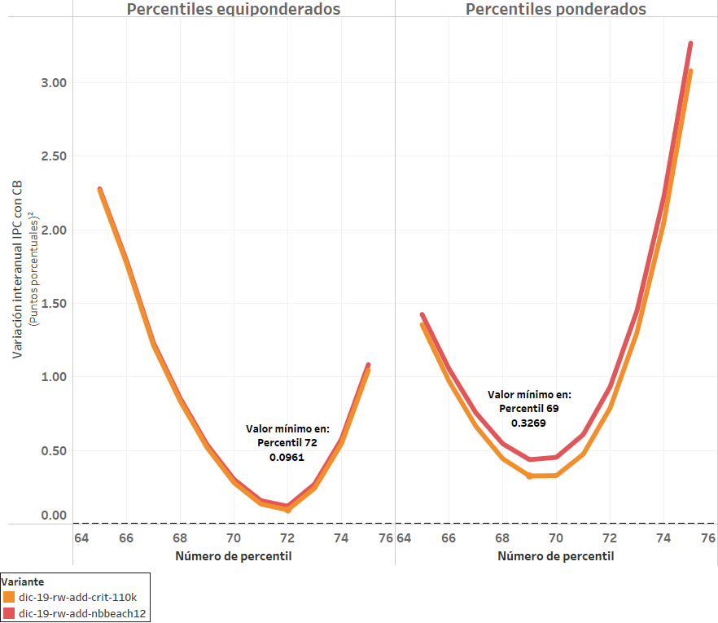   -->

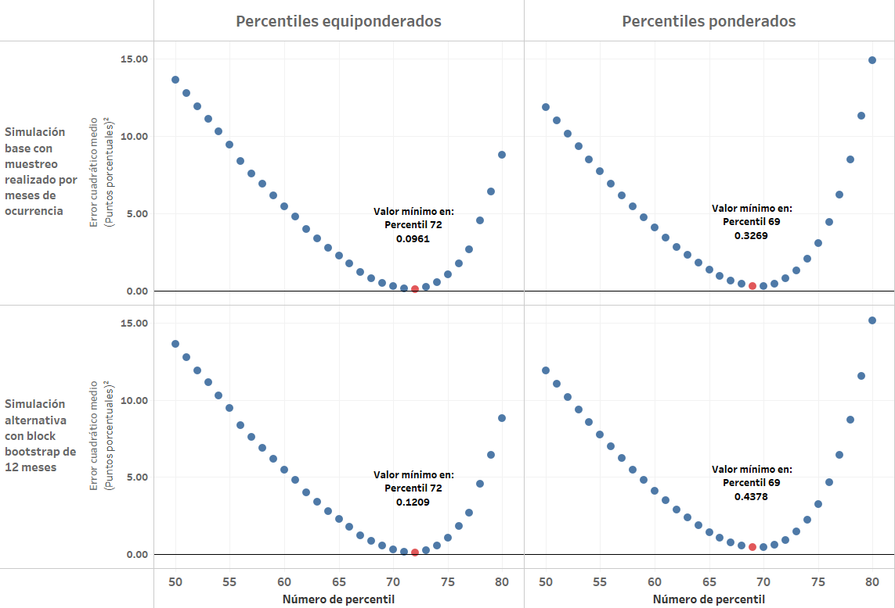  

Como se puede observar, utilizando una variante de muestreo de *block bootstrap*, el **percentil equiponderado 72** y el **percentil ponderado 69** resultan ser nuevamente los estimadores muestrales que minimizan el MSE de evaluación en el período completo, con resultados hasta el período de diciembre de 2019. 

## Distribuciones de simulación del MSE en las medidas óptimas

A continuación, se presentan gráficas de las distribuciones de simulación del MSE en el escenario base. Esta gráfica permite observar el rango, o amplitud, de la distribución de simulación del estadístico de evaluación a través de la gráfica de la distribución acumulada.

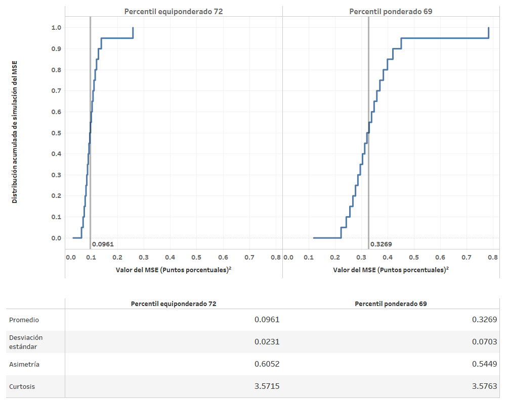  

Como se puede observar, el error cuadrático medio del percentil ponderado 69 se distribuye a través de un rango más amplio de valores y con una media de simulación en un nivel más alto que la del percentil equiponderado 72. Ya que se observan valores de asimetría cercanos a cero y curtosis cercana a tres, se tienen distribuciones del error cuadrático medio que son aproximadamente normales en el escenario base. 

A continuación, se muestra una gráfica similar, en la que se compara la amplitud de las distribuciones de simulación respecto al tipo de tendencia para ambos grupos de medidas. Nuevamente, se observa que con cualquiera de los tres tipos de componente de tendencia, se tienen distribuciones con mayor desviación estándar en el grupo de percentiles ponderados.

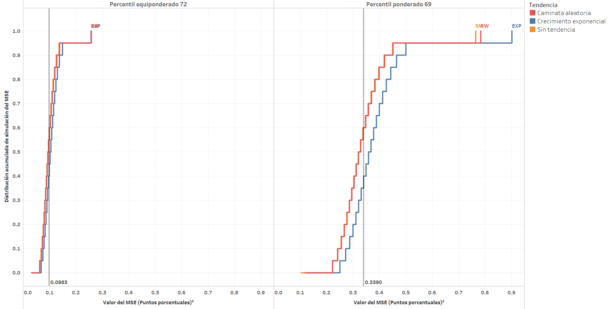  

En la siguiente gráfica, se compara la amplitud de las distribuciones de simulación en los diferentes períodos de evaluación, para ambos grupos de medidas. En este caso, se observa que las distribuciones con mayor rango son las del período de transición, en cualquiera de los escenarios de tendencia.  

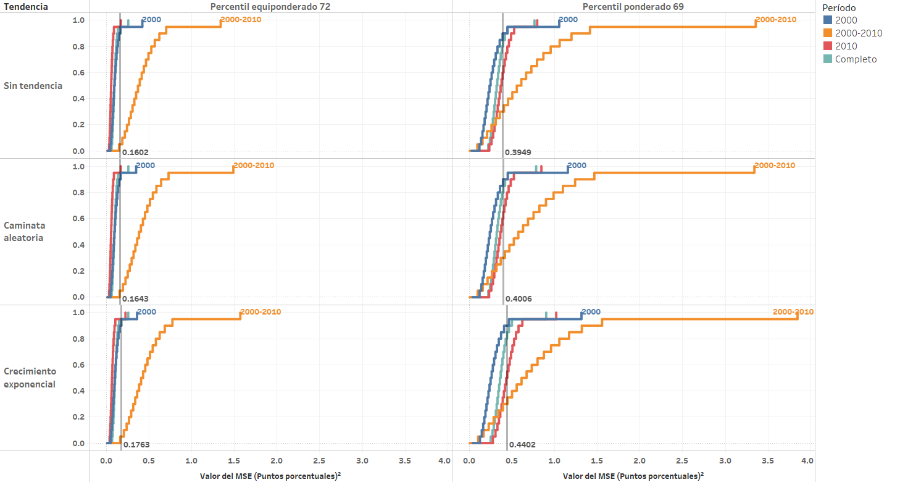  

## Análisis de trayectorias para los datos históricamente observados

A continuación, se presenta una gráfica del comportamiento históricamente observado de los percentiles óptimos obtenidos del escenario base y se comparan resultados con la variación interanual del IPC. Como se observa, el comportamiento general de ambas medidas de inflación subyacente posee menor volatilidad que la medida de inflación oficial. Por su parte, el percentil ponderado 69 presenta niveles ligeramente más altos durante el período del IPC base 2000. Sin embargo, durante el período del IPC base 2010, esta medida presenta en la mayor parte del período un nivel más bajo que el del percentil equiponderado 72, en especial a partir del año 2014.

Cabe resaltar el comportamiento de ambas medidas de inflación durante el período de la crisis económica mundial de 2007-2009, en el cual se observa un alza y una caída mucho más moderada que la registrada por la medida de inflación oficial. Finalmente, a partir de finales del año 2015, ante una desaceleración económica mundial, la caída de precios de alimentos y de petróleo, la variación interanual del IPC registra una subida persistente de nivel, mientras que las medidas de inflación subyacente con base en los percentiles reportan niveles más bajos y moderados de inflación.

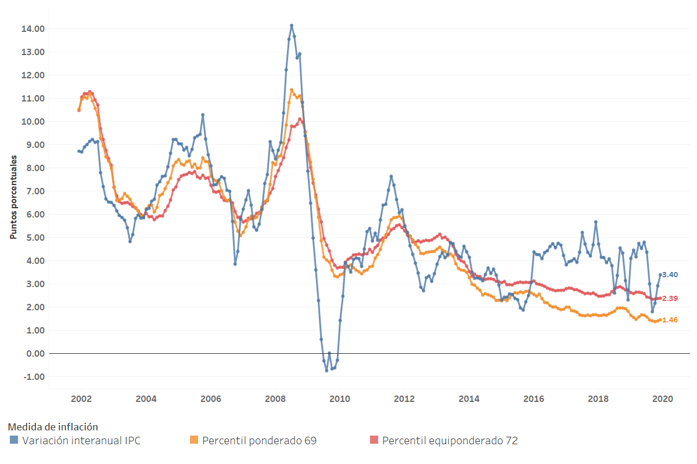  
****