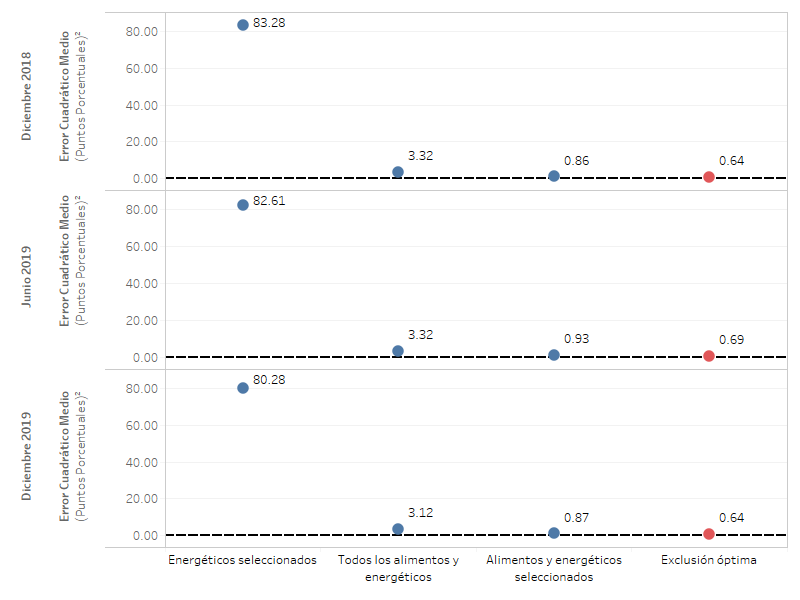
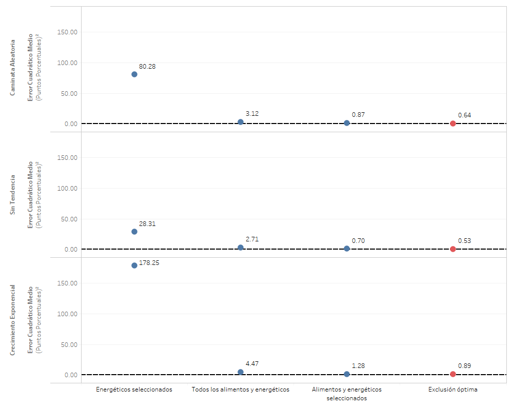
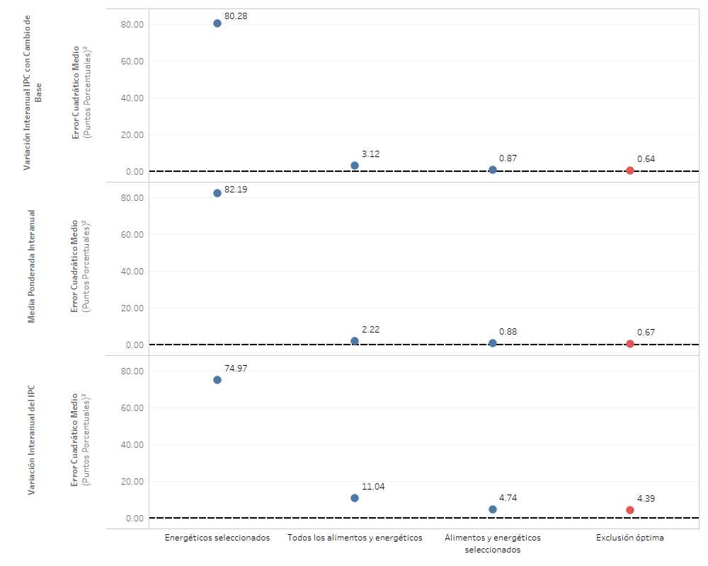
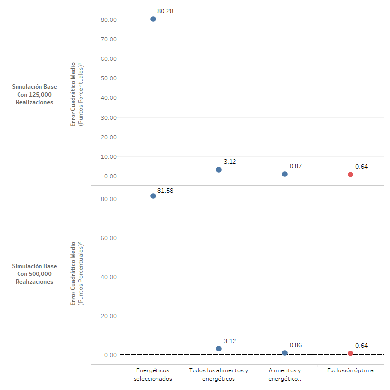
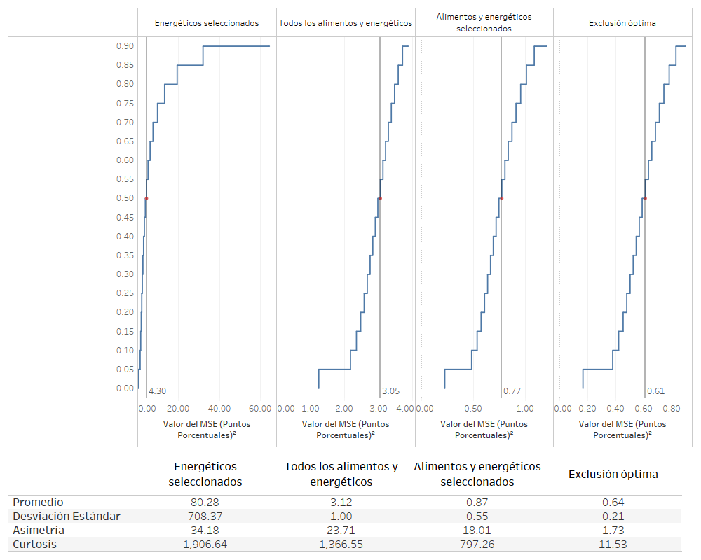
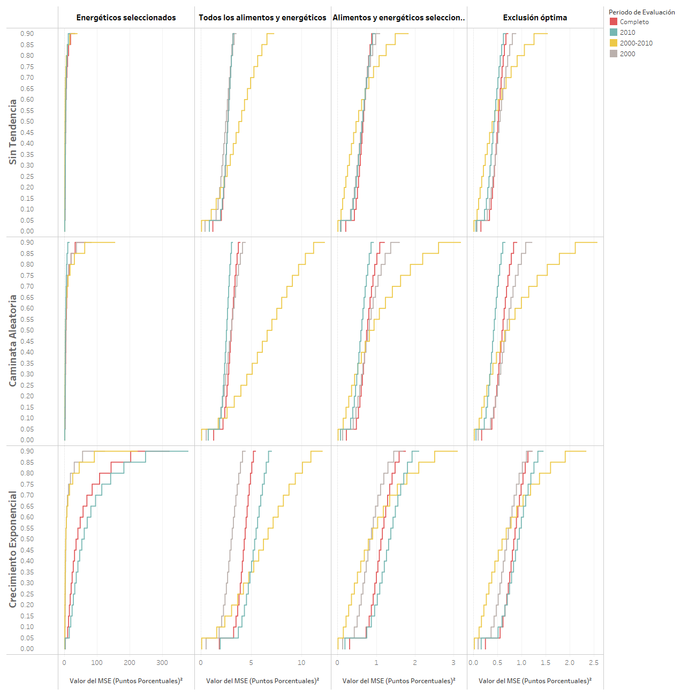
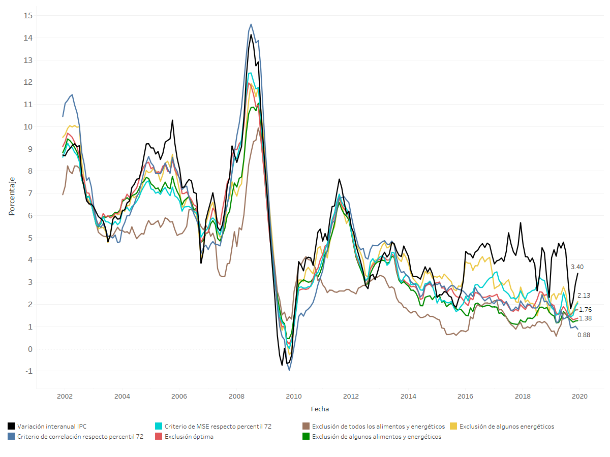

# Evaluación de medidas de inflación total

En esta sección se documentan los resultados del proceso de evaluación de la medida de inflación interanual total y media ponderada interanual. Además de esto, se evalúan las medidas de inflación suavizadas a través de medias móviles, las cuales abarcan de 2 a 12 meses. 

Finalmente, se añade un análisis de sensibilidad el cual se efectúa alterando algunos parámetros respecto a los supuestos básicos.

## Resultados de la evaluación de diferentes medidas de inflación

Dicha evaluación se llevó a cabo utilizando los criterios básicos, aplicados sobre las dos medidas de inflación total y sus respectivas medias móviles.

**Figura.** *Resultado de la evaluación con criterios básicos. Inflación total interanual y medias móviles.*

**Figura.** *Resultado de la evaluación con criterios básicos. Inflación total interanual y medias móviles. Descomposición del MSE.*

En las gráficas anteriores podemos observar que la medida de inflación total minimiza su MSE promedio de evaluación al realizar una media móvil de 12 meses. Sin embargo, dicha media móvil introduce el mayor componente de sesgo a la métrica mencionada. Esto se ve compensado por la mejora en el componente de correlación y precisión. 

**Figura.** *Resultado de la evaluación con criterios básicos. Inflación media ponderada interanual y medias móviles.*

**Figura.** *Resultado de la evaluación con criterios básicos. Inflación media ponderada interanual y medias móviles. Descomposición del MSE.*

Respecto a la media ponderada, podemos notar que la media móvil de 8 meses es la que posee el menor MSE promedio. En la descomposición del MSE podemos notar que tanto el componente de sesgo así como el componente de varianza es mínimo para la media móvil de 12 meses, sin embargo, la componente de correlación se optimiza para la media móvil de 7 periodos. 

Finalmente, si se compara se puede notar que la tanto la media ponderada sin media móvil, así como sus medias móviles, presentan un menor valor de MSE promedio respecto a la inflación total con media móvil de 12 meses, la cual es la mejor evaluada entre el conjunto de medidas basadas en la inflación total. 

## Análisis de sensibilidad ****

En esta sección se presentan los análisis de sensbilidad obtenidos en el ejercicio de evaluación de las medidas de inflación basadas en métodos de exclusión fija. 

### Análisis de sensibilidad ante cambios en el período final de evaluación ****

Debido a que se considera el período completo de evaluación hasta diciembre de 2019, se realiza un análisis de sensibilidad que considera los resultados ante un cambio en el período final de evaluación. Se consideran los siguientes períodos finales de evaluación:

* Diciembre de 2018
* Junio de 2019
* Diciembre 2019

**Figura.** *Análisis de sensibilidad respecto del período final considerado en la evaluación.*

Como se puede observar, en todos los períodos finales considerados,la medida de exclusión óptima resulta invariantemente óptima en términos del MSE de evaluación. Estos resultados muestran que dicha medida óptima no es sensible a cambios en los períodos finales de evaluación que están separados entre 6 meses y un año.

### Análisis de sensibilidad ante cambio en la medida de evaluación ****

Considerando los estadísticos de evaluación alternativos, se construye una gráfica que ilustra el desempeño de las medidas consideradas, utilizando diferentes medidas de evaluación. Dicha gráfica se muestra a continuación.

**Figura.** *Análisis de sensibilidad respecto al cambio en la medida de evaluación.*

Se puede observar que la medida de exclusión óptima es la que obtiene las mejores evaluaciones, sin importar el estadístico utilizado. Cabe destacar que la medida de exclusión de alimentos y energéticos seleccionados se encuentra cercana a los resultados obtenidos a la medida de exclusión óptima. 

### Análisis de sensibilidad ante cambios en el subperíodo de evaluación ****

A continuación, se presenta un análisis de sensibilidad de la evaluación al considerar un cambio en el período de evaluación. La siguiente gráfica ilustra la evaluación de las diferentes medidas exclusión en los diferentes períodos de evaluación, mientras que el escenario base se observa en la última fila, correspondiente al período completo.

**Figura.** *Análisis de sensibilidad ante cambios en el subperíodo de evaluación.*

Se puede observar que la medida de exclusión óptima es la que obtiene las mejores evaluaciones, sin importar el periodo de evaluación utilizado. Se destaca que en el periodo de transición *2000-2010* se encuentran los mayores MSE promedio, derivado de la alta volatilidad en este periodo. Además, se observa que descarta únicamente algunos energéticos seleccionado posee los mayores MSE promedio.

### Análisis de sensibilidad ante cambios en la componente de tendencia ****

A continuación, se presenta un análisis de sensibilidad de la evaluación al considerar un cambio en la componente multiplicativa de tendencia en el procedimiento de evaluación. La siguiente gráfica ilustra la evaluación de las medidas de exclusión fija en tres escenarios de tendencia, siendo el escenario con criterios básicos el que se observa en la primera fila, correspondiente a la componente de tendencia de caminata aleatoria.

**Figura.** *Análisis de sensibilidad ante cambios en la componente de tendencia.*

Se puede observar que la medida de exclusión óptima es la que obtiene las mejores evaluaciones, sin importar la tendencia aplicada. Se destaca que la aplicación de tendencia siempre deriva en una MSE promedio mayor en todas las medidas, y que la componente exponencial es la que introduce más volatilidad e induce mayores errores estándares.

### Análisis de sensibilidad ante cambios en la trayectoria de inflación paramétrica ****

Ahora se presenta un análisis de sensibilidad de la evaluación al considerar un cambio en la trayectoria de inflación paramétrica del procedimiento de evaluación. La siguiente gráfica ilustra la evaluación de las diferentes medidas de exclusión fija utilizando tres diferentes parámetros de inflación, siendo el escenario base el que se observa en la primera fila, correspondiente a la evaluación respecto al parámetro de variación interanual del IPC con cambios de base.

**Figura.** *Análisis de sensibilidad ante cambios en la trayectoria de inflación paramétrica.*

Se puede observar que la medida de exclusión óptima es la que obtiene las mejores evaluaciones, sin importar el parámetro contra quien se esté evaluando. 

### Análisis de sensibilidad ante cambios en el número de simulaciones ****

En este caso, se realiza una prueba de sensibilidad cambiando el número de simulaciones a 500,000 realizaciones de las trayectorias de inflación muestral.

Como se muestra en la gráfica siguiente, los resultados coinciden sin mayor variabilidad. Esto se debe a que el número inicial de simulaciones es, en realidad, más que suficiente para la distribución del MSE de los estimadores muestrales (en realidad, con alrededor de 10,000 simulaciones se tenía errores estándar de simulación muy pequeños).

**Figura.** *Análisis de sensibilidad ante cambios en el número de simulaciones.*

### Análisis de sensibilidad ante cambios en el muestreo ****

Se realiza una prueba de sensibilidad utilizando como técnica de remuestreo la variante de nonoverlapping block bootstrap con bloques de 12 meses. El muestreo se realiza de forma independiente para cada unos de los gastos básicos en cada una de las bases del IPC. A continuación, se muestran los resultados en la gráfica siguiente.

**Figura.** *Análisis de sensibilidad ante cambios en el muestreo.*

Se destaca la disminución en el MSE promedio de la medida de inflación que excluye algunos energéticos. Esta reducción se justifica en la estructura de años completo de los datos contra la estructura mensual, dado que en el muestreo por bloque es menos frecuente la selección de aquellas variaciones intermensuales atípicamente altas o bajas.

### Distribuciones de simulación del MSE en las medidas óptimas ****

A continuación, se presentan gráficas de las distribuciones de simulación del MSE en el escenario base. Esta gráfica permite observar el rango, o amplitud, de la distribución de simulación del estadístico de evaluación a través de la gráfica de la distribución acumulada.

**Figura.** *Distribuciones de simulación del MSE de las medidas de exclusión fija con criterio basicos*.

Se puede observar que la medida *Energéticos seleccionados* presenta la distribución de MSE promedio con mayor desviación estándar, asimetría y curtosis. Por el contrario, la medida denominada *Exclusión óptima* es la que presenta la menor curtosis y asimetría. 

A continuación, se muestra una gráfica similar, en la que se compara la amplitud de las distribuciones de simulación respecto al tipo de tendencia. Nuevamente, se observa que con cualquiera de los tres tipos de componentes de tendencia, se tienen distribuciones con mayor desviación estándar en la medida que solamente excluye alguno gastos básicos relacionado a energéticos.

**Figura.** *Distribuciones de simulación del MSE de las medidas de exclusión fija con criterio basicos, por tipo de tendencia aplicada en la evaluación*.

En la siguiente gráfica, se compara la amplitud de las distribuciones de simulación en los diferentes subperíodos de evaluación. En este caso, se observa que las distribuciones con mayor rango son las del período de transición, en cualquiera de los escenarios de tendencia. Además, se hace notar que al tendencia exponencial es la que produce una mayor amplitud en los rangos de MSE en todas las medidas de exclusión fija, así como cualquier periodo de evaluación. 

**Figura.** *Distribuciones de simulación del MSE de las medidas de exclusión fija con criterio basicos, por subperíodo de evaluación*.

## Análisis de trayectorias para los datos históricamente observados ****

A continuación, se presenta una gráfica del comportamiento históricamente observado de las diferentes medidas de exclusión evaluadas, comparándolas con la variación interanual del IPC, en el período de diciembre de 2001 a diciembre de 2019. Como se observa, en el período de la base 2000 del IPC, todas las medidas, excepto aquella que excluye todos los gastos básicos de los grupos de combustibles y alimentos, tienden a seguir el comportamiento de la inflación total con niveles cercanos y usualmente menores. Similarmente, se observa el mismo comportamiento en el periodo que comprende a la base 2010 del IPC. Se observa que la medida de inflación que excluye todos los alimentos y combustibles es la que mantiene el menor nivel en todos los periodos, así como una volatilidad reducida. 

**Figura.** *Trayectorias de inflación históricamente observadas de las medidas de exclusión fija evaluadas*.
