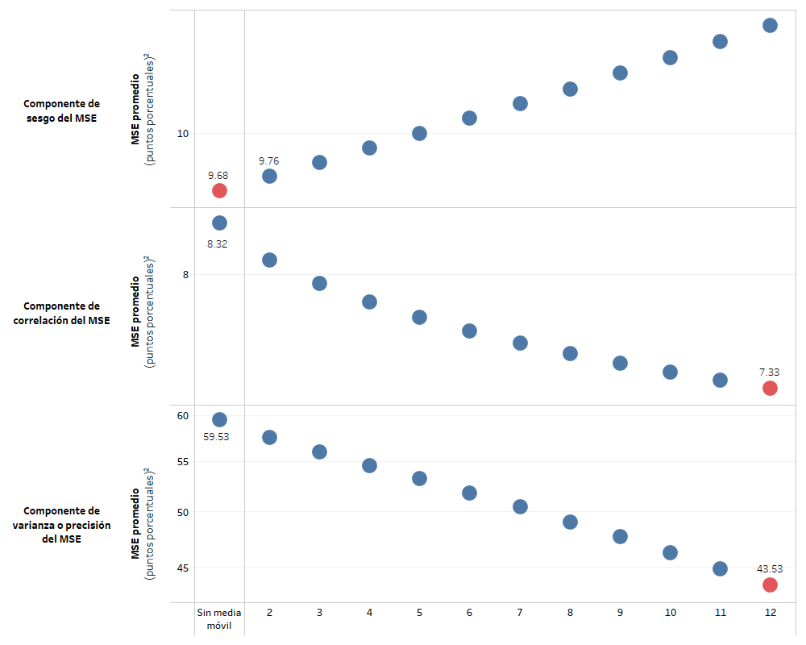
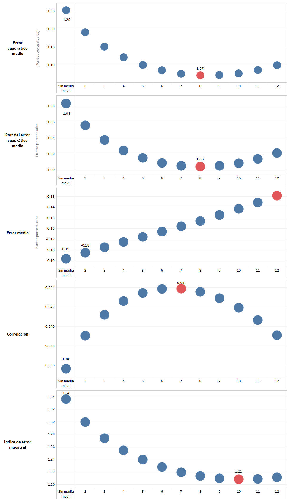
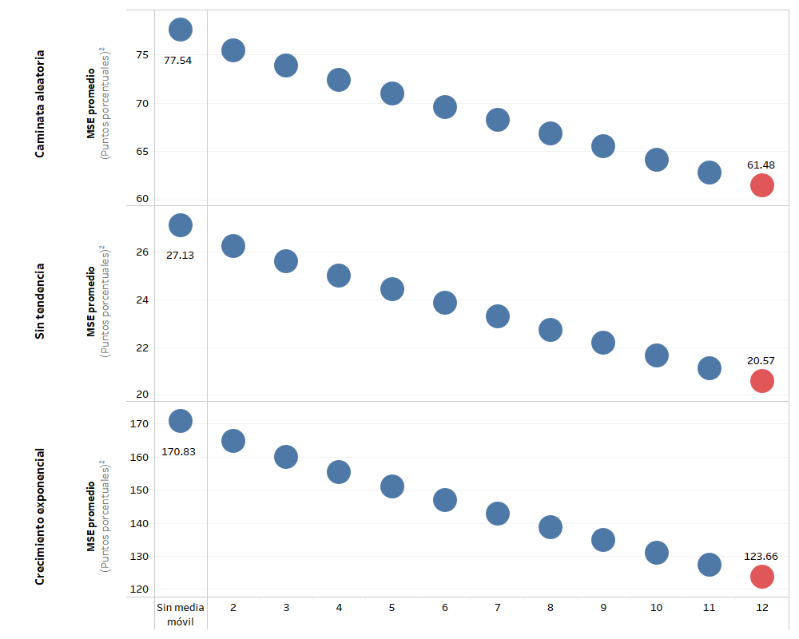
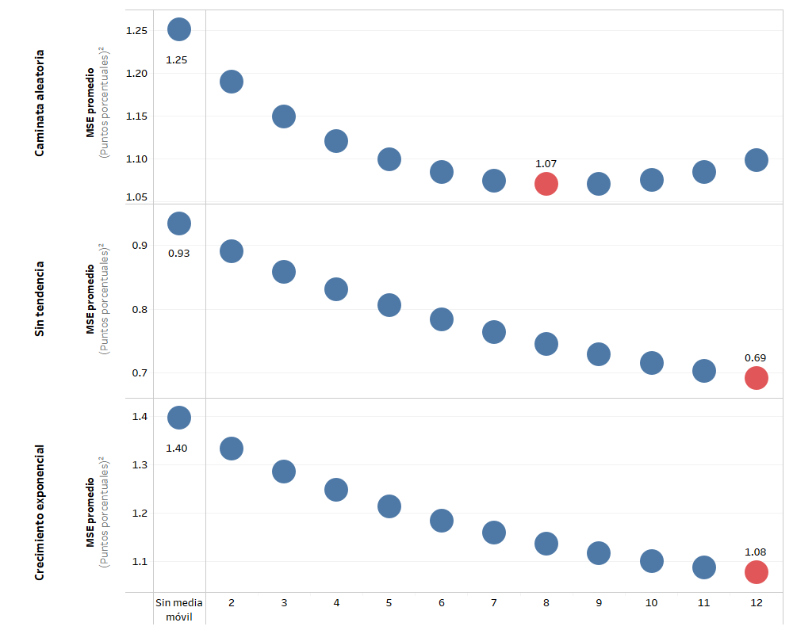
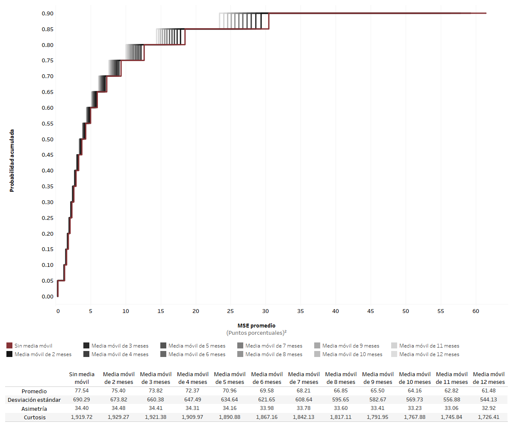
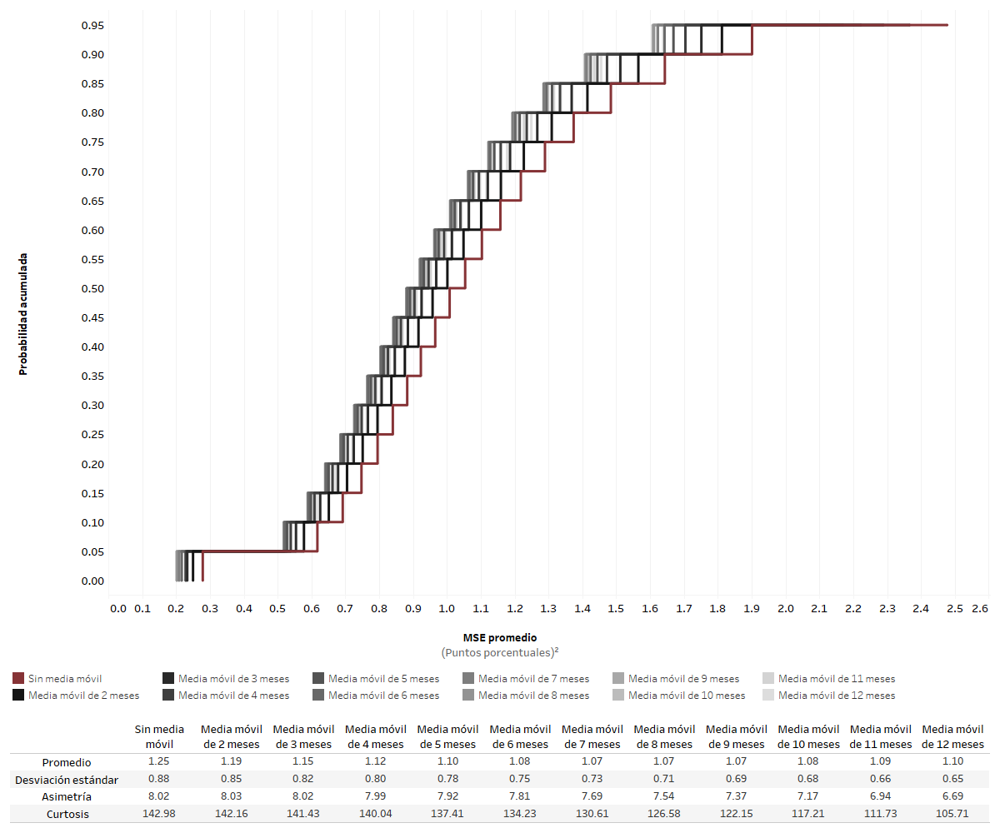
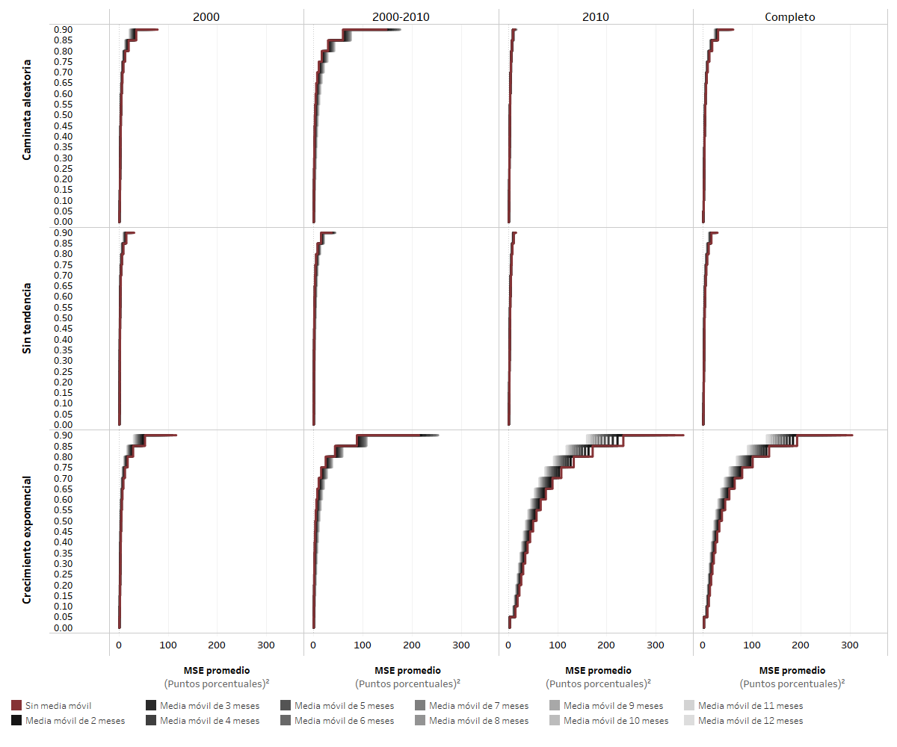
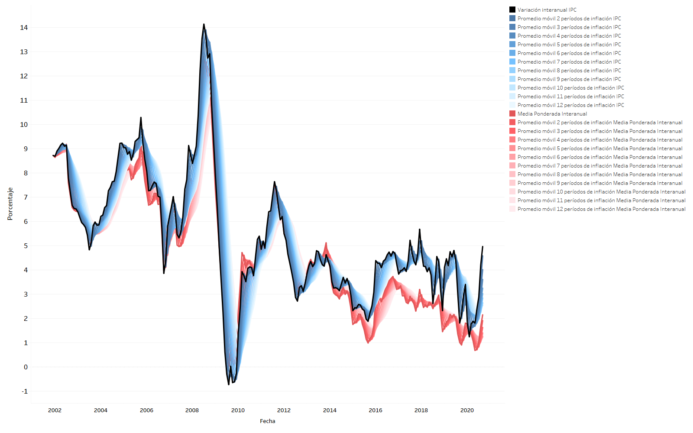

# Evaluación de medidas de inflación total

En esta sección se documentan los resultados del proceso de evaluación de la medida de inflación interanual total y media ponderada interanual. Además de esto, se evalúan las medidas de inflación suavizadas a través de medias móviles, las cuales abarcan de 2 a 12 meses. 

Finalmente, se añade un análisis de sensibilidad el cual se efectúa alterando algunos parámetros respecto a los supuestos básicos.

## Resultados de la evaluación de diferentes medidas de inflación

Dicha evaluación se llevó a cabo utilizando los criterios básicos, aplicados sobre las dos medidas de inflación total y sus respectivas medias móviles.

**Figura.** *Resultado de la evaluación con criterios básicos. Inflación total interanual y medias móviles.*

**Figura.** *Resultado de la evaluación con criterios básicos. Inflación total interanual y medias móviles. Descomposición del MSE.*

En las gráficas anteriores podemos observar que la medida de inflación total minimiza su MSE promedio de evaluación al realizar una media móvil de 12 meses. Sin embargo, dicha media móvil introduce el mayor componente de sesgo a la métrica mencionada. Esto se ve compensado por la mejora en el componente de correlación y precisión. 

**Figura.** *Resultado de la evaluación con criterios básicos. Inflación media ponderada interanual y medias móviles.*

**Figura.** *Resultado de la evaluación con criterios básicos. Inflación media ponderada interanual y medias móviles. Descomposición del MSE.*

Respecto a la media ponderada, podemos notar que la media móvil de 8 meses es la que posee el menor MSE promedio. En la descomposición del MSE podemos notar que tanto el componente de sesgo así como el componente de varianza es mínimo para la media móvil de 12 meses, sin embargo, la componente de correlación se optimiza para la media móvil de 7 periodos. 

Finalmente, si se compara se puede notar que la tanto la media ponderada sin media móvil, así como sus medias móviles, presentan un menor valor de MSE promedio respecto a la inflación total con media móvil de 12 meses, la cual es la mejor evaluada entre el conjunto de medidas basadas en la inflación total. 

## Análisis de sensibilidad

En esta sección se presentan los análisis de sensibilidad obtenidos en el ejercicio de evaluación de las medidas de inflación total, asi como las derivadas del cálculo de sus medias móviles.  

### Análisis de sensibilidad ante cambios en el período final de evaluación 

Debido a que se considera el período completo de evaluación hasta diciembre de 2019, se realiza un análisis de sensibilidad que considera los resultados ante un cambio en el período final de evaluación. Se consideran los siguientes períodos finales de evaluación:

* Diciembre de 2018
* Junio de 2019
* Diciembre 2019

**Figura.** *Análisis de sensibilidad respecto del período final considerado en la evaluación. Inflación total CPI.*

Como se puede observar, el valor del MSE promedio para la inflación total CPI es poco sensible ante cambios en el periodo final de evaluación. Además, se observa que la media móvil de 12 meses de dicha medida es la mejor evaluada sin importar el periodo final de evaluación.

**Figura.** *Análisis de sensibilidad respecto del período final considerado en la evaluación. Media ponderada.*

Del mismo modo, se observa que la inflación media ponderada tampoco es sensible ante cambios el periodo final de evaluación. Sin embargo, la média móvil mejor evaluada sí cambia respecto a la fecha de finalización, siendo la media móvil de 8 meses la que corresponde a diciembre de 2019 y la média móvil de 9 meses para los periodos restantes.

### Análisis de sensibilidad ante cambio en la medida de evaluación

Considerando los estadísticos de evaluación alternativos, se construyen gráficas que ilustran el desempeño de las medidas consideradas, utilizando diferentes medidas de evaluación. Dichas gráficas se muestran a continuación.

**Figura.** *Análisis de sensibilidad respecto al cambio en la medida de evaluación. Inflación total CPI.*

Como se observa en la gráfica, la medida de inflación total CPI es sensible ante el cambio de estadístico. Se puede notar por medio del error medio, que las médias móviles tienden a introducir sesgo a la medida, esto debido a el atraso de la señal que se deriva de este procedimiento. Además podemos notar que la media móvil de 8 meses es la que presenta la mejor correlación promedio. 

**Figura.** *Análisis de sensibilidad respecto al cambio en la medida de evaluación. Media ponderada.*

Del mismo modo que ocurre con la inflación total CPI, el promedio móvil sobre la media ponderada introduce un componente de sesgo positivos a través de las médias móviles. Sin embargo, la medida de inflación es menos sensible ante los cambios del estadístico a evaluar. 

### Análisis de sensibilidad ante cambios en el subperíodo de evaluación

A continuación, se presenta un análisis de sensibilidad de la evaluación al considerar un cambio en el período de evaluación. Las siguientes gráficas ilustran la evaluación de las diferentes medidas en los diferentes períodos de evaluación, mientras que el escenario base se observa en la última fila, correspondiente al período completo.

**Figura.** *Análisis de sensibilidad ante cambios en el subperíodo de evaluación. Inflación total CPI.*

Se observa que la medida de inflación total CPI es altamente sensible al periodo de evaluación. Tanto para el periodo que abarca la base 2000 como el periodo completo, la medida mejor evaluada corresponde a la media móvil de 12 meses, sin embargo, para el periodo de transición la medida sin cálculo de media móvil es la mejor evaluada. Para el periodo que comprende únicamente a la base 2010, es la media móvil de 3 meses la que optimiza el MSE promedio.

**Figura.** *Análisis de sensibilidad ante cambios en el subperíodo de evaluación. Media ponderada.*

Si observamos el valor del MSE promedio de la evaluación de la media ponderada sin media móvil, podemos notar que es menos sensible ante los cambios del periodo de evaluación. Sin embargo, la media móvil óptima sí es sensible ante este cambio. 

### Análisis de sensibilidad ante cambios en la componente de tendencia

A continuación, se presenta un análisis de sensibilidad de la evaluación al considerar un cambio en la componente multiplicativa de tendencia en el procedimiento de evaluación. Las siguientes gráficas ilustran la evaluación de las medidas de inflación total en tres escenarios de tendencia, siendo el escenario con criterios básicos el que se observa en la primera fila, correspondiente a la componente de tendencia de caminata aleatoria.

**Figura.** *Análisis de sensibilidad ante cambios en la componente de tendencia. Inflación total CPI.*
    

Si observamos el MSE promedio de la inflación total CPI sin media móvil en los tres escenarios, notamos que el valor de dicho estadístico es altamente sensible a la forma de la aplicación de la tendencia, sin embargo, podemos notar que la media móvil de 12 meses es la que presenta el menor MSE promedio sin importar la tendencia aplicada. 

**Figura.** *Análisis de sensibilidad ante cambios en la componente de tendencia. Media ponderada.*
    

Respecto a la media ponderada, el MSE promedio de la medida sin media móvil es menos sensible al cambio de la aplicación de tendencia, comparado con la inflación total. También se observa que la media móvil óptima para esta medida de inflación es sensible a la tendencia aplicada, siendo de 8 meses para la aplicación de caminata aleatoria y 12 para las demás.

### Análisis de sensibilidad ante cambios en la trayectoria de inflación paramétrica

Se presenta un análisis de sensibilidad de la evaluación al considerar un cambio en la trayectoria de inflación paramétrica del procedimiento de evaluación. La siguiente gráfica ilustra la evaluación de las diferentes medidas de inflación total utilizando tres diferentes parámetros de inflación, siendo el escenario base el que se observa en la primera fila, correspondiente a la evaluación respecto al parámetro de variación interanual del IPC con cambios de base.

**Figura.** *Análisis de sensibilidad ante cambios en la trayectoria de inflación paramétrica. Inflación total IPC.*
  

Se observa que el MSE promedio de la medida de inflación total sin media móvil no es altamente sensible al cambio de inflación paramétrica. Además, la media móvil óptima no varía ante cambios en el parámetro de inflación.

**Figura.** *Análisis de sensibilidad ante cambios en la trayectoria de inflación paramétrica. Media ponderada.*
 

En el caso de la media ponderada, podemos notar que el MSE promedio sin media móvil es sensible en el caso de la evaluación contra la inflación parámetro IPC total.  Además de esto, se observa que la media móvil óptima es sensible ante cambios en el parámetro de inflación. 

### Análisis de sensibilidad ante cambios en el número de simulaciones

A contuación se presenta un análisis de sensibilidad cambiando el número de simulaciones a 500,000 realizaciones de las trayectorias de inflación muestral.

**Figura.** *Análisis de sensibilidad ante cambios en el número de simulaciones. Inflación total IPC.*
 

Respecto a la medida de inflación total IPC, podemos notar que no es altamente sensible ante cambios en el número de simulaciones, manteniéndose la media móvil óptima.

**Figura.** *Análisis de sensibilidad ante cambios en el número de simulaciones. Media ponderada.*
 

Respecto a la media ponderada, podemos notar que no es sensible ante el cambio en el número de simulaciones, manteniéndose la media movil óptima. Podemos notar que esta medida es mucho menos sensible ante los cambios en el número de simulaciones, comparado con la inflación total.

### Análisis de sensibilidad ante cambios en el muestreo ---

Se realiza una prueba de sensibilidad utilizando como técnica de remuestreo la variante de *nonoverlapping block bootstrap* con bloques de 12 meses. El muestreo se realiza de forma independiente para cada unos de los gastos básicos en cada una de las bases del IPC. A continuación, se muestran los resultados en la gráfica siguiente.

**Figura.** *Análisis de sensibilidad ante cambios en el muestreo. Inflación total IPC.*
 

El método de cómputo de la inflación total IPC hace que sea altamente sensible ante variaciones anómalas en los gatos básicos. El muestreo por bloque reduce la importante de las variaciones anómalas, dado que la probabilidad de su ocurrencia dentro del muestreo es mucho menor. Debido a esto, la medida es altamente sensible ante dichos cambios.

**Figura.** *Análisis de sensibilidad ante cambios en el muestreo. Media ponderada.*
 

Respecto a la media ponderada, podemos notar que la medida es mucho menos sensible ante los cambios en el tipo de muestreo. Esto debido a que dicho método de cálculo es menos sensible ante variaciones anómalas.

### Distribuciones de simulación del MSE en las medidas óptimas

A continuación, se presentan gráficas de las distribuciones de simulación del MSE en el escenario base. Esta gráfica permite observar el rango, o amplitud, de la distribución de simulación del estadístico de evaluación a través de la gráfica de la distribución acumulada.

**Figura.** *Distribuciones de simulación del MSE de la medida de inflación total IPC y sus respectivas medias móviles.*.
 

Podemos notar que las medias móviles que abarcan más periodos, tienden a acumular más probabilidad en valores de MSE promedio más bajos.

**Figura.** *Distribuciones de simulación del MSE de la medida de inflación media ponderada y sus respectivas medias móviles.*.
 

Respecto al a media ponderada, se percibe el mismo efecto de las medias móviles sobre la distribución del MSE promedio, siendo más severo el desplazamiento en aquellas distribuciones derivadas de una media móvil con menos ded 5 periodos. 

Podemos notar que el MSE promedio derivado de la evaluación de la media ponderada tiene una media y dispersión menor a la derivada de la medida de inflación total IPC. En este caso, la diferencia es la sensibilidad de la medida de inflación ante variaciones anómalas en los gatos básicos.

**Figura.** *Distribuciones de simulación del MSE de la medida de inflación total IPC con criterio básicos y por tipo de tendencia aplicada en la evaluación*.
 

En la gráfica anterior, correspondiente a la medida de inflación total IPC, podemos observar que, a una misma tendencia aplicada fija, el periodo de transición 2000-2010 es el que genera una distribución de MSE promedio más dispersa. Por el contrario, el periodo de evaluación 2010 es el que presenta la distribución menos dispersa, además de estar concentrada en MSE promedio menores. Respecto a la tendencia, podemos notar que la aplicación de crecimiento exponencial genera la distribución más dispersa, concentrándose en MSE promedio mayores a los observados en los otros tipos de aplicaciones de tendencia. 

**Figura.** *Distribuciones de simulación del MSE de la meida ponderada con criterio básicos y por tipo de tendencia aplicada en la evaluación*.
 

Las conclusiones son similares para las distribuciones del MSE promedio obtenidas al evaluar la media ponderada, con la observación que dichas distribuciones se centran en valores mucho menores a los obtenidos al evaluar la inflación total CPI. 

## Análisis de trayectorias para los datos históricamente observados ****

A continuación, se presenta una gráfica del comportamiento históricamente observado de las medidas de inflación total (y sus medias móviles), comparándolas con la variación interanual del IPC, en el período de diciembre de 2001 a diciembre de 2019. En primer lugar, podemos observar que las medias móviles tienden a atrasar y suavizar la señal provista por las medidas de inflación total IPC y media ponderada. Además, el nivel de las inflaciones totales IPC y la media ponderada son similares durante la base 2000, separándose presistentemente a partir de 2015 (en la base 2010).

**Figura.** *Trayectorias de inflación históricamente observadas en la inflación total IPC, como en la media ponderada y sus respectivas medias móviles*.
 
