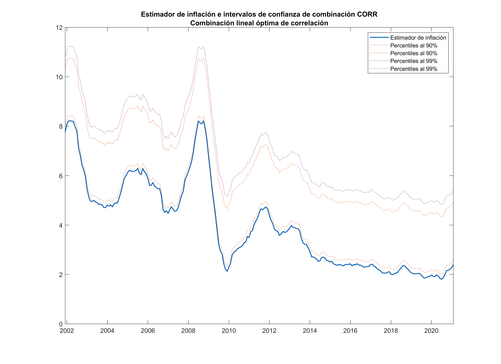
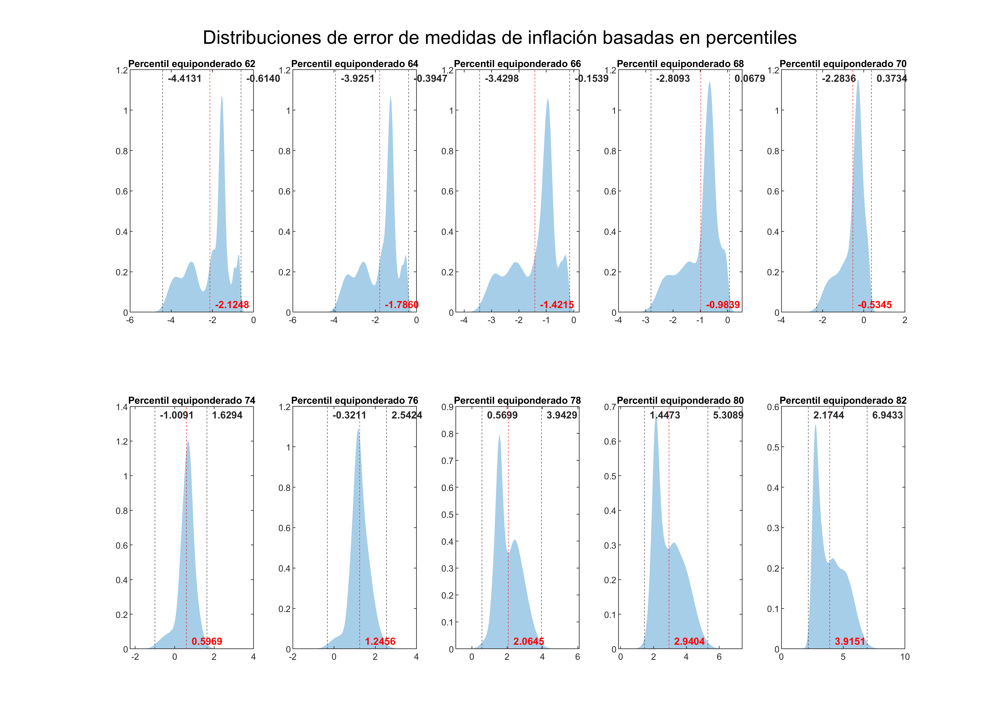
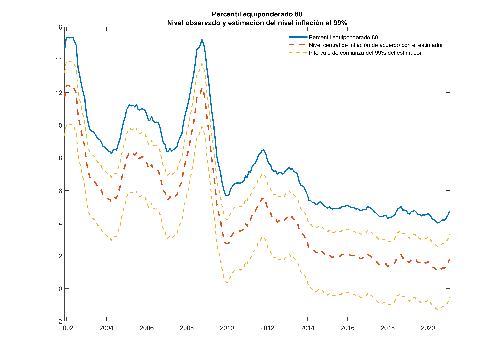

# Intervalos de confianza

## Construcción de intervalos de confianza para medidas de combinación lineal

- A partir de las distribuciones de error (de todos los períodos y todas las realizaciones) de cada medida de inflación, se obtienen los percentiles adecuados para tener el 90%, 95% y 99% de los errores dentro de los límites $e_{j,L}$ y $e_{j,U}$.
  - $e_{j,L}$ acumula 0.5%, 2.5% ó 5% en la cola inferior de la medida $j$.
  - $e_{j,U}$ acumula 99.5%, 97.5% ó 95% en la cola superior de la medida $j$.
- Partiendo de que los errores de la medida $j$ en el período $t$ fueron computados como $e_{j,t} = \pi_{j,t} - \pi_{t}$, esto permite estimar que el parámetro (la verdadera inflación) está dado por: $\hat{\pi}_{t} = \pi_{j,t} - e_{j,t}$

- Por lo tanto, se puede construir un intervalo de confianza para la estimación del parámetro utilizando $e_{j,L}$ y $e_{j,U}$. 
  - El límite inferior de $\hat{\pi}_{t}$ está dado por $\pi_{j,t} - e_{j,U}$. 
  - El límite superior de $\hat{\pi}_{t}$ está dado por $\pi_{j,t} - e_{j,L}$. 
  - El valor central está dado por $\pi_{j,t}$ 
    - pues, si el error fuera cero ($e_{j,t} = 0$), el estimador muestral $j$ estaría justo en el nivel de la verdadera inflación.

- A continuación se ilustran los resultados obtenidos para las medidas de inflación que componen las combinaciones lineales óptimas.

### Intervalos de confianza para combinación lineal MSE

#### Distribuciones de error de medidas de la combinación lineal de MSE

#### Percentiles de distribuciones de error (combinación MSE)
| Medida de inflación               | $L_{99}$ | $U_{99}$ | $L_{95}$ | $U_{95}$ | $L_{90}$ | $U_{90}$ |
| :-------------------------------- | -------: | -------: | -------: | -------: | -------: | -------: |
| Percentil equiponderado 72        |   -0.764 |    1.738 |   -0.606 |    1.384 |   -0.532 |    1.152 |
| Percentil ponderado 70            |   -1.688 |    1.786 |   -1.258 |    1.313 |   -1.044 |    1.034 |
| Media truncada eq. (57.5, 84)     |   -0.876 |    1.523 |   -0.708 |    1.165 |   -0.633 |    0.928 |
| Media truncada pond. (15, 97)     |   -1.355 |    1.670 |   -1.006 |    1.230 |   -0.833 |    0.971 |
| Exclusión fija óptima DIE         |   -2.415 |    1.965 |   -1.502 |    1.519 |   -1.062 |    1.327 |
| Subyacente dinámica (0.32, 1.72)  |   -1.362 |    1.741 |   -0.974 |    1.299 |   -0.797 |    1.019 |
| Subyacente MAI óptima MSE         |   -1.098 |    1.492 |   -0.824 |    1.103 |   -0.691 |    0.869 |
| **Combinación lineal óptima MSE** |   -0.940 |    1.390 |   -0.662 |    0.986 |   -0.544 |    0.732 |

#### Combinación lineal óptima MSE con intervalos de confianza al 99%

--- 
### Intervalos de confianza para combinación lineal ME

#### Distribuciones de error de medidas de la combinación lineal de MSE

#### Percentiles de distribuciones de error (combinación ME)
| Medida de inflación              | $L_{99}$ | $U_{99}$ | $L_{95}$ | $U_{95}$ | $L_{90}$ | $U_{90}$ |
| :------------------------------- | -------: | -------: | -------: | -------: | -------: | -------: |
| Percentil equiponderado 72       |   -0.763 |    1.738 |   -0.606 |    1.384 |   -0.532 |    1.152 |
| Percentil ponderado 70           |   -1.688 |    1.786 |   -1.258 |    1.313 |   -1.044 |    1.034 |
| Media truncada eq. (42.5, 91)    |   -0.762 |    1.623 |   -0.640 |    1.288 |   -0.574 |    1.074 |
| Media truncada pond. (52.5, 85)  |   -1.600 |    1.606 |   -1.235 |    1.156 |   -1.052 |    0.900 |
| Exclusión fija óptima DIE        |   -2.415 |    1.965 |   -1.502 |    1.519 |   -1.062 |    1.327 |
| Subyacente dinámica (0.35, 1.88) |   -1.324 |    1.720 |   -0.967 |    1.289 |   -0.800 |    1.019 |
| Subyacente MAI óptima ME         |   -1.357 |    1.552 |   -0.991 |    1.105 |   -0.814 |    0.870 |
| **Combinación lineal óptima ME** |   -1.256 |    1.537 |   -0.959 |    1.137 |   -0.808 |    0.873 |

#### Combinación lineal óptima ME con intervalos de confianza al 99%

--- 
### Intervalos de confianza para combinación lineal de correlación

#### Distribuciones de error de medidas de la combinación lineal de correlación

#### Percentiles de distribuciones de error (combinación de correlación)
| Medida de inflación                | $L_{99}$ | $U_{99}$ | $L_{95}$ | $U_{95}$ | $L_{90}$ | $U_{90}$ |
| :--------------------------------- | -------: | -------: | -------: | -------: | -------: | -------: |
| Percentil equiponderado 80         |   -5.308 |   -1.447 |   -4.821 |    -1.70 |   -4.558 |   -1.817 |
| Percentil ponderado 80             |   -8.292 |   -1.045 |   -7.310 |    -1.31 |   -6.802 |   -1.465 |
| Media truncada eq. (57.5, 92)      |   -3.799 |   -0.721 |   -3.426 |    -1.15 |   -3.225 |   -1.343 |
| Media truncada pond. (52.5, 97)    |   -9.251 |   -1.740 |   -8.304 |    -2.05 |   -7.804 |   -2.225 |
| Exclusión fija óptima DIE          |   -2.415 |   1.9652 |   -1.502 |    1.519 |   -1.062 |   1.3277 |
| Subyacente dinámica (0.359, 2.5)   |   -2.109 |   1.1368 |   -1.652 |    0.670 |   -1.437 |   0.4075 |
| Subyacente MAI óptima CORR         |    0.989 |   6.2742 |    1.110 |    5.974 |    1.210 |   5.7135 |
| **Combinación lineal óptima CORR** |   -0.001 |   3.0126 |   0.1263 |    2.716 |    0.210 |   2.5332 |

#### Combinación lineal óptima de correlación con intervalos de confianza al 99%

---
## Reducción de intervalos de confianza con medidas basadas en percentiles

Se busca acotar el intervalo de confianza de la combinación lineal óptima MSE y para esto se observan las distribuciones de error medio a través de todas las simulaciones de las medidas de inflación basadas en percentiles. 

- Conformamos límites de confianza del 99% para la inflación paramétrica de las medidas que subestiman el parámetro de inflación.

| Medida de inflación  | Observado en FEB-21 | Límite inferior | Límite superior |
| :------------------: | :-----------------: | :-------------: | :-------------: |
|   Percentil eq. 62   |       1.0261        |   **1.6402**    |     5.4392      |
|   Percentil eq. 64   |       1.3244        |   **1.7191**    |     5.2495      |
|   Percentil eq. 66   |       1.6414        |   **1.7953**    |     5.0713      |
|   Percentil eq. 68   |       1.9131        |   **1.8452**    |     4.7224      |
| **Percentil eq. 69** |       2.0581        |  ***1.8447***   |     4.6078      |
|   Percentil eq. 70   |       2.2122        |   **1.8388**    |     4.4958      |

---
- Conformamos límites de confianza del 99% para la inflación paramétrica de las medidas que sobreestiman el parámetro de inflación.
  
| Medida de inflación  | Observado en FEB-21 | Límite inferior | Límite superior |
| :------------------: | :-----------------: | :-------------: | :-------------: |
|   Percentil eq. 74   |       2.9963        |     1.3669      |   **4.0055**    |
|   Percentil eq. 76   |       3.3794        |     0.83698     |   **3.7005**    |
|   Percentil eq. 78   |       3.9679        |    0.024996     |    **3.398**    |
| **Percentil eq. 80** |       4.7694        |    -0.53946     |  ***3.3221***   |
|   Percentil eq. 82   |       5.7276        |     -1.2157     |   **3.5531**    |

--- 

- La siguiente gráfica fue revisada para determinar si límites inferiores de los intervalos de confianza de los percentiles equiponderados 68 y 69 pueden fungir como límites inferiores de la combinación lineal óptima MSE.

- En la base 2000 del IPC, dichos límites no son mejores que el propio límite inferior de la combinación lineal óptima. 
- En algunos períodos alrededor del 2010, el límite inferior es superior al estimador puntual de combinación lineal MSE (hay un traslape).
- En la base 2010, dichos límites inferiores resultan mejores que el de la cominación lineal MSE.

## Conformación de intervalo de confianza conjunto

- Se seleccionan las siguientes tres medidas de inflación para determinar un intervalo de confianza conjunto: 
  - Combinación lineal óptima MSE.
  - Combinación lineal óptima de correlación.
  - Percentil equiponderado 80.

- A continuación se muestran las distribuciones de sus errores y las distribuciones marginales para el nivel de inflación en febrero de 2021.

 

### Nivel de confianza con distribución conjunta de errores

- El valor estimado de inflación a través de la combinación lineal de MSE en febrero de 2021 es: 

  - **Estimación puntual:**  2.84 p.p. 
  - **Límite inferior:**     2.41 p.p. 
  - **Límite superior:**     3.32 p.p. 
  - **Nivel de confianza:**  97.5% de acuerdo con la distribución conjunta de errores de las 3 medidas de inflación.

## Interpretación del cómputo del nivel de confianza del 97.5%
- Esta puede servir como una forma alternativa de explicar el nivel de confianza del 97.5%.
- En cada realización y para cada medida y período se tiene el valor puntual de cada estimador. Además, se tiene la distribución ex-post del error,  es decir, los tríos de errores de cada medida de inflación. 
- Se siguen los pasos detallados a continuación: 

1. Conformar en cada realización el intervalo de confianza de cada estimador con su respectiva distribución de error ex-post.
2. Obtener la intersección de los límites de confianza: el máximo de los intervalos inferiores y el mínimo de los intervalos superiores
3. Determinar si el parámetro quedó dentro de esta reducción del intervalo de confianza en cada período y en cada realización.
4. Determinar en qué proporción total del número de realizaciones el parámetro quedó acotado por estos límites recortados. 
   1. Se calcula el promedio en la dimensión de las realizaciones y queda como función del tiempo. Se muestra gráfica a continuación. 
   2. Se calcula el promedio en la dimensión de las realizaciones y el tiempo. Esto resultó en el **97.5%** nuevamente.

- La ventaja de este análisis es que nos da una idea de la interpretación que tiene el 97.5% en el tiempo: **es el promedio a través del tiempo del porcentaje de las veces que durante la simulación, la trayectoria paramétrica estuvo dentro del intervalo de confianza reducido con las 3 medidas de inflación**.

- Como se observa, en algunos períodos la trayectoria paramétrica estuvo efectivamente fuera del intervalo de confianza reducido.
  - Desde un 10% en los mejores períodos hasta un 40% de las veces al inicio de la base 2010.
- Si se compara esta gráfica con la equivalente, pero tomando solamente la combinación lineal MSE, queda claro que se está haciendo un intercambio en el nivel de confianza por reducir el ancho del intervalo utilizando las 3 medidas de inflación.

--- 
## Anexos

### Medidas de inflación que componen el intervalo de confianza conjunto

 

 

    

