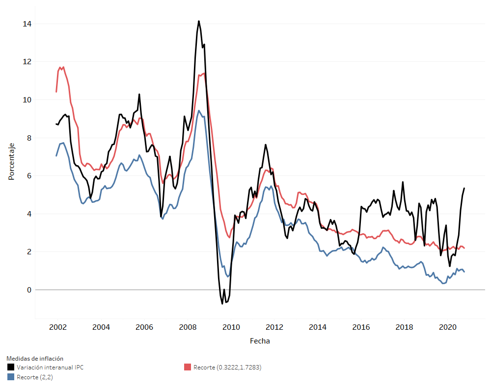

# Evaluación de medidas de exclusión dinámica

En esta sección se documentan los resultados del proceso de evaluación de la medida de inflación basadas en la exclusión dinámica de gastos básicos. Junto a dicha evaluación, se añade los resultados de la optimización de los límites para el recorte dinámico, explicado más adelante. 

Finalmente, se añade un análisis de sensibilidad, el cual se efectúa modificando algunos parámetros respecto de los criterios básicos de evaluación.

Dada la desviación estándar $\sigma_{v_t}$ del conjunto $\lbrace v_{t,i}\rbrace_{i=1}^N$, la cual corresponde a las variaciones intermensuales de todos los gastos básicos en el periodo $t$, definimos la función 

$$
w_{t,i} = \lbrace \begin{array}{cc} IPC_i& \bar{v_t} - \lambda_1\sigma_{v_t} \leq v_{t,i} \leq \bar{v_t} + \lambda_2 \sigma_{v_t} \\
0 &  \text{en otro caso} \end{array}
$$

A partir de los nuevos pesos, computamos una variación intermensual promedio ponderada

$$
\hat{v_t} = \sum_{i=1}^N \dfrac{w_{t,i}}{\sum_{i=1}^N w_{t,i}}v_{t,i}
$$

con la cual podemos computar un nuevo índice de precios capitalizando a partir del periodo inicial del modo siguiente

$$
\hat{IPC_t} = 100 \prod_{j=1}^t \hat{v_j}
$$

En donde $t$ corresponde a la posición relativa respecto al periodo inicial. Esta ecuación corresponde al cómputo de la inflación subyacente dinámica.  

El recorte usual para la medida de inflación subyacente dinámica corresponde al recorte simétrico, definido por $\lambda_1 = \lambda_2 = 2$, siendo este uno de los dos recortes a evaluar en las posteriores secciones. Además de esto, y utilizando la HEMI, se plante el problema de optimización

$$
\min_{\lambda_1, \lambda_2} f(\lambda_1,\lambda_2)
$$

En donde la función $f(.)$ corresponde a la evaluación de un conjunto de variaciones intermensuales con criterios básicos, utilizando como variables a optimizar, los parámetros de escala para los recortes. El resultado del proceso de optimización corresponde al segundo recorte a evaluar.

**Figura.** *Evaluación exploratorio. Evaluación de medidas de inflación subyacente dinámica variando los factores $\lambda_1$ y $\lambda_2$. Evaluación con criterios básicos y 10,000 simulaciones.*

Previo a la optimización con criterios básicos y 125 mil simulaciones, se realiza un proceso exploratorio con 10 mil simulaciones con el fin de identificar la región óptima y un punto adecuado para comenzar el algoritmo de optimización. De la gráfica anterior podemos observar que el recorte óptimo se encuentra al rededor de $\lambda_1 = 0.35$ y $\lambda_2 = 1.9$. Comparado con el recorte simétrico, podemos notar que la medida óptima descarta una mayor cantidad de gastos básicos que están bajo la media de cada periodo. Además podemos notar que la medida con recorte simétrico se encuentra en una región subóptima, mostrándose en la gráfica el recorte más cercano a la misma. 

Al completar el proceso de optimización utilizando critérios básicos, se obtienen los parámetros $\lambda_1 = 0.3222$ y $\lambda_2 = 1.7283$. Esto quiere decir que, respecto al recorte simétrico de dos desviaciones estándar, la medida óptima incluye menos gástos básicos, descartando más gastos que tienen una variación interanual inferior a la media. También podemos notar que el recorte óptimo no es simétrico. Esto puede explicarse por la acumulación de variaciones pequeñas en la distribución.

## Resultados de la evaluación de diferentes medidas de inflación

Dicha evaluación se llevó a cabo utilizando los criterios básicos, aplicados sobre el recorte simétrico y el recorte optimizado.

**Figura.** *Resultados del error cuadrático medio de la evaluación con criterios básicos.*

Podemos observar que el recorte optimizado presenta un MSE promedio de evaluación mucho menor al recorte simétrico, estando al rededor de los niveles de MSE promedio observados en la media truncada equiponderada.

**Figura.** *Resultados del MSE de la evaluación con criterios básicos.*

Respecto a la descomposición del MSE promedio, podemos notar que la medida optimizada presenta sesgo y varianza cercanas a cero.

## Análisis de sensibilidad

En esta sección se presentan los análisis de sensibilidad obtenidos en el ejercicio de evaluación de las medidas subyacentes dinámicas con recorte simétrico y optimizado.

### Análisis de sensibilidad ante cambios en el período final de evaluación 

Debido a que se considera el período completo de evaluación hasta diciembre de 2019, se realiza un análisis de sensibilidad que considera los resultados ante un cambio en el período final de evaluación. Se consideran los siguientes períodos finales de evaluación:

* Diciembre de 2018
* Junio de 2019
* Diciembre 2019

**Figura.** *Análisis de sensibilidad respecto del período final considerado en la evaluación.*

Se puede observar que ambas medidas son poco sensibles ante cambios en el periodo final de evaluación, siendo la medida optimizada la que presenta los menores MSE promedios en los tres escenarios.

### Análisis de sensibilidad ante cambio en la medida de evaluación

Considerando los estadísticos de evaluación alternativos, se construyen gráficas que ilustran el desempeño de las medidas consideradas, utilizando diferentes medidas de evaluación. Dichas gráficas se muestran a continuación.

**Figura.** *Análisis de sensibilidad respecto al cambio en la medida de evaluación.*

Podemos observar, en primer lugar, que la medida optimizada es la que presenta las mejores características para cada estadístico. Ademas, se puede notar que presenta un error medio igual a cero, lo que implica un sesgo nulo. Además de esto, la medida óptima obtiene una correlación promedio mayor a la medida con recorte simétrico.

El índice de error muestral resume las propiedades antes mencionadas.

### Análisis de sensibilidad ante cambios en el subperíodo de evaluación

A continuación, se presenta un análisis de sensibilidad de la evaluación al considerar un cambio en el período de evaluación. Las siguientes gráficas ilustran los resultados en los diferentes períodos de evaluación, mientras que el escenario base se observa en la última fila, correspondiente al período completo.

**Figura.** *Análisis de sensibilidad ante cambios en el subperíodo de evaluación.*

Se observa que los valores más altos de MSE promedio se obtienen en el periodo de transición, mientras que los más bajos en el periodo 2010. La medida de recorte optimizado presenta el menor MSE promedio en los cuatro escenarios, siendo robusta ante dichos cambios.

### Análisis de sensibilidad ante cambios en la componente de tendencia

A continuación, se presenta un análisis de sensibilidad de la evaluación al considerar un cambio en la componente multiplicativa de tendencia en el procedimiento de evaluación. Las siguientes gráficas ilustran la evaluación de las medidas de inflación total en tres escenarios de tendencia, siendo el escenario con criterios básicos el que se observa en la primera fila, correspondiente a la componente de tendencia de caminata aleatoria.

**Figura.** *Análisis de sensibilidad ante cambios en la componente de tendencia.*
    

La medida optimizada es la que presenta el menor MSE promedio sin importar el escenario de tendencia aplicado. También podemos notar que la tendencia de crecimiento exponencial es la que introduce una mayor componente de error en el proceso.

### Análisis de sensibilidad ante cambios en la trayectoria de inflación paramétrica

Se presenta un análisis de sensibilidad de la evaluación al considerar un cambio en la trayectoria de inflación paramétrica del procedimiento de evaluación. La siguiente gráfica ilustra la evaluación de las diferentes medidas de inflación total utilizando tres diferentes parámetros de inflación, siendo el escenario base el que se observa en la primera fila, correspondiente a la evaluación respecto al parámetro de variación interanual del IPC con cambios de base.

**Figura.** *Análisis de sensibilidad ante cambios en la trayectoria de inflación paramétrica. variación interanual del IPC.*
  

Se observa que la medida optimizada es la que presenta el menor MSE promedio en cualquiera de los tres escenarios. Además, los valores más altos de MSE promedio se obtienen al evaluar las medidas subyacentes contra las inflación total IPC paramétrica. 

### Análisis de sensibilidad ante cambios en el número de simulaciones

A contuación se presenta un análisis de sensibilidad cambiando el número de simulaciones a 500,000 realizaciones de las trayectorias de inflación muestral.

**Figura.** *Análisis de sensibilidad ante cambios en el número de simulaciones.*
 

Dado que ambas medidas moderan la volatilidad de las variaciones introducidas en ellas, el cambio en el número de simulaciones es altamente robusto, siendo la medida optimizada la que obtiene el menor MSE promedio en ambos escenarios.

### Análisis de sensibilidad ante cambios en el muestreo

Se realiza una prueba de sensibilidad utilizando como técnica de remuestreo la variante de *nonoverlapping block bootstrap* con bloques de 12 meses. El muestreo se realiza de forma independiente para cada unos de los gastos básicos en cada una de las bases del IPC. A continuación, se muestran los resultados en la gráfica siguiente.

**Figura.** *Análisis de sensibilidad ante cambios en el muestreo.*
 

Del mismo modo que el escenario anterior, dado que las medidas moderan la volatilidad de las variaciones introducidas en el proceso, dichas medidas son altamente robustas ante cambios en el tipo de muestreo, siendo el recorte optimizado el que presenta el menor MSE promedio en ambos escenarios.

### Distribuciones de simulación del MSE en las medidas óptimas

A continuación, se presentan las gráficas de las distribuciones de simulación del MSE en el escenario base. Esta gráfica permite observar el rango, o amplitud, de la distribución de simulación del error cuadrático medio a través de la gráfica de su distribución acumulada.

**Figura.** *Distribuciones de simulación del MSE promedio.*.
 

Podemos notar que la distribución del MSE promedio de la medida con recorte optimizado tiene un un promedio y desviación entándar menor, lo que indica que se concentra en valores bajos. Esto es deseable dado que indica robustez en el estadístico. 

**Figura.** *Distribuciones de simulación del MSE promedio con criterios básicos y por tipo de tendencia aplicada en la evaluación*.
 

Respecto a la sensibilidad de las distribuciones, se puede observar que el las distribuciones no son altamente sensible ante cambios en el periodo de evaluación y tendencia, exceptuando al escenario que introduce una tendencia exponencial.

## Análisis de trayectorias para los datos históricamente observados

A continuación, se presenta una gráfica del comportamiento históricamente observado de las medidas subyacentes dinámicas, tanto la simétrica como la de recorte optimizado, así como la inflación total. Podemos notar que ambas medidas subyacentes presentan una alta correlación con la inflación total, sin embargo, el nivel de la inflación subyacente con recorte óptimo es mayor a la medida de recorte simétrico en toda su trayectoria.

**Figura.** *Trayectorias de inflación históricamente observadas de la variación interanual del IPC y de las medidas subyacentes dinámicas.*.
 
