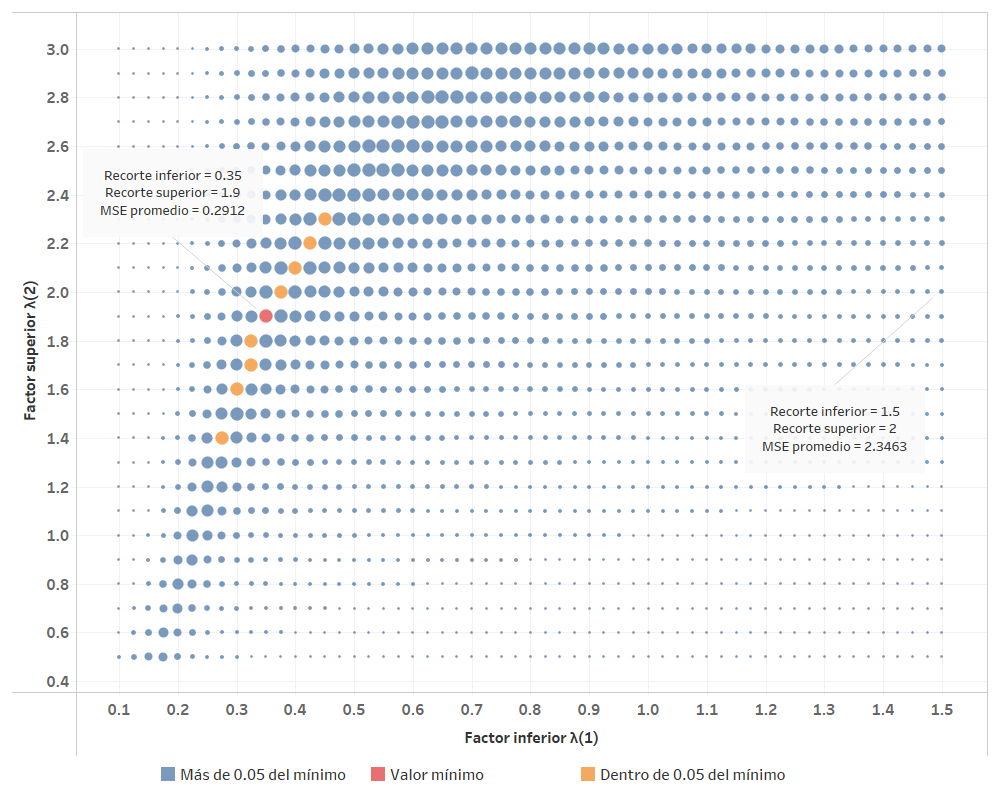

# Evaluación de medidas de exclusión dinámica

En esta sección se documentan los resultados del proceso de evaluación de la medida de inflación basadas en la exclusión dinámica de gastos básicos. Junto a dicha evaluación, se añade los resultados de la optimización de los límites para el recorte dinámico, explicado más adelante. 

Finalmente, se añade un análisis de sensibilidad, el cual se efectúa modificando algunos parámetros respecto de los criterios básicos de evaluación.

## Proceso de optimización se los límites de exclusión

Dada la desviación estándar $\sigma_{v_t}$ del conjunto $\lbrace v_{t,i}\rbrace_{i=1}^N$, la cual corresponde a las variaciones intermensuales de todos los gastos básicos en el periodo $t$, definimos el subconjunto 
$$\mathscr{V}_t = \lbrace v_{t,i}: \lambda_1 \sigma_{v_t} - \bar{v_t}  \leq v_{t,i} \leq \lambda_2 \sigma_{v_t} + \bar{v_t} \rbrace$$

El conjunto $\mathscr{V}_t$, corresponde a aquellas variaciones intermensuales en el periodo $t$ que se encuentran en el rango especificado, en donde los parámetros $\lambda_1$ y $\lambda_2$ son los que determinan la amplitud del mismo. 

Sobre el conjunto anterior se puede calcular una variación intermensual ponderada

$$
v_t = \sum_ {v_{t,i} \in \mathscr{V}_t} \dfrac{IPC_{v_{t,i}}}{\sum_ {v_{t,i} \in \mathscr{V}_t}IPC_{v_{t,i}}}v_{t,i}
$$

la cual corresponde a la inflación subyacente dinámica. 

El recorte usual para la medida de inflación subyacente dinámica corresponde al recorte simétrico, definido por $\lambda_1 = \lambda_2 = 2$, siendo este uno de los dos recortes a evaluar en las posteriores secciones. Además de esto, y utilizando la HEMI, se plante el problema de optimización

$$
\min_{\lambda_1, \lambda_2} f(\lambda_1,\lambda_2)
$$

En donde la función $f(.)$ corresponde a la evaluación de un conjunto de variaciones intermensuales con criterios básicos, utilizando como variables a optimizar, los parámetros de escala para los recortes. El resultado del proceso de optimización corresponde al segundo recorte a evaluar.

**Figura.** *Evaluación exploratorio. Evaluación de medidas de inflación subyacente dinámica variando los factores $\lambda_1$ y $\lambda_2$. Evaluación con criterios básicos y 10,000 simulaciones.*

Previo a la optimización con criterios básicos y 125 mil simulaciones, se realiza un proceso exploratorio con 10 mil simulaciones con el fin de identificar la región óptima y un punto adecuado para comenzar el algoritmo de optimización. De la gráfica anterior podemos observar que el recorte óptimo se encuentra al rededor de $\lambda_1 = 0.35$ y $\lambda_2 = 1.9$. Comparado con el recorte simétrico, podemos notar que la medida óptima descarta una mayor cantidad de gastos básicos que están bajo la media de cada periodo. Además podemos notar que la medida con recorte simétrico se encuentra en una región subóptima, mostrándose en la gráfica el recorte más cercano a la misma. 

## Resultados de la evaluación de diferentes medidas de inflación

Dicha evaluación se llevó a cabo utilizando los criterios básicos, aplicados sobre las dos medidas de inflación total y sus respectivas medias móviles.

**Figura.** *Resultados del error cuadrático medio de la evaluación con criterios básicos. Variación interanual del IPC y sus medias móviles.*

**Figura.** *Resultados del error cuadrático medio de la evaluación con criterios básicos. Variación interanual del IPC y sus medias móviles. Descomposición aditiva del MSE.*

En las gráficas anteriores podemos observar que la variación interanual del IPC minimiza su MSE promedio de evaluación al realizar una media móvil de 12 meses. Sin embargo, dicha media móvil introduce el mayor componente de sesgo a la métrica mencionada. Esto se ve compensado por la mejora en el componente de correlación y precisión. 

A continuación, se muestran los resultados de la medida de inflación de media ponderada interanual.

**Figura.** *Resultados del MSE de la evaluación con criterios básicos. Inflación de media ponderada interanual y sus medias móviles.*

**Figura.** *Resultados del MSE de la evaluación con criterios básicos. Inflación de media ponderada interanual y sus medias móviles. Descomposición aditiva del MSE.*

Respecto a la media ponderada, podemos notar que la media móvil de 8 meses es la que posee el MSE promedio mínimo. En la descomposición del MSE se observa que tanto el componente de sesgo así como el componente de varianza es mínimo para la media móvil de 12 meses, sin embargo, la componente de correlación se optimiza para la media móvil de 7 periodos. 

Finalmente, si se compara se puede notar que la tanto la media ponderada sin media móvil, así como sus medias móviles, presentan un menor valor de MSE promedio respecto a la inflación total con media móvil de 12 meses, la cual es la mejor evaluada entre el conjunto de medidas basadas en la inflación total. 

## Análisis de sensibilidad

En esta sección se presentan los análisis de sensibilidad obtenidos en el ejercicio de evaluación de las medidas de inflación total, asi como las derivadas del cómputo de sus medias móviles.  

### Análisis de sensibilidad ante cambios en el período final de evaluación 

Debido a que se considera el período completo de evaluación hasta diciembre de 2019, se realiza un análisis de sensibilidad que considera los resultados ante un cambio en el período final de evaluación. Se consideran los siguientes períodos finales de evaluación:

* Diciembre de 2018
* Junio de 2019
* Diciembre 2019

**Figura.** *Análisis de sensibilidad respecto del período final considerado en la evaluación. Variación interanual del IPC.*

Como se puede observar, el valor del MSE promedio para la variación interanual del IPC es poco sensible ante cambios en el periodo final de evaluación. Además, se observa que la media móvil de 12 meses de dicha medida es la mejor evaluada sin importar el periodo final de evaluación.

**Figura.** *Análisis de sensibilidad respecto del período final considerado en la evaluación. Media ponderada interanual.*

Del mismo modo, se observa que la inflación media ponderada tampoco es sensible ante cambios el periodo final de evaluación. Sin embargo, la média móvil mejor evaluada sí cambia respecto a la fecha de finalización, siendo la media móvil de 8 meses la que corresponde a diciembre de 2019 y la média móvil de 9 meses para los periodos restantes.

### Análisis de sensibilidad ante cambio en la medida de evaluación

Considerando los estadísticos de evaluación alternativos, se construyen gráficas que ilustran el desempeño de las medidas consideradas, utilizando diferentes medidas de evaluación. Dichas gráficas se muestran a continuación.

**Figura.** *Análisis de sensibilidad respecto al cambio en la medida de evaluación. Variación interanual del IPC.*

Como se observa en la gráfica, la medida de variación interanual del IPC es sensible ante el cambio de estadístico. Se puede notar por medio del error medio, que las médias móviles tienden a introducir sesgo a la medida, esto debido a el atraso de la señal que se deriva de este procedimiento. Además podemos notar que la media móvil de 8 meses es la que presenta la mejor correlación promedio. 

**Figura.** *Análisis de sensibilidad respecto al cambio en la medida de evaluación. Media ponderada interanual.*

Del mismo modo que ocurre con la variación interanual del IPC, el promedio móvil sobre la media ponderada introduce un componente de sesgo positivos a través de las médias móviles. Sin embargo, la medida de inflación es menos sensible ante los cambios del estadístico a evaluar. 

### Análisis de sensibilidad ante cambios en el subperíodo de evaluación

A continuación, se presenta un análisis de sensibilidad de la evaluación al considerar un cambio en el período de evaluación. Las siguientes gráficas ilustran los resultados en los diferentes períodos de evaluación, mientras que el escenario base se observa en la última fila, correspondiente al período completo.

**Figura.** *Análisis de sensibilidad ante cambios en el subperíodo de evaluación. Variación interanual del IPC.*

Se observa que la medida de variación interanual del IPC es altamente sensible al periodo de evaluación. Tanto para el periodo que abarca la base 2000 como el periodo completo, la medida mejor evaluada corresponde a la media móvil de 12 meses, sin embargo, para el periodo de transición la variación interanual del IPC sin cálculo de media móvil es la mejor evaluada. Para el periodo que comprende únicamente a la base 2010, es la media móvil de 3 meses la que optimiza el MSE promedio.

**Figura.** *Análisis de sensibilidad ante cambios en el subperíodo de evaluación. Media ponderada interanual.*

Si observamos el valor del MSE promedio de la evaluación de la media ponderada sin media móvil, podemos notar que es menos sensible ante los cambios del periodo de evaluación. Sin embargo, la media móvil óptima sí es sensible ante este cambio. 

### Análisis de sensibilidad ante cambios en la componente de tendencia

A continuación, se presenta un análisis de sensibilidad de la evaluación al considerar un cambio en la componente multiplicativa de tendencia en el procedimiento de evaluación. Las siguientes gráficas ilustran la evaluación de las medidas de inflación total en tres escenarios de tendencia, siendo el escenario con criterios básicos el que se observa en la primera fila, correspondiente a la componente de tendencia de caminata aleatoria.

**Figura.** *Análisis de sensibilidad ante cambios en la componente de tendencia. Variación interanual del IPC.*
    

Si observamos el MSE promedio de la variación interanual del IPC sin media móvil en los tres escenarios, notamos que el valor de dicho estadístico es altamente sensible a la forma de la aplicación de la tendencia, sin embargo, podemos notar que la media móvil de 12 meses es la que presenta el menor MSE promedio sin importar la tendencia aplicada. 

**Figura.** *Análisis de sensibilidad ante cambios en la componente de tendencia. Media ponderada interanual.*
    

Respecto a la media ponderada, el MSE promedio obtenido sin la aplicación media móvil es menos sensible al cambio de la aplicación de tendencia, comparado con la inflación total. También se observa que la media móvil óptima para esta medida de inflación es sensible a la tendencia aplicada, siendo de 8 meses para la aplicación de caminata aleatoria y 12 para las demás.

### Análisis de sensibilidad ante cambios en la trayectoria de inflación paramétrica

Se presenta un análisis de sensibilidad de la evaluación al considerar un cambio en la trayectoria de inflación paramétrica del procedimiento de evaluación. La siguiente gráfica ilustra la evaluación de las diferentes medidas de inflación total utilizando tres diferentes parámetros de inflación, siendo el escenario base el que se observa en la primera fila, correspondiente a la evaluación respecto al parámetro de variación interanual del IPC con cambios de base.

**Figura.** *Análisis de sensibilidad ante cambios en la trayectoria de inflación paramétrica. variación interanual del IPC.*
  

Se observa que el MSE promedio de la variación interanual del IPC sin media móvil no es altamente sensible al cambio de inflación paramétrica. Además, la media móvil óptima no varía ante cambios en el parámetro de inflación.

**Figura.** *Análisis de sensibilidad ante cambios en la trayectoria de inflación paramétrica. Media ponderada interanual.*
 

En el caso de la media ponderada, podemos notar que el MSE promedio sin media móvil es sensible en el caso de la evaluación contra la inflación parámetro IPC total.  Además de esto, se observa que la media móvil óptima es sensible ante cambios en el parámetro de inflación. 

### Análisis de sensibilidad ante cambios en el número de simulaciones

A contuación se presenta un análisis de sensibilidad cambiando el número de simulaciones a 500,000 realizaciones de las trayectorias de inflación muestral.

**Figura.** *Análisis de sensibilidad ante cambios en el número de simulaciones. variación interanual del IPC.*
 

Respecto a la variación interanual del IPC, podemos notar que no es altamente sensible ante cambios en el número de simulaciones, manteniéndose la media móvil óptima. Esto se debe a que esta medida de inflación se utilizó para fijar el número de simulaciones a utilizar en la evaluación de criterios básicos.

**Figura.** *Análisis de sensibilidad ante cambios en el número de simulaciones. Media ponderada interanual.*
 

Respecto a la media ponderada, podemos notar que no es sensible ante el cambio en el número de simulaciones, manteniéndose la media movil óptima. Podemos notar que esta medida es mucho menos sensible ante los cambios en el número de simulaciones, comparado con la inflación total.

### Análisis de sensibilidad ante cambios en el muestreo ---

Se realiza una prueba de sensibilidad utilizando como técnica de remuestreo la variante de *nonoverlapping block bootstrap* con bloques de 12 meses. El muestreo se realiza de forma independiente para cada unos de los gastos básicos en cada una de las bases del IPC. A continuación, se muestran los resultados en la gráfica siguiente.

**Figura.** *Análisis de sensibilidad ante cambios en el muestreo. Variación interanual del IPC.*
 

El método de cómputo de la variación interanual del IPC hace que sea altamente sensible ante la aparición de valores extremos de las variaciones intermensuales de los gatos básicos. Por otra parte, el muestreo por bloque reduce la ocurrencia repetida de valores extremos en el muestreo, ya que históricamente se ha observado que los valores extremos tienden a revertirse algunos períodos después. Debido a esto, la variación interanual del IPC es altamente sensible ante la técnica de muestreo.

**Figura.** *Análisis de sensibilidad ante cambios en el muestreo. Media ponderada interanual.*
 

Respecto a la media ponderada interanual, podemos notar que la medida es mucho menos sensible ante los cambios en el tipo de muestreo que la variación interanual del IPC. Esto se debe a que dicho que su metodología de cómputo utiliza las variaciones interanuales de los índices de precios de los gastos básicos. Dichas variaciones interanuales comprenden una ventana de variaciones intermensuales, que compensan la ocurrencia de valores extremos en la ventana. Es por esto que se observa que la media ponderada es mucho menos sensible ante valores extremos de las variaciones intermensuales obtenidas en el proceso de muestreo.

### Distribuciones de simulación del MSE en las medidas óptimas

A continuación, se presentan las gráficas de las distribuciones de simulación del MSE en el escenario base. Esta gráfica permite observar el rango, o amplitud, de la distribución de simulación del error cuadrático medio a través de la gráfica de su distribución acumulada.

**Figura.** *Distribuciones de simulación del MSE de la variación interanual del IPC y sus respectivas medias móviles.*.
 

Podemos notar que las medias móviles que abarcan más periodos, la distribución de simulación tiende a acumularse más en valores de MSE promedio más bajos.

**Figura.** *Distribuciones de simulación del MSE de la medida de inflación de media ponderada interanual y sus respectivas medias móviles.*.
 

Respecto a la media ponderada interanual, se percibe el mismo efecto de las medias móviles sobre la distribución del MSE promedio, siendo más severo el desplazamiento en aquellas distribuciones derivadas de una media móvil con menos de 5 períodos. 

Se puede observar que el MSE promedio derivado de la evaluación de la media ponderada interanual tiene una media y dispersión menor a la derivada de la variación interanual del IPC. En este caso, la diferencia es la sensibilidad de la medida de inflación ante la ocurrencia de valores extremos en las variaciones intermensuales de los gastos básicos.

**Figura.** *Distribuciones de simulación del MSE de la variación interanual del IPC con criterios básicos y por tipo de tendencia aplicada en la evaluación*.
 

En la gráfica anterior, correspondiente a la variación interanual del IPC IPC, podemos observar que, a una misma tendencia aplicada fija, el periodo de transición 2000-2010 es el que genera una distribución de MSE promedio más dispersa. Por el contrario, el periodo de evaluación 2010 es el que presenta la distribución menos dispersa, además de estar concentrada en MSE promedio menores. Respecto a la tendencia, podemos notar que la aplicación de una componente de tendencia con crecimiento exponencial genera la distribución más dispersa, concentrándose en MSE promedio mayores a los observados en los otros tipos de aplicaciones de tendencia. 

**Figura.** *Distribuciones de simulación del MSE de la meida ponderada con criterio básicos y por tipo de tendencia aplicada en la evaluación*.
 

Por último, las conclusiones son similares en las distribuciones del MSE promedio obtenidas al evaluar la media ponderada interanual, con respecto a que dichas distribuciones se centran en valores mucho menores a los obtenidos al evaluar la variación interanual del IPC. 

## Análisis de trayectorias para los datos históricamente observados

A continuación, se presenta una gráfica del comportamiento históricamente observado de las medidas de inflación total (y sus medias móviles), comparándolas con la variación interanual del IPC, en el período de diciembre de 2001 a diciembre de 2019. En primer lugar, podemos observar que las medias móviles tienden a retrasar, y a su vez, suavizar la señal provista por la variación interanual del IPC y la media ponderada interanual. Además, el nivel de las la variación interanual del IPC y de la media ponderada son similares durante la base 2000, separándose de manera persistente a partir del año 2015.

**Figura.** *Trayectorias de inflación históricamente observadas de la variación interanual del IPC y de la media ponderada interanual, y sus respectivas medias móviles*.
 
